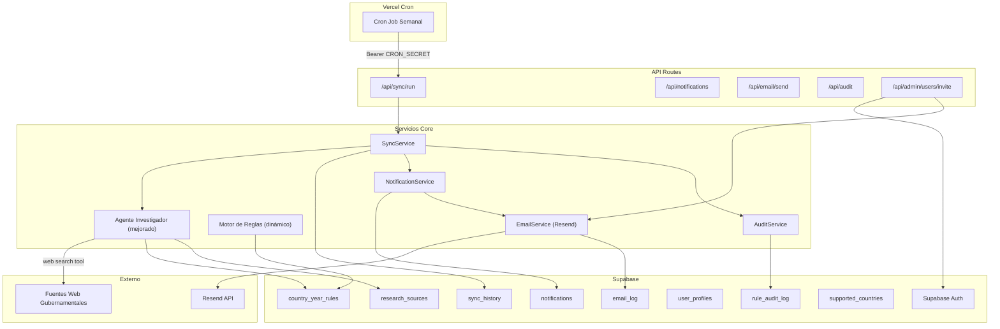
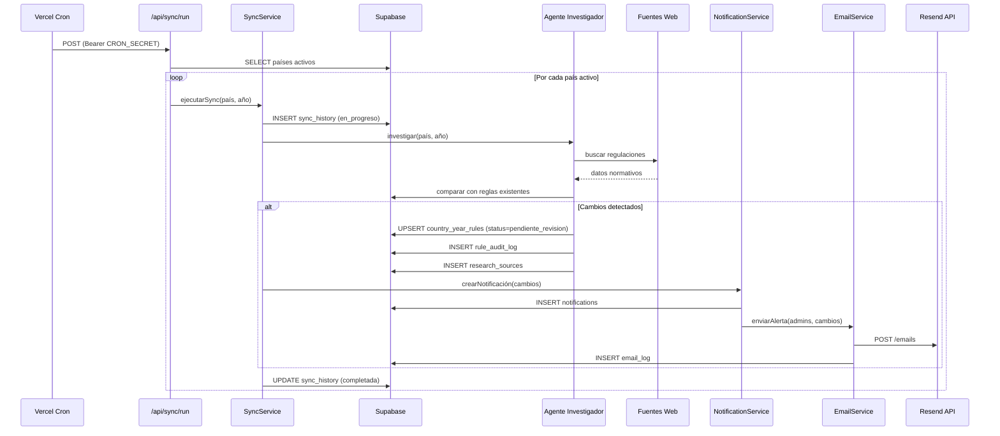
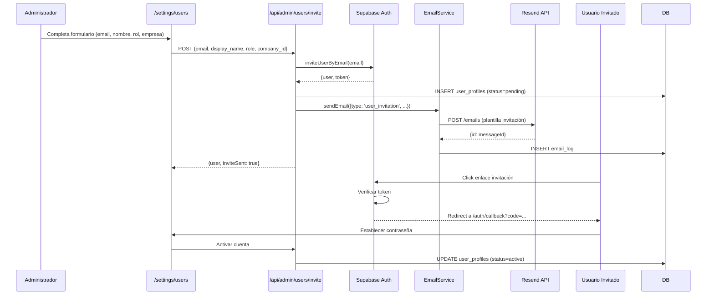
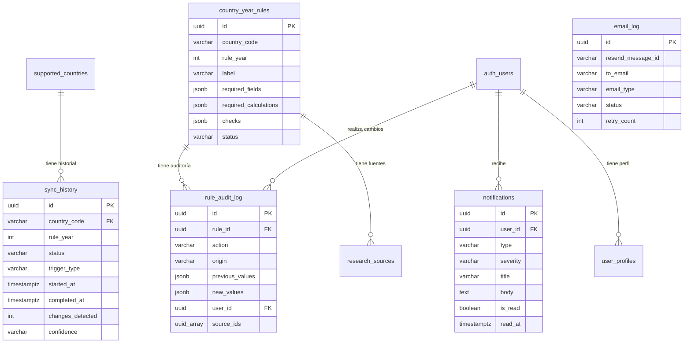

# Documento de Diseño — Sincronización Regulatoria Automática Multi-País

## Visión General

Este diseño describe la arquitectura técnica para automatizar la sincronización de normativa laboral en NominaSmart. El sistema actual depende de un botón manual "Investigar" y una base de datos simulada (`REGULATION_DB`). Esta mejora introduce:

1. Un servicio de sincronización periódica (cron) que ejecuta investigaciones automáticas por país.
2. Reemplazo de `REGULATION_DB` por consultas a fuentes web reales vía el Vercel AI SDK.
3. Generación automática de borradores de reglas para el año fiscal siguiente.
4. Motor de reglas dinámico que carga constantes desde `country_year_rules` sin hardcodeo.
5. Sistema de notificaciones in-app y por email (Resend) para cambios regulatorios.
6. Registro de auditoría completo para trazabilidad de cambios en reglas.
7. Flujo de invitación de usuarios con Supabase Auth + Resend.
8. Servicio de email transaccional con plantillas localizadas.

### Decisiones de Diseño Clave

- **Cron via Vercel Cron Jobs**: Se usa `vercel.json` con cron expressions para disparar API routes protegidas por un `CRON_SECRET`. Esto evita infraestructura adicional.
- **Resend como proveedor de email**: Se integra directamente con la API REST de Resend (sin SDK adicional) para mantener el bundle ligero. Se usa `fetch` nativo.
- **Invitación via `inviteUserByEmail` de Supabase Auth**: Genera un magic link que redirige al callback existente (`/auth/callback`), donde el usuario establece su contraseña.
- **Columna `status` en `country_year_rules`**: Se agrega para diferenciar reglas aprobadas, pendientes de revisión y borradores.
- **Motor de reglas sin hardcodeo**: Se elimina `CO_CONSTANTS` y `REGULATION_DB`, cargando todo desde la BD.

## Arquitectura



### Flujo de Sincronización Periódica




## Componentes e Interfaces

### 1. SyncService (`src/lib/sync/sync-service.ts`)

Orquesta la sincronización periódica. Itera sobre países activos, invoca al Agente Investigador, registra historial y dispara notificaciones.

```typescript
interface SyncOptions {
  countryCode?: string; // Si se omite, sincroniza todos los países activos
  year?: number;        // Default: año actual
  force?: boolean;      // Ignorar frecuencia configurada
}

interface SyncResult {
  countryCode: string;
  year: number;
  status: 'completed' | 'failed';
  changesDetected: number;
  confidence: 'high' | 'medium' | 'low';
  duration: number;
  error?: string;
}

async function runSync(options: SyncOptions): Promise<SyncResult[]>
```

### 2. Agente Investigador Mejorado (`src/lib/ai/agents/researcher.ts`)

Se modifica el agente existente para:
- Reemplazar `REGULATION_DB` con una herramienta `web_search` que consulta fuentes reales vía el Vercel AI SDK.
- Mantener `REGULATION_DB` como fallback cuando las fuentes web no están disponibles.
- Agregar lógica de reintentos con backoff exponencial.

```typescript
// Nueva herramienta para el agente
interface WebSearchTool {
  name: 'web_search';
  description: string;
  parameters: {
    query: string;
    countryCode: string;
    year: number;
  };
  execute: (args: { query: string; countryCode: string; year: number }) => Promise<string>;
}
```

### 3. Motor de Reglas Dinámico (`src/lib/ai/rule-engine.ts`)

Se refactoriza para eliminar `CO_CONSTANTS` y cargar todo desde la BD:

```typescript
// Se elimina CO_CONSTANTS y getHardcodedConstants()
// Se agrega:

interface ParsedRuleConstants {
  smmlv?: number;
  transportAllowance?: number;
  ibcMax?: number;
  healthEmployee?: number;
  healthEmployer?: number;
  pensionEmployee?: number;
  pensionEmployer?: number;
  [key: string]: number | undefined;
}

function parseChecksToConstants(checks: string[]): ParsedRuleConstants
function formatConstantsToChecks(constants: ParsedRuleConstants, template: string[]): string[]

async function loadAndValidateRules(
  countryCode: string,
  year: number,
): Promise<CountryRuleEngine>
```

### 4. EmailService (`src/lib/email/email-service.ts`)

Servicio centralizado para envío de emails vía Resend.

```typescript
type EmailType = 'user_invitation' | 'regulatory_alert' | 'weekly_summary';

interface SendEmailOptions {
  to: string | string[];
  type: EmailType;
  locale: 'en' | 'es' | 'pt';
  data: Record<string, unknown>;
}

interface SendEmailResult {
  success: boolean;
  messageId?: string;
  error?: string;
}

async function sendEmail(options: SendEmailOptions): Promise<SendEmailResult>
```

Internamente usa `fetch` contra `https://api.resend.com/emails` con el header `Authorization: Bearer RESEND_API_KEY`. Implementa reintentos (3 intentos, backoff exponencial).

### 5. NotificationService (`src/lib/notifications/notification-service.ts`)

Gestiona notificaciones in-app y dispara emails cuando corresponde.

```typescript
type NotificationSeverity = 'info' | 'warning' | 'critical';

interface CreateNotificationOptions {
  userId?: string;       // null = broadcast a admins
  type: 'regulatory_change' | 'sync_completed' | 'rule_pending_review';
  severity: NotificationSeverity;
  title: string;
  body: string;
  metadata?: Record<string, unknown>;
}

async function createNotification(options: CreateNotificationOptions): Promise<string>
async function markAsRead(notificationId: string, userId: string): Promise<void>
async function getUnreadCount(userId: string): Promise<number>
```

### 6. AuditService (`src/lib/audit/audit-service.ts`)

Registra cambios en reglas para trazabilidad.

```typescript
type AuditAction = 'created' | 'updated' | 'approved' | 'rejected';
type AuditOrigin = 'automatic' | 'manual';

interface AuditEntry {
  ruleId: string;
  action: AuditAction;
  origin: AuditOrigin;
  previousValues: Record<string, unknown> | null;
  newValues: Record<string, unknown>;
  userId?: string;
  sourceIds?: string[];
}

async function logAudit(entry: AuditEntry): Promise<string>
async function getAuditHistory(ruleId: string): Promise<AuditLogRow[]>
```

### 7. API Routes Nuevas

| Ruta | Método | Descripción |
|------|--------|-------------|
| `/api/sync/run` | POST | Ejecuta sincronización (protegida por CRON_SECRET) |
| `/api/sync/history` | GET | Historial de sincronizaciones por país |
| `/api/notifications` | GET | Notificaciones del usuario actual |
| `/api/notifications/[id]/read` | PATCH | Marcar notificación como leída |
| `/api/audit/[ruleId]` | GET | Historial de auditoría de una regla |
| `/api/admin/users/invite` | POST | Invitar usuario por email |
| `/api/admin/users/[id]/resend-invite` | POST | Reenviar invitación |
| `/api/admin/rules/[id]/approve` | PATCH | Aprobar regla pendiente |
| `/api/admin/rules/[id]/reject` | PATCH | Rechazar regla pendiente |
| `/api/email/send` | POST | Envío interno de email (no expuesto públicamente) |

### 8. Flujo de Invitación de Usuarios



### 9. Plantillas de Email (`src/lib/email/templates/`)

Se crean plantillas como funciones que retornan HTML:

```typescript
// src/lib/email/templates/index.ts
interface EmailTemplate {
  subject: string;
  html: string;
}

function userInvitationTemplate(data: {
  displayName: string;
  inviteUrl: string;
  locale: 'en' | 'es' | 'pt';
}): EmailTemplate

function regulatoryAlertTemplate(data: {
  countryName: string;
  changesCount: number;
  confidence: string;
  changesDetail: string;
  locale: 'en' | 'es' | 'pt';
}): EmailTemplate

function weeklySummaryTemplate(data: {
  syncs: Array<{ country: string; status: string; changes: number }>;
  locale: 'en' | 'es' | 'pt';
}): EmailTemplate
```

### 10. Cambios en Componentes Existentes

- **`/admin/countries/page.tsx`**: Agregar columna "Última sincronización" con fecha, estado y cambios detectados. Agregar botón "Sincronizar ahora" por país.
- **`/settings/users/page.tsx`**: Reemplazar campo "Contraseña" por flujo de invitación. Agregar botón "Reenviar invitación" para usuarios pendientes.
- **`/rules/page.tsx`**: Agregar badge de estado (aprobada/pendiente/borrador). Agregar botones "Aprobar" y "Rechazar" para reglas pendientes. Agregar enlace a historial de auditoría.
- **Layout principal**: Agregar icono de campana con badge de notificaciones no leídas.


## Modelos de Datos

### Nuevas Tablas

#### `sync_history`

Registra cada ejecución de sincronización automática o manual.

```sql
CREATE TABLE IF NOT EXISTS sync_history (
    id UUID PRIMARY KEY DEFAULT gen_random_uuid(),
    country_code VARCHAR(5) NOT NULL REFERENCES supported_countries(country_code),
    rule_year INT NOT NULL,
    status VARCHAR(20) NOT NULL DEFAULT 'in_progress',  -- in_progress, completed, failed
    trigger_type VARCHAR(20) NOT NULL DEFAULT 'automatic', -- automatic, manual
    started_at TIMESTAMPTZ NOT NULL DEFAULT now(),
    completed_at TIMESTAMPTZ,
    changes_detected INT DEFAULT 0,
    confidence VARCHAR(10),  -- high, medium, low
    error_message TEXT,
    retry_count INT DEFAULT 0,
    created_at TIMESTAMPTZ NOT NULL DEFAULT now()
);

CREATE INDEX idx_sync_history_country ON sync_history(country_code, rule_year);
CREATE INDEX idx_sync_history_status ON sync_history(status);
```

#### `rule_audit_log`

Registro de auditoría de cambios en reglas normativas. Retención mínima de 5 años.

```sql
CREATE TABLE IF NOT EXISTS rule_audit_log (
    id UUID PRIMARY KEY DEFAULT gen_random_uuid(),
    rule_id UUID NOT NULL REFERENCES country_year_rules(id) ON DELETE CASCADE,
    action VARCHAR(20) NOT NULL,  -- created, updated, approved, rejected
    origin VARCHAR(20) NOT NULL,  -- automatic, manual
    previous_values JSONB,
    new_values JSONB NOT NULL,
    user_id UUID REFERENCES auth.users(id) ON DELETE SET NULL,
    source_ids UUID[] DEFAULT '{}',
    created_at TIMESTAMPTZ NOT NULL DEFAULT now()
);

CREATE INDEX idx_rule_audit_log_rule ON rule_audit_log(rule_id);
CREATE INDEX idx_rule_audit_log_created ON rule_audit_log(created_at);
```

#### `notifications`

Notificaciones in-app para administradores.

```sql
CREATE TABLE IF NOT EXISTS notifications (
    id UUID PRIMARY KEY DEFAULT gen_random_uuid(),
    user_id UUID REFERENCES auth.users(id) ON DELETE CASCADE,
    type VARCHAR(50) NOT NULL,  -- regulatory_change, sync_completed, rule_pending_review
    severity VARCHAR(20) NOT NULL DEFAULT 'info',  -- info, warning, critical
    title VARCHAR(255) NOT NULL,
    body TEXT,
    metadata JSONB DEFAULT '{}',
    is_read BOOLEAN DEFAULT false,
    read_at TIMESTAMPTZ,
    created_at TIMESTAMPTZ NOT NULL DEFAULT now()
);

CREATE INDEX idx_notifications_user ON notifications(user_id, is_read);
CREATE INDEX idx_notifications_type ON notifications(type);
```

#### `email_log`

Registro de todos los correos enviados vía Resend.

```sql
CREATE TABLE IF NOT EXISTS email_log (
    id UUID PRIMARY KEY DEFAULT gen_random_uuid(),
    resend_message_id VARCHAR(100),
    to_email VARCHAR(255) NOT NULL,
    email_type VARCHAR(50) NOT NULL,  -- user_invitation, regulatory_alert, weekly_summary
    status VARCHAR(20) NOT NULL DEFAULT 'pending',  -- pending, sent, failed, bounced
    error_message TEXT,
    retry_count INT DEFAULT 0,
    sent_at TIMESTAMPTZ,
    created_at TIMESTAMPTZ NOT NULL DEFAULT now()
);

CREATE INDEX idx_email_log_status ON email_log(status);
CREATE INDEX idx_email_log_type ON email_log(email_type);
```

### Cambios en Tablas Existentes

#### `country_year_rules` — Agregar columna `status`

```sql
ALTER TABLE country_year_rules
ADD COLUMN IF NOT EXISTS status VARCHAR(20) NOT NULL DEFAULT 'approved';
-- Valores: draft, pending_review, approved, rejected

CREATE INDEX idx_country_year_rules_status ON country_year_rules(status);
```

#### `user_profiles` — Agregar columnas para invitación y preferencias

```sql
ALTER TABLE user_profiles
ADD COLUMN IF NOT EXISTS invitation_status VARCHAR(20) DEFAULT 'active',
-- Valores: pending, active, expired
ADD COLUMN IF NOT EXISTS preferred_locale VARCHAR(5) DEFAULT 'es',
ADD COLUMN IF NOT EXISTS alert_countries TEXT[] DEFAULT '{}';
-- Países para los que el usuario recibe alertas regulatorias
```

### Diagrama Entidad-Relación (Nuevas Tablas)



### Configuración de Vercel Cron

```json
// vercel.json
{
  "crons": [
    {
      "path": "/api/sync/run",
      "schedule": "0 6 * * 1"
    }
  ]
}
```

El cron se ejecuta cada lunes a las 6:00 UTC. La ruta `/api/sync/run` valida el header `Authorization: Bearer ${CRON_SECRET}` para prevenir invocaciones no autorizadas.

### Variables de Entorno Nuevas

| Variable | Descripción |
|----------|-------------|
| `RESEND_API_KEY` | API key de Resend para envío de emails |
| `RESEND_FROM_EMAIL` | Dirección de remitente (ej: `noreply@nominasmart.com`) |
| `CRON_SECRET` | Secret para autenticar cron jobs de Vercel |


## Propiedades de Correctitud

*Una propiedad es una característica o comportamiento que debe cumplirse en todas las ejecuciones válidas de un sistema — esencialmente, una declaración formal sobre lo que el sistema debe hacer. Las propiedades sirven como puente entre especificaciones legibles por humanos y garantías de correctitud verificables por máquinas.*

### Propiedad 1: Sincronización cubre todos los países activos

*Para cualquier* conjunto de países activos en `supported_countries`, ejecutar una sincronización completa debe producir exactamente un registro en `sync_history` por cada país activo, con `country_code`, `started_at` y `status` poblados.

**Valida: Requisitos 1.1, 1.3, 1.5**

### Propiedad 2: Frecuencia de sincronización respetada

*Para cualquier* frecuencia configurada (diaria, semanal, mensual) y cualquier timestamp de última sincronización, la función que determina si debe ejecutarse una nueva sincronización debe retornar `true` solo cuando ha transcurrido el intervalo configurado.

**Valida: Requisito 1.2**

### Propiedad 3: Reintentos limitados a 3 con estado final fallido

*Para cualquier* operación de sincronización que falla consistentemente, el número de reintentos no debe exceder 3 y el estado final en `sync_history` debe ser `failed`.

**Valida: Requisito 1.4**

### Propiedad 4: Investigación produce al menos 2 fuentes

*Para cualquier* solicitud de investigación con un país y año válidos donde las fuentes externas están disponibles, el resultado debe contener al menos 2 fuentes con URL, título, fecha de acceso y nivel de confianza válido.

**Valida: Requisitos 2.1, 2.2**

### Propiedad 5: Persistencia completa de fuentes consultadas

*Para cualquier* fuente consultada durante una investigación, debe existir un registro en `research_sources` con `source_url`, `source_title`, `accessed_at`, `confidence` y `country_year_rule_id` poblados.

**Valida: Requisito 2.4**

### Propiedad 6: Resolución de conflictos por confianza

*Para cualquier* conjunto de fuentes con información contradictoria sobre un mismo campo regulatorio, el sistema debe seleccionar el valor de la fuente con mayor nivel de confianza (high > medium > low).

**Valida: Requisito 2.5**

### Propiedad 7: Borrador de reglas copia estructura del año anterior

*Para cualquier* país activo con reglas para el año N pero sin reglas para el año N+1, ejecutar la generación automática debe crear una regla con `status='draft'` para el año N+1 que contenga los mismos `required_fields`, `required_calculations` y `checks` que la regla del año N.

**Valida: Requisito 3.1**

### Propiedad 8: Cambios detectados marcan regla como pendiente de revisión

*Para cualquier* regla en estado `draft` o `approved` que recibe cambios del Agente Investigador, el estado debe cambiar a `pending_review`.

**Valida: Requisito 3.2**

### Propiedad 9: Aprobación cambia estado y genera auditoría

*Para cualquier* regla en estado `pending_review`, aprobarla debe cambiar su estado a `approved` y crear un registro en `rule_audit_log` con `action='approved'`.

**Valida: Requisito 3.4**

### Propiedad 10: Sin cambios preserva reglas existentes y notifica

*Para cualquier* sincronización que no detecta cambios regulatorios, las reglas existentes deben permanecer sin modificaciones y debe generarse una notificación informando que no se encontraron cambios.

**Valida: Requisito 3.6**

### Propiedad 11: Motor de reglas carga constantes dinámicamente

*Para cualquier* combinación de país y año con reglas en `country_year_rules`, el motor de reglas debe cargar y utilizar los valores de esa regla (no constantes hardcodeadas) para las validaciones.

**Valida: Requisitos 4.1, 4.4**

### Propiedad 12: Parseo de checks extrae valores numéricos correctamente

*Para cualquier* string de check que contenga valores numéricos (porcentajes, montos, topes), la función `parseChecksToConstants` debe extraer los valores numéricos correctos.

**Valida: Requisito 4.5**

### Propiedad 13: Round-trip de parseo/formateo de reglas

*Para cualquier* regla válida almacenada en `country_year_rules`, parsear los checks a constantes y formatear las constantes de vuelta a checks debe producir un objeto equivalente al original.

**Valida: Requisito 4.6**

### Propiedad 14: Mapeo de confianza a severidad de notificación

*Para cualquier* nivel de confianza, la severidad de la notificación generada debe ser: `info` si confianza es `high`, `warning` si confianza es `medium` o `low`.

**Valida: Requisitos 5.1, 5.2, 5.3**

### Propiedad 15: Marcar notificación como leída

*Para cualquier* notificación no leída, marcarla como leída debe establecer `is_read=true` y `read_at` con un timestamp válido.

**Valida: Requisito 5.5**

### Propiedad 16: Auditoría completa con datos condicionales

*Para cualquier* cambio en una regla, el registro de auditoría debe contener `rule_id`, `action`, `origin`, `previous_values`, `new_values` y `created_at`. Además, si `origin='automatic'` entonces `source_ids` debe estar poblado, y si `origin='manual'` entonces `user_id` debe estar poblado.

**Valida: Requisitos 6.1, 6.2, 6.3**

### Propiedad 17: Historial de auditoría ordenado cronológicamente

*Para cualquier* regla con múltiples entradas de auditoría, consultar el historial debe retornar las entradas ordenadas por `created_at` de forma ascendente.

**Valida: Requisito 6.4**

### Propiedad 18: Creación de usuario genera perfil e invitación

*Para cualquier* solicitud válida de creación de usuario (email único, nombre, rol, empresa), el sistema debe crear un usuario en Supabase Auth, un registro en `user_profiles` con `invitation_status='pending'`, y un registro en `email_log` con `email_type='user_invitation'`.

**Valida: Requisitos 7.1, 7.2**

### Propiedad 19: Email duplicado rechazado

*Para cualquier* email que ya existe en el sistema, intentar crear un nuevo usuario con ese email debe retornar un error y no crear registros adicionales.

**Valida: Requisito 7.3**

### Propiedad 20: Reenvío de invitación solo para usuarios pendientes

*Para cualquier* usuario con `invitation_status='pending'`, reenviar la invitación debe ser permitido. *Para cualquier* usuario con `invitation_status='active'`, reenviar la invitación debe ser rechazado.

**Valida: Requisito 7.6**

### Propiedad 21: Rol determina permisos

*Para cualquier* rol válido (admin, analyst, client), los permisos asignados al usuario deben corresponder exactamente al conjunto de permisos definido para ese rol.

**Valida: Requisito 7.7**

### Propiedad 22: Alertas enviadas solo a destinatarios configurados por país

*Para cualquier* cambio regulatorio en un país X, los correos de alerta deben enviarse únicamente a usuarios activos que tengan el país X en su campo `alert_countries`.

**Valida: Requisitos 8.2, 8.6**

### Propiedad 23: Registro completo de envío de email

*Para cualquier* intento de envío de email, debe existir un registro en `email_log` con `to_email`, `email_type`, `status` y `created_at` poblados. Si el envío fue exitoso, `resend_message_id` y `sent_at` también deben estar poblados.

**Valida: Requisito 8.3**

### Propiedad 24: Reintentos de email limitados a 3

*Para cualquier* envío de email que falla consistentemente, el número de reintentos no debe exceder 3 y el estado final en `email_log` debe ser `failed`.

**Valida: Requisito 8.4**

### Propiedad 25: Plantillas localizadas según idioma del destinatario

*Para cualquier* email enviado a un usuario con `preferred_locale` configurado, el contenido del email (subject y body) debe estar en el idioma correspondiente a ese locale.

**Valida: Requisito 8.7**


## Manejo de Errores

### Sincronización

| Escenario | Comportamiento |
|-----------|---------------|
| Fuentes web no disponibles | Fallback a `REGULATION_DB`, marcar confianza como `low`, registrar en `sync_history` |
| Timeout en investigación | Reintentar hasta 3 veces con backoff exponencial (1s, 2s, 4s). Marcar como `failed` si agota reintentos |
| Error de BD al guardar regla | Registrar error en `sync_history`, no crear notificación parcial, rollback implícito |
| País sin reglas previas | Crear borrador vacío con campos mínimos, marcar como `draft` |
| Conflicto de concurrencia (upsert) | Usar `ON CONFLICT` de PostgreSQL para resolver, última escritura gana |

### Email (Resend)

| Escenario | Comportamiento |
|-----------|---------------|
| API key inválida | Registrar error en `email_log`, no reintentar, alertar en logs del servidor |
| Rate limit (429) | Reintentar con backoff exponencial respetando header `Retry-After` |
| Email rebotado | Actualizar `email_log.status` a `bounced`, no reintentar |
| Plantilla no encontrada para locale | Fallback a locale `es`, registrar warning |

### Usuarios

| Escenario | Comportamiento |
|-----------|---------------|
| Email duplicado en Auth | Retornar error 409 con mensaje descriptivo |
| Fallo al crear perfil después de crear Auth user | Mantener Auth user, marcar perfil como pendiente, permitir retry |
| Token de invitación expirado | Permitir reenvío de invitación desde panel admin |
| Rol inválido | Retornar error 400 con roles válidos |

### Motor de Reglas

| Escenario | Comportamiento |
|-----------|---------------|
| No existen reglas para país/año | Retornar error descriptivo: `No rules configured for {country} {year}` |
| Check con formato no parseable | Ignorar el check específico, registrar warning, continuar con los demás |
| BD no disponible | Retornar error 503, no usar fallback hardcodeado |

## Estrategia de Testing

### Enfoque Dual

Se utilizan dos tipos de tests complementarios:

1. **Tests unitarios (Vitest)**: Verifican ejemplos específicos, edge cases y condiciones de error.
2. **Tests de propiedades (fast-check + Vitest)**: Verifican propiedades universales con inputs generados aleatoriamente.

Ambos son necesarios: los tests unitarios capturan bugs concretos y los tests de propiedades verifican correctitud general.

### Configuración de Tests de Propiedades

- **Librería**: `fast-check` (ya presente en `devDependencies`)
- **Runner**: `vitest` (ya configurado)
- **Iteraciones mínimas**: 100 por propiedad
- **Formato de tag**: Cada test de propiedad debe incluir un comentario con el formato:
  ```
  // Feature: auto-regulatory-sync, Property {N}: {título}
  ```
- **Cada propiedad de correctitud debe ser implementada por UN SOLO test de propiedad.**

### Tests Unitarios

Los tests unitarios deben cubrir:

- **Ejemplos específicos**: Parseo de checks de Colombia 2025 con valores conocidos (SMMLV $1.423.500).
- **Edge cases**: Sync con país sin reglas previas, email con locale no soportado, usuario con email duplicado.
- **Integración**: Flujo completo de sync → notificación → email (con mocks de Resend).
- **Error conditions**: Timeout de fuentes web, API key de Resend inválida, BD no disponible.

### Tests de Propiedades

Cada propiedad del documento de diseño se implementa como un test `fast-check`:

| Propiedad | Archivo de Test | Generadores |
|-----------|----------------|-------------|
| P1: Sync cubre países activos | `sync-service.property.test.ts` | Listas de países activos |
| P2: Frecuencia respetada | `sync-service.property.test.ts` | Frecuencias + timestamps |
| P3: Reintentos limitados | `sync-service.property.test.ts` | Operaciones fallidas |
| P4: Investigación ≥2 fuentes | `researcher.property.test.ts` | Países + años válidos |
| P5: Persistencia de fuentes | `researcher.property.test.ts` | Fuentes con campos variados |
| P6: Resolución por confianza | `researcher.property.test.ts` | Conjuntos de fuentes conflictivas |
| P7: Borrador copia estructura | `rule-generation.property.test.ts` | Reglas existentes |
| P8: Cambios → pendiente_review | `rule-generation.property.test.ts` | Reglas + cambios |
| P9: Aprobación → approved + audit | `rule-generation.property.test.ts` | Reglas pendientes |
| P10: Sin cambios preserva reglas | `rule-generation.property.test.ts` | Reglas sin cambios |
| P11: Carga dinámica de constantes | `rule-engine.property.test.ts` | Reglas de BD variadas |
| P12: Parseo de checks numéricos | `rule-engine.property.test.ts` | Strings de checks con números |
| P13: Round-trip parseo/formateo | `rule-engine.property.test.ts` | Reglas válidas completas |
| P14: Confianza → severidad | `notification-service.property.test.ts` | Niveles de confianza |
| P15: Marcar como leída | `notification-service.property.test.ts` | Notificaciones no leídas |
| P16: Auditoría completa | `audit-service.property.test.ts` | Cambios automáticos y manuales |
| P17: Historial ordenado | `audit-service.property.test.ts` | Múltiples entradas de auditoría |
| P18: Creación usuario + perfil + email | `user-invite.property.test.ts` | Datos de usuario válidos |
| P19: Email duplicado rechazado | `user-invite.property.test.ts` | Emails existentes |
| P20: Reenvío solo pendientes | `user-invite.property.test.ts` | Usuarios con distintos estados |
| P21: Rol → permisos | `user-invite.property.test.ts` | Roles válidos |
| P22: Alertas por país | `email-service.property.test.ts` | Usuarios + países configurados |
| P23: Registro de email completo | `email-service.property.test.ts` | Envíos exitosos y fallidos |
| P24: Reintentos email ≤3 | `email-service.property.test.ts` | Envíos fallidos |
| P25: Plantillas localizadas | `email-service.property.test.ts` | Locales + tipos de email |

### Estructura de Archivos de Test

```
src/lib/
├── sync/__tests__/
│   └── sync-service.property.test.ts
├── ai/__tests__/
│   ├── researcher.property.test.ts
│   ├── rule-engine.property.test.ts
│   └── rule-generation.property.test.ts
├── notifications/__tests__/
│   └── notification-service.property.test.ts
├── audit/__tests__/
│   └── audit-service.property.test.ts
├── email/__tests__/
│   └── email-service.property.test.ts
└── auth/__tests__/
    └── user-invite.property.test.ts
```
