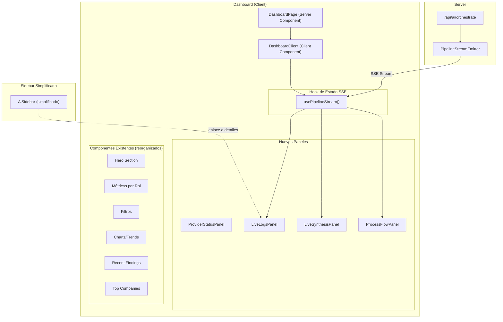

# Documento de Diseño: Rediseño del Dashboard

## Visión General

Este diseño transforma el dashboard de NominaSmart de una vista estática de métricas a un centro de comando interactivo con 4 nuevas secciones: Panel de Proveedores IA, Flujo de Proceso con agentes, Panel de Logs en tiempo real y Panel de Síntesis IA. El sidebar de chat se simplifica moviendo la información técnica al Panel de Logs. Todo se construye sobre la infraestructura SSE existente (`PipelineStreamEmitter`) y el sistema de diseño Obsidian Ledger (`design-tokens.ts`).

## Arquitectura

El rediseño sigue una arquitectura de componentes React con estado compartido mediante un hook personalizado (`usePipelineStream`) que centraliza la conexión SSE y distribuye eventos a los paneles de logs y síntesis.



### Flujo de Datos

1. `DashboardPage` (server component) obtiene datos de Supabase (payrolls, companies, providers).
2. `DashboardClient` recibe datos iniciales y renderiza el layout con todas las secciones.
3. `usePipelineStream` se conecta al endpoint SSE cuando el usuario inicia un análisis y distribuye eventos.
4. `LiveLogsPanel` consume eventos `agent-start`, `agent-complete`, `agent-communication` del hook.
5. `LiveSynthesisPanel` consume eventos `pipeline-complete` y resultados parciales de `agent-complete`.
6. `ProcessFlowPanel` actualiza el paso activo basándose en los eventos del pipeline.
7. `AiSidebar` simplificado muestra solo la conversación, con enlace al Panel de Logs para detalles técnicos.

## Componentes e Interfaces

### 1. `usePipelineStream` — Hook de estado SSE centralizado

```typescript
// src/hooks/usePipelineStream.ts

interface LogEntry {
  id: string;
  timestamp: number;
  type: 'agent-start' | 'agent-complete' | 'agent-communication' | 'error';
  agentId?: string;
  agentName?: string;
  message: string;
  metadata?: {
    tokensUsed?: number;
    latencyMs?: number;
    success?: boolean;
    fromAgent?: string;
    toAgent?: string;
    queryType?: string;
  };
}

interface SynthesisResult {
  summary: string;
  riskLevel: 'low' | 'medium' | 'high';
  findings: Array<{ description: string; severity: string }>;
  recommendations: string[];
  contributingAgents: Array<{ id: string; name: string; emoji: string }>;
  completedAt: number;
}

interface PipelineStreamState {
  isConnected: boolean;
  isRunning: boolean;
  logs: LogEntry[];
  synthesis: SynthesisResult | null;
  activeStep: number; // 0-3 for the 4-step flow
  activeAgentId: string | null;
  error: string | null;
}

interface UsePipelineStreamReturn extends PipelineStreamState {
  clearLogs: () => void;
  startPipeline: (messages: Array<{ role: string; content: string }>, context?: Record<string, unknown>) => void;
}
```

Este hook encapsula toda la lógica SSE que actualmente vive en `AiSidebar.executeSSEStream`. Los paneles de logs y síntesis consumen su estado reactivamente.

### 2. `ProviderStatusPanel` — Panel de estado de proveedores IA

```typescript
// src/components/ui/ProviderStatusPanel.tsx

interface ProviderSummary {
  id: string;
  displayName: string;
  providerType: string;
  isActive: boolean;
  lastTestSuccess: boolean | null;
}

interface ProviderStatusPanelProps {
  providers: ProviderSummary[];
}
```

Muestra un resumen compacto de proveedores configurados. Si no hay proveedores, muestra un CTA prominente. Incluye un enlace a `/settings/providers` para configuración completa.

### 3. `ProcessFlowPanel` — Flujo de proceso con agentes

```typescript
// src/components/ui/ProcessFlowPanel.tsx

interface ProcessStep {
  id: string;
  title: string;
  description: string;
  agents: Array<{ id: string; name: string; emoji: string; role: string }>;
  status: 'pending' | 'active' | 'completed';
  href: string;
}

interface ProcessFlowPanelProps {
  currentStep: number;
  steps: ProcessStep[];
  onStepClick?: (stepIndex: number) => void;
}
```

Reutiliza la lógica de `GuidedFlow.tsx` pero con agentes visibles en cada paso. Muestra avatares de agentes con `AgentAvatar` y comunicación inter-agente cuando múltiples agentes colaboran.

### 4. `LiveLogsPanel` — Panel de logs en tiempo real

```typescript
// src/components/ui/LiveLogsPanel.tsx

interface LiveLogsPanelProps {
  logs: LogEntry[];
  onClear: () => void;
  maxHeight?: string;
}
```

Panel con scroll automático que muestra entradas de log con timestamp, avatar del agente, y metadata. Soporta hasta 100+ entradas con virtualización si es necesario. Botón de limpiar logs.

### 5. `LiveSynthesisPanel` — Panel de síntesis en tiempo real

```typescript
// src/components/ui/LiveSynthesisPanel.tsx

interface LiveSynthesisPanelProps {
  synthesis: SynthesisResult | null;
  isRunning: boolean;
}
```

Muestra el resumen consolidado cuando el pipeline completa. Estado vacío cuando no hay resultados. Actualización incremental durante ejecución.

### 6. `AiSidebar` — Versión simplificada

El sidebar existente se simplifica:
- Se eliminan los chips de `agentResults` del bloque de mensaje.
- Se elimina la sección de `busHistory` (comunicación inter-agente) del sidebar.
- Se reduce `SUGGESTIONS` de 6 a 3 elementos.
- Se elimina el `streamingText` incremental del sidebar.
- Se agrega un enlace "Ver detalles en logs" que hace scroll al `LiveLogsPanel`.
- El indicador de typing se simplifica a solo avatar + nombre del agente activo.

## Modelos de Datos

### LogEntry

| Campo | Tipo | Descripción |
|-------|------|-------------|
| id | string | UUID único de la entrada |
| timestamp | number | Epoch ms del evento |
| type | enum | `agent-start` \| `agent-complete` \| `agent-communication` \| `error` |
| agentId | string? | ID del agente (ej: `auditor`, `mapper`) |
| agentName | string? | Nombre display del agente (ej: `Juli`) |
| message | string | Descripción legible del evento |
| metadata | object? | Datos adicionales: tokens, latencia, éxito, agentes origen/destino |

### SynthesisResult

| Campo | Tipo | Descripción |
|-------|------|-------------|
| summary | string | Resumen narrativo del análisis |
| riskLevel | enum | `low` \| `medium` \| `high` |
| findings | array | Lista de hallazgos con descripción y severidad |
| recommendations | string[] | Recomendaciones priorizadas |
| contributingAgents | array | Agentes que contribuyeron al resultado |
| completedAt | number | Epoch ms de finalización |

### ProviderSummary

| Campo | Tipo | Descripción |
|-------|------|-------------|
| id | string | UUID del proveedor |
| displayName | string | Nombre visible configurado |
| providerType | string | Tipo: openai, anthropic, groq, google, openrouter |
| isActive | boolean | Si el proveedor está habilitado |
| lastTestSuccess | boolean? | Resultado del último test de conectividad |

### ProcessStep

| Campo | Tipo | Descripción |
|-------|------|-------------|
| id | string | Identificador del paso (upload, mapping, validation, report) |
| title | string | Título localizado del paso |
| description | string | Descripción del paso |
| agents | array | Agentes asignados al paso con id, nombre, emoji, rol |
| status | enum | `pending` \| `active` \| `completed` |
| href | string | Ruta de navegación al hacer clic |

### Layout del Dashboard (orden de secciones)

```
┌─────────────────────────────────────────────────┐
│                  Hero Section                    │
├──────────────────────┬──────────────────────────┤
│  ProviderStatusPanel │    ProcessFlowPanel       │
├──────────────────────┴──────────────────────────┤
│              Métricas por Rol (4 cards)          │
├──────────────────────┬──────────────────────────┤
│    LiveLogsPanel     │   LiveSynthesisPanel      │
├──────────────────────┴──────────────────────────┤
│           Charts / Trends / Health               │
├──────────────────────────────────────────────────┤
│              Recent Findings                     │
├──────────────────────┬──────────────────────────┤
│    Top Companies     │   Latest Payroll Card     │
└──────────────────────┴──────────────────────────┘
```

En mobile (< 768px), todo se apila en una columna. En desktop (≥ 1024px), los paneles de logs y síntesis van lado a lado, al igual que proveedores y flujo de proceso.


## Propiedades de Correctitud

*Una propiedad es una característica o comportamiento que debe mantenerse verdadero en todas las ejecuciones válidas de un sistema — esencialmente, una declaración formal sobre lo que el sistema debe hacer. Las propiedades sirven como puente entre especificaciones legibles por humanos y garantías de correctitud verificables por máquina.*

### Property 1: Conteo de proveedores coincide con datos de entrada

*Para cualquier* array de proveedores con estados activo/inactivo variados, el resumen renderizado por `ProviderStatusPanel` debe mostrar un conteo total igual a la longitud del array y un conteo de activos igual al número de proveedores con `isActive === true`.

**Validates: Requirements 1.1**

### Property 2: Renderizado completo de información de proveedores

*Para cualquier* lista no vacía de proveedores, el `ProviderStatusPanel` debe renderizar para cada proveedor su nombre (`displayName`), tipo (`providerType`) y estado (`isActive`).

**Validates: Requirements 1.4**

### Property 3: Alerta visual para proveedores con test fallido

*Para cualquier* lista de proveedores donde algunos tienen `lastTestSuccess === false`, el `ProviderStatusPanel` debe mostrar un indicador de alerta únicamente junto a los proveedores cuyo último test falló, y no junto a los que tienen `lastTestSuccess === true` o `null`.

**Validates: Requirements 1.5**

### Property 4: Agentes visibles en cada paso del flujo de proceso

*Para cualquier* conjunto de pasos del proceso con agentes asignados, el `ProcessFlowPanel` debe mostrar para cada paso todos los agentes asignados con su nombre, emoji y avatar, incluyendo pasos con múltiples agentes colaborando.

**Validates: Requirements 2.2, 2.5, 2.6**

### Property 5: Eventos SSE producen entradas de log correctas

*Para cualquier* evento SSE de tipo `agent-start`, `agent-complete` o `agent-communication`, el hook `usePipelineStream` debe producir un `LogEntry` con: (a) tipo correcto correspondiente al evento, (b) timestamp no nulo, (c) mensaje descriptivo no vacío, y (d) metadata apropiada según el tipo de evento (tokens/latencia para `agent-complete`, agentes origen/destino para `agent-communication`).

**Validates: Requirements 3.1, 3.2, 3.3, 7.1, 7.2, 7.4**

### Property 6: Pipeline completado produce síntesis completa

*Para cualquier* evento `pipeline-complete` con datos de respuesta, el `SynthesisResult` producido debe contener: resumen no vacío, nivel de riesgo válido (`low`|`medium`|`high`), lista de hallazgos, lista de recomendaciones, y lista de agentes contribuyentes con id, nombre y emoji.

**Validates: Requirements 4.1, 4.4, 7.3**

### Property 7: Resultados parciales actualizan síntesis incrementalmente

*Para cualquier* secuencia de eventos `agent-complete` recibidos antes de `pipeline-complete`, el estado de síntesis del hook debe reflejar los resultados parciales acumulados, y la cantidad de agentes contribuyentes debe ser igual al número de eventos `agent-complete` exitosos recibidos.

**Validates: Requirements 4.2**

### Property 8: Sidebar no renderiza detalles técnicos

*Para cualquier* mensaje de respuesta del asistente en el `AiSidebar` simplificado, el bloque de mensaje no debe contener chips de tokens consumidos, indicadores de latencia en milisegundos, ni secciones de comunicación inter-agente (busHistory).

**Validates: Requirements 6.3**

### Property 9: Respuestas del sidebar muestran avatar y nombre del agente

*Para cualquier* mensaje de respuesta del asistente en el `AiSidebar`, el componente debe renderizar el avatar (vía `AgentAvatar`) y el nombre display del agente que generó la respuesta.

**Validates: Requirements 6.2**

### Property 10: Respuestas del sidebar incluyen enlace a logs

*Para cualquier* mensaje de respuesta del asistente en el `AiSidebar`, el componente debe incluir un enlace o botón que permita al usuario navegar al `LiveLogsPanel` para ver detalles técnicos.

**Validates: Requirements 6.6**

### Property 11: Claves de traducción existen para los tres idiomas

*Para cualquier* clave de traducción usada en los nuevos componentes del dashboard, los archivos de mensajes `en.json`, `es.json` y `pt.json` deben contener una entrada correspondiente.

**Validates: Requirements 5.5**

### Property 12: Reconexión SSE usa backoff exponencial

*Para cualquier* número de intento de reconexión `n` (donde 0 ≤ n < 3), el delay antes del reintento debe ser `2^n * 1000` milisegundos (1s, 2s, 4s), y tras 3 intentos fallidos la conexión debe detenerse.

**Validates: Requirements 7.5**

## Manejo de Errores

| Escenario | Comportamiento |
|-----------|---------------|
| Fallo al cargar proveedores desde API | `ProviderStatusPanel` muestra estado de error con botón de reintentar |
| Conexión SSE perdida | Hook muestra indicador de desconexión, reintenta con backoff exponencial (1s, 2s, 4s), máximo 3 intentos |
| Evento SSE malformado | Hook ignora el evento silenciosamente y continúa procesando (mismo comportamiento que `parseSSEChunk` actual) |
| Pipeline completa con error fatal | `LiveLogsPanel` muestra entrada de error, `LiveSynthesisPanel` muestra mensaje de error con opción de reintentar |
| Proveedor sin API key configurada | `ProviderStatusPanel` muestra indicador de "no configurado" diferenciado del estado inactivo |
| Timeout en respuesta del sidebar | `AiSidebar` muestra mensaje de timeout con sugerencia de reintentar |
| Logs exceden 500 entradas | Hook descarta las entradas más antiguas manteniendo las últimas 500 (FIFO) |

## Estrategia de Testing

### Testing Dual: Unit Tests + Property-Based Tests

Se utilizan ambos enfoques de forma complementaria:

- **Unit tests** (Vitest): Verifican ejemplos específicos, edge cases y condiciones de error.
- **Property-based tests** (fast-check + Vitest): Verifican propiedades universales con inputs generados aleatoriamente.

### Librería de Property-Based Testing

Se usa `fast-check` (ya instalada en el proyecto como dependencia) con Vitest como test runner.

### Configuración

- Mínimo 100 iteraciones por property test.
- Cada property test debe referenciar su propiedad del documento de diseño.
- Formato de tag: `Feature: dashboard-redesign, Property {number}: {property_text}`

### Plan de Tests

**Unit Tests:**
- `ProviderStatusPanel`: renderizado con 0, 1, N proveedores; estados vacío y error.
- `ProcessFlowPanel`: renderizado de 4 pasos con diferentes estados; navegación en clic.
- `LiveLogsPanel`: renderizado de entradas; auto-scroll; botón limpiar.
- `LiveSynthesisPanel`: estado vacío; renderizado de síntesis completa.
- `AiSidebar`: verificar ausencia de chips técnicos; máximo 3 sugerencias.
- `usePipelineStream`: conexión, desconexión, procesamiento de eventos individuales.

**Property-Based Tests:**
- Property 1: Generar arrays aleatorios de proveedores, verificar conteos.
- Property 2: Generar proveedores con datos aleatorios, verificar renderizado completo.
- Property 3: Generar proveedores con `lastTestSuccess` aleatorio, verificar alertas.
- Property 4: Generar pasos con 1-4 agentes aleatorios, verificar visibilidad.
- Property 5: Generar eventos SSE aleatorios, verificar LogEntry producido.
- Property 6: Generar datos de pipeline-complete, verificar SynthesisResult.
- Property 7: Generar secuencias de agent-complete, verificar acumulación incremental.
- Property 8: Generar mensajes de asistente, verificar ausencia de detalles técnicos.
- Property 12: Generar números de intento 0-2, verificar delay = 2^n * 1000.
