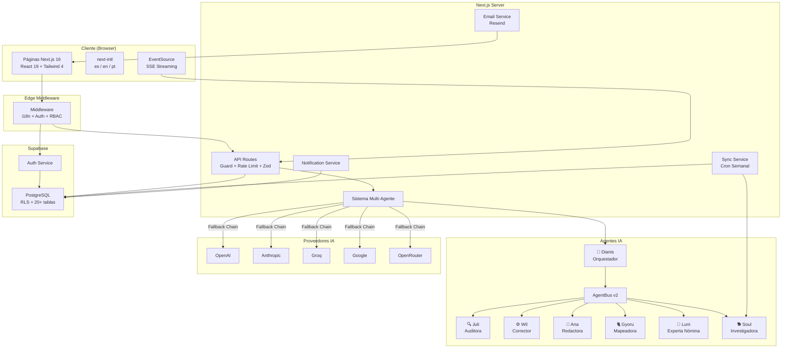
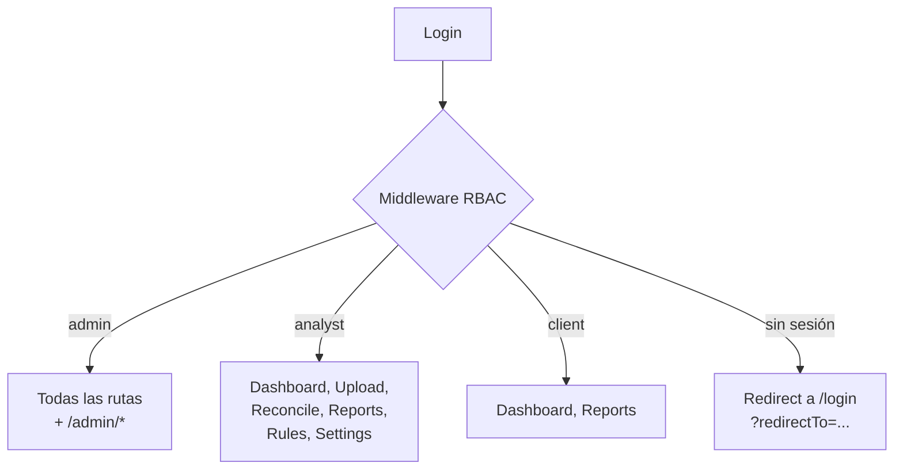

# Documento de Diseño — NominaSmart Overhaul

## Visión General

Este documento describe el diseño técnico para la revisión integral de NominaSmart, una plataforma de auditoría de nómina multi-país con 7 agentes de IA. El overhaul aborda los problemas reportados por usuarios: UX confusa, funcionalidades prometidas que no operan correctamente, navegación deficiente y falta de coherencia general.

El enfoque técnico se centra en:
1. Reestructurar la navegación y el flujo guiado de 3 pasos (Cargar → Auditar → Reportar) con indicadores de progreso reales.
2. Asegurar que el pipeline de auditoría de 4 pasos funcione end-to-end: carga → mapeo (Gyoru) → verificación (Juli) → corrección (Wil) + reporte (Ana).
3. Implementar RBAC funcional en Sidebar, middleware y API routes para los 3 roles (admin, analyst, client).
4. Completar el soporte multi-país para los 7 países prometidos (CO, MX, PE, CL, BR, AR, US).
5. Hacer funcional el chat IA con SSE streaming, fallback a JSON, y reconexión automática.
6. Corregir las páginas públicas para reflejar capacidades reales del sistema.

Stack tecnológico: Next.js 16, React 19, Supabase (PostgreSQL + RLS), Tailwind CSS 4, Vercel AI SDK, 5 proveedores IA (OpenAI, Anthropic, Groq, Google, OpenRouter), next-intl, Recharts, XLSX, Zod, Vitest + fast-check.

## Arquitectura

### Arquitectura de Alto Nivel



### Decisiones Arquitectónicas Clave

| Decisión | Justificación |
|----------|---------------|
| Mantener App Router de Next.js 16 con rutas `[locale]` | Ya implementado, next-intl 4.8 funciona bien con esta estructura |
| RBAC en middleware Edge + API guard | Doble capa: middleware filtra navegación, guard protege datos |
| SSE streaming con fallback JSON | Permite respuestas incrementales del chat IA; fallback para compatibilidad |
| Fallback chain por prioridad de proveedores | Resiliencia: si OpenAI falla, intenta Anthropic, luego Groq, etc. |
| Rate limiting Redis (Upstash) + in-memory | Distribuido en producción, funcional en desarrollo local |
| RLS en PostgreSQL | Aislamiento de datos entre empresas a nivel de base de datos |
| Reglas normativas dinámicas en `country_year_rules` | Permite actualizar reglas sin deploy; Soul las sincroniza semanalmente |
| XLSX procesado en browser | Evita enviar archivos grandes al servidor; Web Workers para >1000 filas |

### Flujo de Navegación RBAC




## Componentes e Interfaces

### Capa de Presentación

#### Layout y Navegación

| Componente | Archivo | Responsabilidad |
|-----------|---------|-----------------|
| `AppShell` | `src/components/layout/AppShell.tsx` | Layout principal protegido: Sidebar + Header + contenido + AiSidebar |
| `Sidebar` | `src/components/layout/Sidebar.tsx` | Navegación lateral con flujo guiado de 3 pasos, enlaces RBAC-filtrados, equipo IA |
| `Header` | `src/components/layout/Header.tsx` | Barra superior con NotificationBell, LanguageToggle, perfil de usuario |
| `PublicLayout` | `src/app/[locale]/(public)/layout.tsx` | Layout público: header sticky glassmorphism + footer + nav responsive |

La Sidebar debe:
- Filtrar enlaces según el rol del usuario (client solo ve Dashboard/Reports).
- Mostrar el flujo guiado con indicadores de progreso que reflejen el estado real del pipeline.
- Actualizar el paso activo en <100ms al cambiar de página.

#### Pipeline de Auditoría (Upload)

| Componente | Responsabilidad |
|-----------|-----------------|
| `UploadPage` | Página contenedora del pipeline de 4 pasos con Stepper |
| `UploadZone` | Drag & drop de archivos Excel/CSV, parseo con XLSX, detección de hojas |
| `MappingAI` | Interfaz de mapeo: invoca Gyoru, muestra propuestas, permite edición manual |
| `PayrollEditor` | Editor de celdas con correcciones de Wil, aceptar/rechazar individual |
| `Stepper` | Indicador visual de progreso del pipeline de 4 pasos |

Flujo del pipeline:
```
Paso 1: Carga → UploadZone parsea Excel → detecta hojas/headers → selección de empresa/país/periodo
Paso 2: Mapeo → MappingAI invoca /api/ai/mapping (Gyoru) → propone mapeo → usuario revisa
Paso 3: Verificación → evalúa certificación → campos obligatorios vs mapeados
Paso 4: Corrección → validación matemática local (14 checks) + validación IA en paralelo → PayrollEditor
```

#### Dashboard

| Componente | Responsabilidad |
|-----------|-----------------|
| `DashboardClient` | Orquesta carga paralela de datos (planillas, empresas, proveedores) |
| `DashboardMetrics` | Tarjetas de métricas principales (total planillas, certificables, fallas, riesgo) |
| `DashboardTrends` | Gráficos Recharts de tendencia de riesgo (últimas 30 planillas) |
| `DashboardHealth` | Panel de salud de proveedores IA (nombre, tipo, activo, último test) |
| `DashboardCharts` | Gráficos adicionales de distribución |
| `EmptyState` | Estado vacío con enlace a carga cuando no hay planillas |

#### Chat IA (AiSidebar)

| Componente | Responsabilidad |
|-----------|-----------------|
| `AiSidebar` | Panel lateral de chat con Dianis vía SSE streaming |
| `AgentAvatar` | Avatar visual de cada agente con animación |
| `AgentChip` | Indicador de agente activo durante procesamiento |

La AiSidebar debe implementar:
- Conexión SSE a `/api/ai/orchestrate` con reconexión automática (backoff exponencial: 1s, 2s, 4s, max 3 intentos).
- Fallback a JSON estándar si SSE no está soportado.
- Persistencia de historial en localStorage.
- 4 acciones rápidas: sincronizar reglas (Soul), auditar nómina (Juli), consultar normativa (Luni), generar reporte (Ana).
- Botón de limpiar historial.

### Capa de API

#### Estructura de API Routes

| Ruta | Método | Guard | Rate Limit | Descripción |
|------|--------|-------|------------|-------------|
| `/api/ai/orchestrate` | POST | requireAuth | ai (20/min) | Orquestación multi-agente con SSE |
| `/api/ai/chat` | POST | requireAuth | aiChat (30/min) | Chat conversacional con Dianis |
| `/api/ai/mapping` | POST | requireAuth | ai (20/min) | Mapeo de campos con Gyoru |
| `/api/ai/validation` | POST | requireAuth | ai (20/min) | Validación IA de planilla |
| `/api/ai/corrections` | POST | requireAuth | ai (20/min) | Correcciones con Wil |
| `/api/payrolls` | GET/POST | requireAuth | read/write | CRUD de planillas |
| `/api/actions` | GET/POST | requireAuth | read/write | CRUD de action items |
| `/api/actions/[id]` | PATCH | requireAuth | write | Actualizar action item |
| `/api/rules` | GET/POST | requireAnalystOrAdmin | read/write | Reglas normativas |
| `/api/companies` | GET/POST | requireAuth | read/write | Empresas |
| `/api/notifications` | GET | requireAuth | read | Listar notificaciones |
| `/api/notifications/[id]/read` | PATCH | requireAuth | write | Marcar como leída |
| `/api/settings/providers` | GET/POST | requireAuth | read/write | Proveedores IA |
| `/api/settings/providers/[id]/test` | POST | requireAuth | ai | Test de conectividad |
| `/api/settings/providers/reorder` | PUT | requireAuth | write | Reordenar prioridad |
| `/api/admin/*` | * | requireAdmin | adminWrite | Rutas administrativas |
| `/api/sync/run` | POST | requireAdmin | cron (5/min) | Ejecutar sincronización |
| `/api/sync/bootstrap` | POST | requireAdmin | cron | Bootstrap de país |
| `/api/integrations` | GET/POST | requireAuth | read/write | Integraciones externas |

#### Interfaces de API Guard

```typescript
interface AuthContext {
  userId: string;
  role: 'admin' | 'analyst' | 'client';
}

// Funciones de guard existentes:
requireAuth(): Promise<{ userId: string } | NextResponse>
requireAuthWithRole(): Promise<AuthContext | NextResponse>
requireAdmin(): Promise<AuthContext | NextResponse>
requireAnalystOrAdmin(): Promise<AuthContext | NextResponse>
applyRateLimit(req, routeKey, config): Promise<NextResponse | null>
```

### Capa de Agentes IA

#### Interfaz de Agente

```typescript
interface AgentDefinition {
  name: string;
  systemPrompt: string;
  tools?: ToolDefinition[];
  execute: (context: AgentContext, model: LanguageModel) => Promise<AgentResult>;
}

interface AgentContext {
  payrollData?: PayrollRow[];
  rules?: RuleCheck[];
  previousResults?: Record<string, unknown>;
  countryCode: string;
  year: number;
  locale?: string;
  currencyCode?: string;
  bus?: AgentBus;
  countryRules?: {
    label: string;
    checks: string[];
    requiredFields: string[];
    requiredCalculations: string[];
  };
}

interface AgentResult {
  agentName: string;
  success: boolean;
  data: unknown;
  tokensUsed: number;
  providerUsed: string;
  latencyMs: number;
}
```

#### AgentBus v2

El bus de comunicación inter-agente permite que los agentes se soliciten trabajo entre sí:
- Juli solicita auto-correcciones a Wil después de auditar.
- Dianis coordina la secuencia: Juli → Wil → Ana.
- El bus registra handlers por nombre de agente y despacha mensajes.

```typescript
class AgentBus {
  register(agentName: string, handler: (payload: unknown) => Promise<AgentResult>): void;
  send(agentName: string, payload: unknown): Promise<AgentResult>;
  broadcast(payload: unknown): Promise<AgentResult[]>;
}
```

#### Fallback Chain

```typescript
async function executeWithFallback<T>(
  registry: ProviderRegistryResult,
  taskFn: (model: AnyLanguageModel) => Promise<T>,
  options: FallbackOptions,
): Promise<FallbackResult<T>>
```

Itera proveedores en orden de prioridad. Si uno falla, registra el evento de fallback y pasa al siguiente. Si todos fallan, lanza error con resumen combinado.

#### Selector de Modelos

```typescript
function assessComplexity(context: TaskContext): TaskComplexity  // score 0.0-1.0
async function selectModel(context: TaskContext, config: OptimizationConfig): Promise<ModelSelection>
```

Clasifica la complejidad de la tarea y selecciona el modelo óptimo según la estrategia configurada (cost-first, quality-first, balanced) usando un score compuesto: `costScore × cost_weight + quality × quality_weight`.

### Capa de Servicios

| Servicio | Archivo | Responsabilidad |
|----------|---------|-----------------|
| `SyncService` | `src/lib/sync/sync-service.ts` | Sincronización regulatoria semanal con Soul |
| `NotificationService` | `src/lib/notifications/notification-service.ts` | Notificaciones in-app (info/warning/critical) + broadcast |
| `EmailService` | `src/lib/email/email-service.ts` | Emails transaccionales con Resend + plantillas localizadas |
| `AuditService` | `src/lib/audit/audit-service.ts` | Log de auditoría de reglas con retención 5 años |
| `UsageLogger` | `src/lib/ai/usage-logger.ts` | Registro de uso IA (tokens, latencia, costo) |
| `IntegrationRegistry` | `src/lib/integrations/registry.ts` | Framework extensible de conectores ERP |


## Modelos de Datos

### Tablas Principales (PostgreSQL + RLS)

```mermaid
erDiagram
    companies ||--o{ payroll_uploads : "tiene"
    companies ||--o{ employees : "tiene"
    user_profiles }o--|| companies : "pertenece a"
    payroll_uploads ||--o{ payroll_action_items : "genera"
    payroll_uploads ||--o{ applied_corrections : "recibe"
    ai_providers ||--o{ ai_usage_logs : "registra"
    country_year_rules ||--o{ rule_audit_log : "auditado por"
    country_year_rules ||--o{ research_sources : "documentado por"
    supported_countries ||--o{ sync_history : "sincronizado"
    user_profiles ||--o{ notifications : "recibe"

    companies {
        uuid id PK
        varchar nit UK
        varchar name
        varchar industry
        timestamp created_at
    }

    user_profiles {
        uuid id PK_FK
        varchar role "admin | analyst | client"
        uuid company_id FK
        varchar preferred_locale
        varchar email
        jsonb alert_countries
    }

    payroll_uploads {
        uuid id PK
        uuid company_id FK
        varchar country_code
        int period_year
        int period_month
        jsonb risk_report
        jsonb ai_validation_report
        jsonb employee_risk_summary
        jsonb math_validation_report
        jsonb concept_summary
        jsonb corrections
        jsonb sheet_metadata
        timestamp created_at
    }

    payroll_action_items {
        uuid id PK
        uuid payroll_id FK
        varchar employee_doc
        varchar priority "high | medium | low"
        varchar area
        varchar title
        text description
        text recommended_correction
        varchar status "open | resolved"
        varchar assigned_to
        text resolution_note
        timestamp created_at
    }

    applied_corrections {
        uuid id PK
        uuid payroll_id FK
        int sheet_index
        int row_index
        int col_index
        text old_value
        text new_value
        timestamp created_at
    }

    country_year_rules {
        uuid id PK
        varchar country_code
        int rule_year
        varchar label
        jsonb required_fields
        jsonb required_calculations
        jsonb checks
        varchar status "active | pending_review | draft"
        timestamp created_at
    }

    supported_countries {
        uuid id PK
        varchar country_code UK
        varchar name
        varchar currency_code
        boolean is_active
        varchar sync_frequency "weekly | monthly"
        timestamp last_synced_at
    }

    ai_providers {
        uuid id PK
        uuid user_id FK
        varchar provider_type
        text api_key_encrypted
        varchar model_id
        varchar display_name
        int priority
        boolean is_active
        boolean last_test_success
    }

    ai_usage_logs {
        uuid id PK
        uuid provider_id FK
        uuid company_id FK
        varchar agent_name
        varchar model_id
        int input_tokens
        int output_tokens
        int latency_ms
        decimal estimated_cost_usd
        timestamp created_at
    }

    notifications {
        uuid id PK
        uuid user_id FK
        varchar type "regulatory_change | sync_complete | rule_pending"
        varchar severity "info | warning | critical"
        varchar title
        text body
        boolean is_read
        timestamp created_at
    }

    sync_history {
        uuid id PK
        varchar country_code
        int rule_year
        varchar status "success | failed | in_progress"
        varchar trigger_type "cron | manual | bootstrap"
        int retry_count
        varchar confidence
        timestamp created_at
    }

    rule_audit_log {
        uuid id PK
        uuid rule_id FK
        varchar action
        varchar origin "manual | automatic"
        jsonb changes
        jsonb sources
        uuid changed_by FK
        timestamp created_at
    }

    optimization_config {
        uuid id PK
        varchar strategy "cost-first | quality-first | balanced"
        decimal cost_weight
        decimal quality_weight
        decimal max_cost_per_task_usd
        boolean enable_auto_routing
    }
```

### Esquemas de Validación (Zod)

Los inputs de API se validan con esquemas Zod antes de procesar la lógica de negocio. Ejemplos clave:

```typescript
// Validación de payroll upload
const PayrollUploadSchema = z.object({
  company_id: z.string().uuid(),
  country_code: z.string().length(2),
  period_year: z.number().int().min(2020).max(2030),
  period_month: z.number().int().min(1).max(12),
  risk_report: z.record(z.unknown()).optional(),
  employee_risk_summary: z.array(z.unknown()).optional(),
});

// Validación de action item
const ActionItemSchema = z.object({
  payroll_id: z.string().uuid(),
  employee_doc: z.string().min(1).max(50),
  priority: z.enum(['high', 'medium', 'low']),
  area: z.string().max(100),
  title: z.string().max(200),
  description: z.string().max(2000),
  recommended_correction: z.string().max(2000).optional(),
  assigned_to: z.string().email().optional(),
});

// Validación de regla normativa
const CountryYearRuleSchema = z.object({
  country_code: z.string().length(2),
  rule_year: z.number().int().min(2020).max(2030),
  label: z.string().max(200),
  required_fields: z.array(z.string()),
  required_calculations: z.array(z.string()),
  checks: z.array(z.string()),
  status: z.enum(['active', 'pending_review', 'draft']).default('draft'),
});
```

### Modelo de Datos del Pipeline (Client-Side)

```typescript
// Estado del pipeline de carga en el cliente
interface PipelineState {
  step: 1 | 2 | 3 | 4;
  file: File | null;
  sheets: SheetInfo[];
  selectedSheets: number[];
  headers: string[][];
  mappings: MappingRelation[];
  country: string;
  year: number;
  companyId: string;
  rules: CountryYearRule | null;
  certificationResult: CertificationResult | null;
  mathValidation: ValidationResult | null;
  aiValidation: unknown;
  corrections: CorrectionEntry[];
  riskSummary: EmployeeRisk[];
}

interface MappingRelation {
  sourceColumn: string;
  targetField: string;
  category: 'identity' | 'salary_base' | 'non_salary' | 'ibc' | 'contribution' | 'contract' | 'informational';
  confidence: number;
  status: 'auto' | 'manual' | 'created';
}

interface EmployeeRisk {
  employeeDoc: string;
  employeeName: string;
  riskScore: number;
  findings: AuditFinding[];
}
```


## Propiedades de Correctitud

*Una propiedad es una característica o comportamiento que debe mantenerse verdadero en todas las ejecuciones válidas de un sistema — esencialmente, una declaración formal sobre lo que el sistema debe hacer. Las propiedades sirven como puente entre especificaciones legibles por humanos y garantías de correctitud verificables por máquina.*

### Propiedad 1: Permisos RBAC por rol y ruta

*Para cualquier* combinación de rol (admin, analyst, client) y ruta protegida, la función de verificación de permisos debe retornar `true` solo si el rol tiene acceso a esa ruta según las reglas definidas: admin accede a todo, analyst accede a todo excepto `/admin/*`, client solo accede a `/dashboard` y `/reports`.

**Validates: Requirements 1.3, 1.4, 16.7**

### Propiedad 2: Redirect de autenticación preserva URL destino

*Para cualquier* ruta protegida, cuando un usuario no autenticado intenta acceder, la URL de redirección al login debe contener la ruta original como parámetro `redirectTo`. Tras login exitoso, la redirección debe ir a esa URL o a `/dashboard` si no hay `redirectTo`.

**Validates: Requirements 1.7, 1.8**

### Propiedad 3: Cálculo de índice de flujo guiado

*Para cualquier* pathname válido de la aplicación, la función `getFlowIndex` debe retornar el índice correcto del paso del flujo guiado: 0 para rutas fuera del flujo, 1 para `/upload`, 2 para `/reconcile`, 3 para `/reports`.

**Validates: Requirements 1.1**

### Propiedad 4: Filtrado de datos por company_id para rol client

*Para cualquier* usuario con rol client y cualquier consulta de datos (planillas, empleados, acciones), todos los registros retornados deben pertenecer al `company_id` del usuario.

**Validates: Requirements 2.3**

### Propiedad 5: Dashboard resiliente a errores de carga

*Para cualquier* combinación de respuestas de API (éxito o error) al cargar datos del dashboard, el componente DashboardClient debe renderizar sin lanzar excepciones no controladas.

**Validates: Requirements 2.7**

### Propiedad 6: Detección automática de periodo en archivo

*Para cualquier* conjunto de datos donde las primeras 20 filas contienen un nombre de mes en español y un año entre 2020-2030, la función de detección de periodo debe extraer correctamente el mes y año correspondientes.

**Validates: Requirements 3.3**

### Propiedad 7: Cobertura de campos obligatorios y certificación

*Para cualquier* conjunto de campos mapeados y regla normativa con campos obligatorios y cálculos requeridos, la cobertura calculada debe ser igual al porcentaje de campos obligatorios presentes en el mapeo. La certificación debe ser `true` solo si la cobertura es 100%.

**Validates: Requirements 3.5, 3.9**

### Propiedad 8: Carga de reglas con fallback

*Para cualquier* país y año, si la API de reglas falla, el pipeline debe usar las reglas de respaldo (FALLBACK_RULES) y estas deben contener al menos las reglas para Colombia y México.

**Validates: Requirements 3.6**

### Propiedad 9: Registro de correcciones en planilla

*Para cualquier* corrección aplicada a una celda de la planilla, el historial de correcciones debe contener una entrada con: índice de hoja, fila, columna, valor anterior y valor nuevo, donde el valor anterior difiere del nuevo.

**Validates: Requirements 3.11, 6.5**

### Propiedad 10: Mapeo de campos produce relaciones válidas con categorías

*Para cualquier* conjunto de headers de archivo fuente, el mapeo producido por Gyoru debe generar objetos `MappingRelation` donde cada campo tiene una categoría válida del enum (identity, salary_base, non_salary, ibc, contribution, contract, informational) y los campos obligatorios sin correspondencia aparecen con status "created".

**Validates: Requirements 4.1, 4.2, 4.3**

### Propiedad 11: Verificaciones matemáticas del auditor

*Para cualquier* conjunto de datos de nómina y reglas normativas de un país, el auditor debe ejecutar las verificaciones aplicables (aquellas cuyos campos dependientes están mapeados) y cada hallazgo debe contener: ID de verificación, etiqueta, filas pasadas, filas falladas y muestras.

**Validates: Requirements 5.1, 5.3**

### Propiedad 12: Dependencias faltantes reportadas con sugerencias

*Para cualquier* verificación que no puede ejecutarse por falta de campos mapeados, el auditor debe reportar las dependencias faltantes y sugerir posibles coincidencias (potentialMatches) entre headers del archivo y campos requeridos.

**Validates: Requirements 5.4**

### Propiedad 13: Score de riesgo por empleado

*Para cualquier* conjunto de hallazgos de un empleado con severidades asignadas, el score de riesgo debe ser igual a la suma ponderada: `count(high) × 40 + count(medium) × 20 + count(low) × 10`.

**Validates: Requirements 5.5**

### Propiedad 14: Correcciones determinísticas con fórmulas normativas

*Para cualquier* hallazgo corregible y reglas del país correspondiente, el corrector debe producir una corrección con fórmula normativa explícita y valor esperado calculado usando `buildCorrectionFormulas(countryRules)`. Para hallazgos no corregibles, debe proporcionar `expertGuidance`.

**Validates: Requirements 6.1, 6.2, 6.3**

### Propiedad 15: Hallazgos agrupados por categoría y priorizados por severidad

*Para cualquier* conjunto de hallazgos de auditoría, la función de agrupación de Ana debe producir grupos donde dentro de cada categoría los hallazgos están ordenados por severidad descendente (high > medium > low).

**Validates: Requirements 7.1**

### Propiedad 16: Reporte ejecutivo contiene secciones requeridas

*Para cualquier* reporte generado por Ana, el resultado debe contener: resumen ejecutivo, nivel de riesgo (score/100), análisis narrativo, hallazgos por empleado con recomendaciones y referencias normativas.

**Validates: Requirements 7.2**

### Propiedad 17: Exportación Excel con hojas correctas

*Para cualquier* exportación de reporte a Excel, el workbook generado debe contener exactamente 3 hojas con los nombres: "Resumen", "Riesgo Empleados" y "Cola de Acciones", y cada hoja debe contener al menos los headers de columna esperados.

**Validates: Requirements 7.4, 22.1, 22.2**

### Propiedad 18: Fusión de hallazgos deduplicada y ordenada

*Para cualquier* conjunto de hallazgos del motor matemático y del análisis IA, la fusión debe: (a) no contener duplicados por documento de empleado, y (b) estar ordenada por score de riesgo descendente.

**Validates: Requirements 8.4**

### Propiedad 19: Persistencia de historial de chat en localStorage

*Para cualquier* secuencia de mensajes enviados al chat IA, el historial almacenado en localStorage debe contener todos los mensajes en orden. Tras limpiar el historial, localStorage debe estar vacío para la clave de conversación.

**Validates: Requirements 9.4, 9.10**

### Propiedad 20: Deshabilitación de envío en chat

*Para cualquier* estado del chat donde el input está vacío (o compuesto solo de whitespace) o el sistema está procesando una solicitud, el botón de envío debe estar deshabilitado.

**Validates: Requirements 9.5**

### Propiedad 21: Backoff exponencial en reintentos

*Para cualquier* secuencia de reintentos (SSE, sync, email), los delays deben seguir el patrón de backoff exponencial: intento 1 = 1s, intento 2 = 2s, intento 3 = 4s, con un máximo de 3 intentos. Tras 3 fallos, el sistema debe marcar la operación como fallida.

**Validates: Requirements 9.8, 11.6, 11.7, 14.7**

### Propiedad 22: Validación de reglas normativas

*Para cualquier* objeto de regla normativa, debe conformar al esquema con: country_code (2 chars), rule_year (2020-2030), label, required_fields (array), required_calculations (array), checks (array), y status válido (active, pending_review, draft).

**Validates: Requirements 10.2, 10.5**

### Propiedad 23: Sync procesa solo países activos

*Para cualquier* ejecución de sincronización, solo los países con `is_active = true` en `supported_countries` deben ser procesados. Países sin reglas existentes deben recibir bootstrap; países con reglas deben recibir borrador N+1.

**Validates: Requirements 11.2, 11.3, 11.4**

### Propiedad 24: Cambios regulatorios generan regla pending_review

*Para cualquier* sincronización que detecta cambios regulatorios, la regla debe actualizarse a estado `pending_review`, se debe crear una entrada en `rule_audit_log`, y se debe enviar notificación a usuarios admin.

**Validates: Requirements 11.8**

### Propiedad 25: Completitud de traducciones i18n

*Para cualquier* clave de traducción presente en el diccionario español (es.json), esa misma clave debe existir en los diccionarios inglés (en.json) y portugués (pt.json). Si una clave falta en en/pt, el sistema debe usar el valor en español como fallback.

**Validates: Requirements 12.1, 12.4, 12.5**

### Propiedad 26: Fallback chain de proveedores IA

*Para cualquier* secuencia de N proveedores ordenados por prioridad donde los primeros K fallan (K < N), el sistema debe intentar el proveedor K+1 y registrar K eventos de fallback. Si todos fallan, debe lanzar error con resumen combinado.

**Validates: Requirements 13.3**

### Propiedad 27: Round-trip de encriptación de API keys

*Para cualquier* string de API key, encriptar con AES-256-GCM y luego desencriptar debe producir el string original idéntico.

**Validates: Requirements 13.4**

### Propiedad 28: Selección de modelo por score compuesto

*Para cualquier* conjunto de candidatos de modelo y configuración de optimización, el modelo seleccionado debe tener el mejor score compuesto calculado como `costScore × cost_weight + quality × quality_weight`, respetando el umbral mínimo de calidad.

**Validates: Requirements 13.6**

### Propiedad 29: Validación de notificaciones

*Para cualquier* notificación creada, la severidad debe ser una de (info, warning, critical) y el tipo debe ser uno de (regulatory_change, sync_complete, rule_pending). El conteo de no leídas debe ser igual al número de notificaciones con `is_read = false` del usuario.

**Validates: Requirements 14.1, 14.2, 14.3**

### Propiedad 30: Marcar notificación como leída

*Para cualquier* notificación no leída, tras marcarla como leída, su campo `is_read` debe ser `true` y el conteo de no leídas del usuario debe decrementar en 1.

**Validates: Requirements 14.4**

### Propiedad 31: Rate limiting por endpoint

*Para cualquier* endpoint con preset de rate limit configurado, si un cliente envía más requests que el límite en la ventana de tiempo, las requests excedentes deben recibir HTTP 429 con header `Retry-After` indicando segundos hasta el reset.

**Validates: Requirements 16.2, 16.3**

### Propiedad 32: Sanitización de inputs

*Para cualquier* string, la función `isValidUuid` debe retornar `true` solo para strings que conforman el formato UUID v4. La función `sanitizeString` debe eliminar caracteres de control y limitar la longitud. La función `sanitizeEmail` debe rechazar emails sin formato válido.

**Validates: Requirements 16.6**

### Propiedad 33: Autenticación requerida en rutas protegidas

*Para cualquier* request a una ruta protegida sin sesión válida de Supabase, `requireAuth()` debe retornar HTTP 401.

**Validates: Requirements 16.1**

### Propiedad 34: Orquestación multi-agente completa

*Para cualquier* solicitud de orquestación con plan de N agentes, el orchestrator debe ejecutar los agentes en orden secuencial, pasar resultados entre fases, y consolidar en un `OrchestrateResponse` que contenga resultados de todos los agentes ejecutados exitosamente. Si un agente falla, los restantes deben continuar.

**Validates: Requirements 21.1, 21.2, 21.3, 21.4, 21.6**

### Propiedad 35: Mensajes de error sin detalles técnicos

*Para cualquier* error de API presentado al usuario, el mensaje no debe contener stack traces, nombres de archivos internos, queries SQL ni detalles de implementación.

**Validates: Requirements 23.2**

### Propiedad 36: Límites del plan aplicados

*Para cualquier* usuario con un plan asignado, las operaciones que excedan los límites del plan (empleados, cargas mensuales, agentes, países) deben ser rechazadas con un mensaje descriptivo.

**Validates: Requirements 15.7**

### Propiedad 37: KPIs financieros calculados correctamente

*Para cualquier* conjunto de registros de `ai_usage_logs`, los KPIs deben calcularse correctamente: costo total = suma de `estimated_cost_usd`, tokens totales = suma de `input_tokens + output_tokens`, y el desglose por proveedor debe sumar igual al total.

**Validates: Requirements 18.1, 18.4**

### Propiedad 38: Usage logger registra operaciones completas

*Para cualquier* operación de IA ejecutada, el usage logger debe crear un registro con: provider_id, agent_name, model_id, input_tokens, output_tokens, latency_ms y estimated_cost_usd, todos con valores no nulos.

**Validates: Requirements 18.5**

### Propiedad 39: Consultas limitadas a 30 planillas

*Para cualquier* consulta de planillas recientes, el resultado debe contener como máximo 30 entradas.

**Validates: Requirements 24.5**

### Propiedad 40: Integración falla sin interrumpir flujo

*Para cualquier* fallo de integración externa durante importación, el error debe ser registrado y el flujo principal debe continuar sin lanzar excepción al usuario.

**Validates: Requirements 17.4**


## Manejo de Errores

### Estrategia por Capa

| Capa | Estrategia | Implementación |
|------|-----------|----------------|
| **Edge Middleware** | Redirect silencioso | Redirige a `/login?redirectTo=...` sin exponer errores |
| **API Routes** | Respuestas HTTP estándar | 401 (sin auth), 403 (sin permisos), 429 (rate limit), 400 (input inválido), 500 (error interno) |
| **Agentes IA** | Fallback chain + continuación | Si un proveedor falla, intenta el siguiente. Si un agente falla, el orchestrator continúa con los restantes |
| **Sync Service** | Retry con backoff exponencial | 3 intentos (1s, 2s, 4s). Tras 3 fallos, marca como "failed" en sync_history |
| **Email Service** | Retry con backoff exponencial | Misma estrategia que sync. Fallo silencioso (no bloquea operación principal) |
| **UI Components** | Error boundaries + estados vacíos | Cada sección tiene `error.tsx`, `loading.tsx`, `not-found.tsx` |
| **Formularios** | Preservación de datos | En fallo de guardado, los datos del formulario se preservan para reintento |

### Patrones de Error

```typescript
// API Route — patrón estándar
export async function POST(req: Request) {
  // 1. Rate limit
  const rl = await applyRateLimit(req, 'route-key', RATE_LIMITS.write);
  if (rl) return rl; // 429

  // 2. Auth
  const auth = await requireAuth();
  if (auth instanceof NextResponse) return auth; // 401

  // 3. Input validation
  const body = await req.json();
  const parsed = Schema.safeParse(body);
  if (!parsed.success) {
    return NextResponse.json({ error: 'Invalid input' }, { status: 400 });
  }

  // 4. Business logic con try/catch
  try {
    const result = await businessLogic(parsed.data);
    return NextResponse.json(result);
  } catch {
    return NextResponse.json({ error: 'Internal error' }, { status: 500 });
  }
}
```

### Mensajes de Error al Usuario

- Los mensajes de error nunca exponen detalles técnicos (stack traces, queries SQL, paths internos).
- Cada error tiene un mensaje contextual en el idioma del usuario.
- Los errores de validación indican qué campo es inválido sin revelar la estructura interna.

### SSE Reconexión

```
Intento 1: espera 1s → reconectar
Intento 2: espera 2s → reconectar
Intento 3: espera 4s → reconectar
Intento 4: fallback a JSON estándar (sin SSE)
```

## Estrategia de Testing

### Enfoque Dual: Unit Tests + Property-Based Tests

NominaSmart usa un enfoque dual de testing:

- **Unit tests (Vitest)**: Verifican ejemplos específicos, edge cases y condiciones de error. Se usan para escenarios concretos y puntos de integración.
- **Property-based tests (Vitest + fast-check)**: Verifican propiedades universales que deben cumplirse para todos los inputs válidos. Cada test ejecuta mínimo 100 iteraciones con inputs generados aleatoriamente.

Ambos son complementarios: los unit tests capturan bugs concretos, los property tests verifican correctitud general.

### Librería de Property-Based Testing

- **Librería**: `fast-check` (ya instalada como devDependency)
- **Runner**: Vitest con `vitest run` para ejecución única
- **Iteraciones mínimas**: 100 por propiedad
- **Tag format**: `Feature: nominasmart-overhaul, Property {number}: {título}`

### Estructura de Tests

```
src/
├── lib/
│   ├── ai/
│   │   ├── encryption.test.ts          # Unit + Property (Propiedad 27)
│   │   ├── model-selector.test.ts      # Unit + Property (Propiedad 28)
│   │   ├── providers.test.ts           # Unit + Property (Propiedad 26)
│   │   ├── rule-engine.test.ts         # Unit + Property (Propiedades 11, 12, 13)
│   │   ├── streaming.test.ts           # Unit (SSE)
│   │   ├── plan-serializer.test.ts     # Unit + Property (round-trip)
│   │   └── agents/
│   │       ├── agent-bus.test.ts       # Unit
│   │       ├── auditor.test.ts         # Unit + Property (Propiedades 11, 13)
│   │       ├── cross-validator.test.ts # Unit + Property (Propiedad 18)
│   │       ├── dynamic-planner.test.ts # Unit + Property (Propiedad 34)
│   │       └── intent-classifier.test.ts # Unit
│   ├── api/
│   │   ├── guard.test.ts              # Unit + Property (Propiedades 1, 32, 33)
│   │   └── rate-limit.test.ts         # Unit + Property (Propiedad 31)
│   ├── audit/
│   │   └── audit-service.test.ts      # Unit + Property (Propiedad 22)
│   ├── email/
│   │   └── email-service.test.ts      # Unit + Property (Propiedad 21)
│   ├── notifications/
│   │   └── notification-service.test.ts # Unit + Property (Propiedades 29, 30)
│   ├── payroll/
│   │   ├── format-detector.test.ts    # Unit + Property (Propiedad 6)
│   │   └── ruleValidation.test.ts     # Unit + Property (Propiedad 7)
│   ├── sync/
│   │   └── sync-service.test.ts       # Unit + Property (Propiedades 23, 24)
│   └── design-tokens.test.ts         # Unit
├── components/
│   └── ui/
│       ├── AiSidebar.property.test.tsx       # Property (Propiedades 19, 20)
│       ├── i18n-keys.property.test.ts        # Property (Propiedad 25)
│       ├── ProcessFlowPanel.property.test.tsx # Property (Propiedad 3)
│       └── ProviderStatusPanel.property.test.tsx # Property
```

### Mapeo de Propiedades a Tests

| Propiedad | Archivo de Test | Tipo |
|-----------|----------------|------|
| 1: RBAC permisos | `guard.test.ts` | Property (fast-check genera combinaciones rol×ruta) |
| 3: Índice de flujo | `ProcessFlowPanel.property.test.tsx` | Property |
| 5: Dashboard resiliente | `DashboardClient.test.tsx` | Property |
| 6: Detección de periodo | `format-detector.test.ts` | Property |
| 7: Cobertura campos | `ruleValidation.test.ts` | Property |
| 11: Verificaciones auditor | `auditor.test.ts` | Property |
| 13: Score de riesgo | `auditor.test.ts` | Property |
| 14: Correcciones determinísticas | `corrector.test.ts` | Property |
| 15: Agrupación hallazgos | `cross-validator.test.ts` | Property |
| 17: Exportación Excel | `export.test.ts` | Property |
| 18: Fusión hallazgos | `cross-validator.test.ts` | Property |
| 21: Backoff exponencial | `sync-service.test.ts` | Property |
| 25: i18n completitud | `i18n-keys.property.test.ts` | Property |
| 26: Fallback chain | `providers.test.ts` | Property |
| 27: Encriptación round-trip | `encryption.test.ts` | Property |
| 28: Selección modelo | `model-selector.test.ts` | Property |
| 31: Rate limiting | `rate-limit.test.ts` | Property |
| 32: Sanitización | `guard.test.ts` | Property |
| 34: Orquestación | `dynamic-planner.test.ts` | Property |

### Ejemplo de Property Test con fast-check

```typescript
import { describe, it, expect } from 'vitest';
import * as fc from 'fast-check';

describe('Feature: nominasmart-overhaul, Property 13: Score de riesgo por empleado', () => {
  it('score equals weighted sum of findings by severity', () => {
    const findingArb = fc.record({
      severity: fc.constantFrom('high', 'medium', 'low'),
      id: fc.string(),
      label: fc.string(),
    });

    fc.assert(
      fc.property(fc.array(findingArb, { minLength
: 0, maxLength: 50 }), (findings) => {
        const expected =
          findings.filter(f => f.severity === 'high').length * 40 +
          findings.filter(f => f.severity === 'medium').length * 20 +
          findings.filter(f => f.severity === 'low').length * 10;

        const score = calculateRiskScore(findings);
        expect(score).toBe(expected);
      }),
      { numRuns: 100 },
    );
  });
});
```

### Ejemplo de Property Test: Round-Trip Encriptación

```typescript
describe('Feature: nominasmart-overhaul, Property 27: Round-trip encriptación API keys', () => {
  it('encrypt then decrypt returns original', () => {
    fc.assert(
      fc.property(fc.string({ minLength: 1, maxLength: 500 }), (apiKey) => {
        const encrypted = encrypt(apiKey);
        const decrypted = decrypt(encrypted);
        expect(decrypted).toBe(apiKey);
      }),
      { numRuns: 100 },
    );
  });
});
```

### Requisitos de Cada Property Test

1. Cada property test debe referenciar su propiedad del documento de diseño con el tag: `Feature: nominasmart-overhaul, Property {N}: {título}`.
2. Cada propiedad debe ser implementada por un ÚNICO test de fast-check.
3. Mínimo 100 iteraciones (`numRuns: 100`).
4. Los generadores (arbitraries) deben cubrir edge cases: strings vacíos, arrays vacíos, valores límite.

### Unit Tests Complementarios

Los unit tests cubren:
- Ejemplos específicos de los criterios de aceptación marcados como "example" en el prework.
- Edge cases: archivos vacíos, países sin reglas, proveedores sin configurar.
- Integración entre componentes: pipeline end-to-end, orquestación multi-agente.
- Escenarios de error: API failures, timeouts, datos malformados.
