# Documento de Diseño: NóminaSmart Refactor

## Visión General

Este diseño cubre la refactorización de NóminaSmart en tres ejes principales:

1. **Capa de Proveedores de IA**: Reemplazar el patrón hard-coded OpenAI→Groq por un sistema dinámico multi-proveedor usando el Vercel AI SDK `createProviderRegistry` y paquetes oficiales (`@ai-sdk/openai`, `@ai-sdk/anthropic`, `@ai-sdk/groq`, `@ai-sdk/google`, `@openrouter/ai-sdk-provider`). Las API keys se almacenan cifradas en Supabase con una UI de gestión en `/settings`.

2. **Arquitectura de Agentes**: Reemplazar las 4 rutas API procedurales (`/ai/chat`, `/ai/validation`, `/ai/mapping`, `/ai/corrections`) por un sistema de agentes especializados orquestados por un Agente Maestro. Cada agente tiene un system prompt especializado, herramientas (tools) propias y acceso al contexto de nómina. Los agentes se comunican entre sí a través de un Bus de Agentes para resolver problemas complejos colaborativamente.

3. **Rediseño UI/UX Premium**: Nuevo sistema de tokens de diseño, componentes UI refinados, páginas públicas de marketing, experiencia guiada paso a paso y panel de chat con visibilidad de agentes.

4. **Soporte Multi-País, Multi-Idioma y Multi-Moneda**: Extensión de la plataforma para soportar nóminas de cualquier país con reglas normativas extensibles por país/año, múltiples idiomas vía next-intl, y formateo de monedas según locale. El motor de reglas deja de ser exclusivo de Colombia.

5. **Agente Investigador Regulatorio**: Nuevo agente especializado que investiga en internet las tasas, porcentajes y normativa laboral vigente para cada país/año, mantiene actualizadas las reglas en `country_year_rules` y alerta sobre cambios regulatorios.

6. **Panel Financiero y Gestión de Usuarios**: Paneles de administración para monitorear tokens consumidos, calcular costos/ingresos/rentabilidad, configurar precios de tareas, y gestionar usuarios con roles y empresas.

## Arquitectura

```mermaid
graph TB
    subgraph "Frontend (Next.js 16 + React 19)"
        LP[Landing Page Pública]
        APP[App Autenticada]
        DASH[Dashboard]
        UPLOAD[Flujo Carga]
        SETTINGS[Configuración]
        CHAT[Panel Chat IA]
        FINANCE[Panel Financiero]
        USERMGMT[Gestión Usuarios]
    end

    subgraph "API Routes"
        ORCHESTRATOR["/api/ai/orchestrate"]
        PROVIDERS_API["/api/settings/providers"]
        USAGE_API["/api/settings/usage"]
        USERS_API["/api/admin/users"]
        FINANCE_API["/api/admin/finance"]
        RESEARCH_API["/api/ai/research"]
    end

    subgraph "Capa de Agentes"
        MASTER[Agente Maestro]
        AUDITOR[Agente Auditor]
        REDACTOR[Agente Redactor]
        CORRECTOR[Agente Corrector + Aplicador]
        MAPEADOR[Agente Mapeador]
        NOMINA[Agente Nómina]
        INVESTIGADOR[Agente Investigador]
        BUS[Bus de Agentes]
    end

    subgraph "Capa de Proveedores"
        REGISTRY[Provider Registry]
        FALLBACK[Fallback Chain]
        OPENAI[OpenAI]
        ANTHROPIC[Anthropic]
        GROQ[Groq]
        GOOGLE[Google AI]
        OPENROUTER[OpenRouter]
    end

    subgraph "i18n & Locale"
        INTL[next-intl]
        MESSAGES[messages/*.json]
        CURRENCY[Currency Formatter]
    end

    subgraph "Datos (Supabase)"
        DB_PROVIDERS[ai_providers]
        DB_USAGE[ai_usage_logs]
        DB_PAYROLL[payroll_uploads]
        DB_RULES[country_year_rules]
        DB_ACTIONS[payroll_action_items]
        DB_USERS[user_profiles]
        DB_COUNTRIES[supported_countries]
        DB_PRICING[task_pricing]
        DB_CORRECTIONS[applied_corrections]
        DB_AGENT_COMMS[agent_communications]
    end

    CHAT --> ORCHESTRATOR
    UPLOAD --> ORCHESTRATOR
    SETTINGS --> PROVIDERS_API
    SETTINGS --> USAGE_API
    FINANCE --> FINANCE_API
    USERMGMT --> USERS_API

    ORCHESTRATOR --> MASTER
    MASTER --> BUS
    BUS --> AUDITOR
    BUS --> REDACTOR
    BUS --> CORRECTOR
    BUS --> MAPEADOR
    BUS --> NOMINA
    BUS --> INVESTIGADOR

    AUDITOR --> REGISTRY
    REDACTOR --> REGISTRY
    CORRECTOR --> REGISTRY
    MAPEADOR --> REGISTRY
    NOMINA --> REGISTRY
    INVESTIGADOR --> REGISTRY

    REGISTRY --> FALLBACK
    FALLBACK --> OPENAI
    FALLBACK --> ANTHROPIC
    FALLBACK --> GROQ
    FALLBACK --> GOOGLE
    FALLBACK --> OPENROUTER

    PROVIDERS_API --> DB_PROVIDERS
    ORCHESTRATOR --> DB_USAGE
    ORCHESTRATOR --> DB_PAYROLL
    ORCHESTRATOR --> DB_RULES
    ORCHESTRATOR --> DB_ACTIONS
    USERS_API --> DB_USERS
    FINANCE_API --> DB_USAGE
    FINANCE_API --> DB_PRICING
    INVESTIGADOR --> DB_RULES
    INVESTIGADOR --> DB_COUNTRIES
    CORRECTOR --> DB_CORRECTIONS
    BUS --> DB_AGENT_COMMS

    APP --> INTL
    INTL --> MESSAGES
    APP --> CURRENCY
```



## Componentes e Interfaces

### 1. Capa de Proveedores (`src/lib/ai/providers.ts`)

Módulo central que construye un `ProviderRegistry` dinámico a partir de la configuración almacenada en Supabase.

```typescript
// src/lib/ai/providers.ts
import { createProviderRegistry } from 'ai';
import { createOpenAI } from '@ai-sdk/openai';
import { createAnthropic } from '@ai-sdk/anthropic';
import { createGroq } from '@ai-sdk/groq';
import { createGoogleGenerativeAI } from '@ai-sdk/google';
import { createOpenRouter } from '@openrouter/ai-sdk-provider';

interface ProviderConfig {
  id: string;
  provider_type: 'openai' | 'anthropic' | 'groq' | 'google' | 'openrouter';
  api_key: string;       // descifrada en runtime
  model_id: string;      // ej: "gpt-4o-mini", "claude-sonnet-4-20250514"
  display_name: string;
  priority: number;
  is_active: boolean;
}

interface ProviderRegistryResult {
  registry: ReturnType<typeof createProviderRegistry>;
  getModelWithFallback: (taskType: string) => LanguageModel;
}

function buildRegistry(configs: ProviderConfig[]): ProviderRegistryResult {
  // Construye proveedores dinámicamente según configs activas
  // Ordena por prioridad para fallback
  // Retorna registry + helper de fallback
}
```

### 2. Sistema de Agentes (`src/lib/ai/agents/`)

Cada agente es una función que recibe contexto y retorna un resultado estructurado usando `generateText` o `generateObject` del Vercel AI SDK.

```typescript
// src/lib/ai/agents/types.ts
interface AgentContext {
  payrollData?: PayrollRow[];
  rules?: RuleCheck[];
  previousResults?: Record<string, unknown>;
  countryCode: string;
  year: number;
  locale: string;           // idioma del usuario (es, en, pt, etc.)
  currencyCode: string;     // moneda del país (COP, MXN, USD, etc.)
}

interface AgentResult {
  agentName: string;
  success: boolean;
  data: unknown;
  tokensUsed: number;
  providerUsed: string;
  latencyMs: number;
}

interface AgentDefinition {
  name: string;
  systemPrompt: string;
  tools?: ToolDefinition[];
  execute: (context: AgentContext, model: LanguageModel) => Promise<AgentResult>;
}

// Bus de comunicación inter-agente
interface AgentMessage {
  fromAgent: string;
  toAgent: string;
  queryType: string;
  payload: unknown;
  timestamp: Date;
}

interface AgentBus {
  send: (message: AgentMessage) => Promise<AgentResult>;
  getHistory: () => AgentMessage[];
}
```

#### Agente Maestro (`src/lib/ai/agents/master.ts`)

Orquestador que analiza la solicitud del usuario, determina qué agentes invocar y en qué orden, recopila resultados y genera respuesta consolidada.

```typescript
// Flujo del Agente Maestro:
// 1. Recibe mensaje del usuario + contexto (incluyendo país, idioma, moneda)
// 2. Clasifica la intención (auditoría, mapeo, consulta, corrección, reporte, investigación)
// 3. Crea plan de ejecución con agentes necesarios
// 4. Ejecuta agentes en secuencia, pasando resultados entre ellos vía Bus de Agentes
// 5. Monitorea comunicaciones inter-agente, detecta ciclos y solicitudes redundantes
// 6. Consolida resultados y genera respuesta final en el idioma del usuario

interface OrchestratorPlan {
  steps: Array<{
    agentName: string;
    inputFrom?: string;  // nombre del agente cuyo resultado usar como input
    description: string;
  }>;
}
```

#### Agente Auditor (`src/lib/ai/agents/auditor.ts`)

Reutiliza la lógica existente de `ruleValidation.ts` como herramienta y complementa con análisis IA para hallazgos que requieren interpretación normativa.

#### Agente Redactor (`src/lib/ai/agents/writer.ts`)

Genera reportes narrativos a partir de hallazgos estructurados. System prompt especializado en redacción ejecutiva de auditoría.

#### Agente Corrector (`src/lib/ai/agents/corrector.ts`)

Propone correcciones numéricas usando fórmulas normativas. Solo sugiere cuando el cálculo es determinístico.

#### Agente Mapeador (`src/lib/ai/agents/mapper.ts`)

Mapea columnas de archivos Excel usando el diccionario de sinónimos existente + IA para casos ambiguos.

#### Agente Nómina (`src/lib/ai/agents/payroll-expert.ts`)

Asistente conversacional especializado en normativa laboral colombiana. Tiene herramientas para CRUD de reglas normativas (migradas del chat actual).

#### Agente Investigador Regulatorio (`src/lib/ai/agents/researcher.ts`)

Agente especializado en investigar normativa laboral vigente para cualquier país y año. Usa herramientas de búsqueda web para consultar fuentes oficiales (sitios gubernamentales, gacetas oficiales). Crea y actualiza reglas en `country_year_rules` con las tasas encontradas, almacena URLs de fuentes y genera alertas cuando detecta cambios regulatorios.

```typescript
// src/lib/ai/agents/researcher.ts
interface ResearchResult {
  countryCode: string;
  year: number;
  rules: CountryYearRule;
  sources: Array<{ url: string; title: string; accessDate: string }>;
  confidence: 'high' | 'medium' | 'low';
  changesDetected?: Array<{ field: string; oldValue: unknown; newValue: unknown }>;
}
```

#### Agente Corrector con Aplicación (`src/lib/ai/agents/corrector.ts` — extendido)

Extensión del Agente Corrector existente que además de proponer correcciones puede aplicarlas directamente a los datos de nómina cuando el usuario lo aprueba. Registra cada corrección aplicada con timestamp, usuario aprobador y valores antes/después. Soporta aprobación individual y en lote (atómica).

```typescript
// Extensión del corrector
interface AppliedCorrection {
  id: string;
  correctionId: string;
  rowIndex: number;
  fieldName: string;
  valueBefore: number;
  valueAfter: number;
  approvedBy: string;
  appliedAt: Date;
  revalidationResult: 'resolved' | 'new_findings' | 'unchanged';
}
```

#### Bus de Agentes (`src/lib/ai/agents/agent-bus.ts`)

Canal de comunicación que permite a los agentes solicitar ayuda de otros agentes durante su ejecución. El Agente Maestro mantiene visibilidad de todas las comunicaciones y puede intervenir si detecta ciclos.

```typescript
// src/lib/ai/agents/agent-bus.ts
interface AgentBusConfig {
  maxDepth: number;        // máximo de llamadas anidadas (prevenir ciclos)
  timeout: number;         // timeout por solicitud inter-agente
  masterAgent: AgentDefinition;  // referencia al maestro para supervisión
}

class AgentBus {
  private history: AgentMessage[] = [];
  private depth: number = 0;

  async send(message: AgentMessage): Promise<AgentResult> {
    // 1. Verificar profundidad máxima (prevenir ciclos)
    // 2. Registrar mensaje en historial
    // 3. Enrutar al agente destino
    // 4. Ejecutar y retornar resultado
    // 5. Registrar en ai_usage_logs y agent_communications
  }
}
```

### 3. API Route Unificada (`src/app/api/ai/orchestrate/route.ts`)

Reemplaza las 4 rutas actuales con un endpoint unificado que delega al Agente Maestro.

```typescript
// POST /api/ai/orchestrate
interface OrchestrateRequest {
  type: 'chat' | 'validate' | 'map' | 'correct' | 'apply-corrections' | 'full-analysis' | 'research';
  messages?: ChatMessage[];
  payrollData?: unknown[];
  context?: Record<string, unknown>;
  countryCode?: string;
  year?: number;
  locale?: string;
}

interface OrchestrateResponse {
  reply?: string;
  results: AgentResult[];
  plan: OrchestratorPlan;
  interAgentMessages?: AgentMessage[];
}
```

### 4. Gestión de Proveedores (`src/app/api/settings/providers/route.ts`)

CRUD de proveedores con cifrado de API keys.

```typescript
// GET  /api/settings/providers     → lista proveedores (sin API keys completas)
// POST /api/settings/providers     → crear proveedor + validar conectividad
// PUT  /api/settings/providers/:id → actualizar proveedor
// DELETE /api/settings/providers/:id → eliminar proveedor
// POST /api/settings/providers/:id/test → test de conectividad
// PUT  /api/settings/providers/reorder → reordenar prioridades
```

### 5. Componentes UI Premium

#### Sistema de Tokens de Diseño (`src/app/globals.css`)

```css
/* Tokens de diseño premium */
:root {
  --color-primary: #6366f1;      /* Indigo */
  --color-primary-dark: #4f46e5;
  --color-surface: #ffffff;
  --color-surface-elevated: #f8fafc;
  --color-border: #e2e8f0;
  --color-text-primary: #0f172a;
  --color-text-secondary: #64748b;
  --color-success: #10b981;
  --color-warning: #f59e0b;
  --color-danger: #ef4444;
  --radius-sm: 0.5rem;
  --radius-md: 0.75rem;
  --radius-lg: 1rem;
  --shadow-sm: 0 1px 2px rgba(0,0,0,0.05);
  --shadow-md: 0 4px 6px -1px rgba(0,0,0,0.07);
  --shadow-lg: 0 10px 25px -3px rgba(0,0,0,0.08);
}
```

#### Componentes Nuevos/Rediseñados

- `Stepper`: Componente de pasos visuales para el pipeline de nómina
- `MetricCard`: Tarjeta de métrica con indicador de tendencia y sparkline
- `AgentChip`: Indicador visual del agente activo en el chat
- `ProviderCard`: Tarjeta de configuración de proveedor con estado y acciones
- `ProgressBar`: Barra de progreso animada para procesamiento
- `EmptyState`: Estado vacío con ilustración y CTA
- `CommandPalette`: Paleta de comandos rápidos (Ctrl+K)

### 6. Páginas Públicas y Paneles por Rol

#### Roles del Sistema

- **Administrador**: Acceso completo. Gestiona proveedores de IA, usuarios, empresas, reglas normativas y configuración global. Ve estadísticas de uso de IA y logs.
- **Analista**: Procesa nóminas. Accede al flujo de carga, mapeo, validación, análisis IA, correcciones y certificación. Ve reportes detallados y hallazgos por empleado.
- **Cliente**: Vista ejecutiva. Ve el dashboard con métricas de su empresa, reportes de auditoría, estado de certificación y hallazgos priorizados. No procesa nóminas directamente.

#### Estructura de Rutas

```
src/app/[locale]/
  (public)/                  ← Layout sin autenticación
    page.tsx                 ← Landing page
    pricing/page.tsx         ← Precios
    contact/page.tsx         ← Contacto/Demo
  (app)/                     ← Layout con autenticación (AppShell)
    page.tsx                 ← Dashboard (adaptado por rol)
    upload/                  ← Flujo de carga (Analista, Admin)
    reconcile/               ← Revisión de riesgo (Analista, Admin)
    reports/                 ← Reportes (todos los roles, filtrado por permisos)
    rules/                   ← Reglas normativas (Analista, Admin)
    settings/                ← Configuración
      page.tsx               ← Perfil y preferencias (todos) — incluye selector de idioma
      providers/page.tsx     ← Gestión de proveedores IA (Admin)
      users/page.tsx         ← Gestión de usuarios (Admin)
      companies/page.tsx     ← Gestión de empresas (Admin)
    admin/                   ← Panel de administración (Admin)
      page.tsx               ← Dashboard admin con métricas globales
      usage/page.tsx         ← Estadísticas de uso de IA y tokens
      finance/page.tsx       ← Panel financiero (ingresos, costos, rentabilidad)
      pricing/page.tsx       ← Configuración de precios por tarea
      countries/page.tsx     ← Gestión de países soportados y reglas
  login/page.tsx
```

#### Dashboard Adaptado por Rol

- **Dashboard Admin**: Métricas globales (todas las empresas), uso de IA, estado de proveedores, usuarios activos, nóminas procesadas totales.
- **Dashboard Analista**: Nóminas pendientes de procesar, hallazgos recientes, acciones pendientes, acceso rápido al flujo de carga.
- **Dashboard Cliente**: Métricas de su empresa, estado de certificación, hallazgos priorizados, tendencias de riesgo, reportes recientes.

#### Middleware de Autorización

Toda la autenticación y autorización se gestiona a través de Supabase Auth con el paquete `@supabase/ssr` ya existente en el proyecto:

- **Autenticación**: Supabase Auth maneja login (email/password, OAuth providers), registro, recuperación de contraseña y sesiones JWT.
- **Roles**: Se almacenan en la tabla `user_profiles` vinculada a `auth.users`. Al crear un usuario, se crea automáticamente su perfil con rol `client` por defecto mediante un trigger de Supabase.
- **Middleware Next.js** (`src/middleware.ts`): Valida la sesión de Supabase en cada request. Si no hay sesión, redirige a `/login`. Si hay sesión, verifica el rol contra la ruta solicitada.
- **RLS (Row Level Security)**: Las políticas de Supabase filtran datos por `user_id` y `company_id` según el rol, garantizando que los clientes solo ven datos de su empresa.
- **Rutas protegidas por rol**:
  - `/admin/*`, `/settings/providers`, `/settings/users` → solo `admin`
  - `/upload`, `/reconcile`, `/rules` → `admin` y `analyst`
  - `/reports`, dashboard → todos los roles autenticados (datos filtrados por RLS)

```sql
-- Trigger para crear perfil automáticamente al registrar usuario
CREATE OR REPLACE FUNCTION public.handle_new_user()
RETURNS TRIGGER AS $$
BEGIN
  INSERT INTO public.user_profiles (id, role, display_name)
  VALUES (NEW.id, 'client', NEW.raw_user_meta_data->>'display_name');
  RETURN NEW;
END;
$$ LANGUAGE plpgsql SECURITY DEFINER;

CREATE TRIGGER on_auth_user_created
  AFTER INSERT ON auth.users
  FOR EACH ROW EXECUTE FUNCTION public.handle_new_user();
```

## Modelos de Datos

### Nuevas Tablas en Supabase

#### `user_profiles` — Perfiles de usuario con rol

```sql
CREATE TABLE public.user_profiles (
  id UUID REFERENCES auth.users(id) ON DELETE CASCADE PRIMARY KEY,
  role VARCHAR(20) NOT NULL DEFAULT 'client',  -- admin, analyst, client
  company_id UUID REFERENCES public.companies(id) ON DELETE SET NULL,
  display_name VARCHAR(100),
  created_at TIMESTAMP WITH TIME ZONE DEFAULT NOW(),
  updated_at TIMESTAMP WITH TIME ZONE DEFAULT NOW(),
  CONSTRAINT valid_role CHECK (role IN ('admin', 'analyst', 'client'))
);
```

#### `ai_providers` — Configuración de proveedores de IA

```sql
CREATE TABLE public.ai_providers (
  id UUID DEFAULT gen_random_uuid() PRIMARY KEY,
  user_id UUID REFERENCES auth.users(id) ON DELETE CASCADE,
  provider_type VARCHAR(20) NOT NULL,  -- openai, anthropic, groq, google, openrouter
  display_name VARCHAR(100) NOT NULL,
  api_key_encrypted TEXT NOT NULL,      -- cifrado con pgcrypto
  model_id VARCHAR(100) NOT NULL,
  priority INT NOT NULL DEFAULT 0,
  is_active BOOLEAN NOT NULL DEFAULT true,
  last_test_at TIMESTAMP WITH TIME ZONE,
  last_test_success BOOLEAN,
  created_at TIMESTAMP WITH TIME ZONE DEFAULT NOW(),
  updated_at TIMESTAMP WITH TIME ZONE DEFAULT NOW()
);
```

#### `ai_usage_logs` — Registro de uso de IA

```sql
CREATE TABLE public.ai_usage_logs (
  id UUID DEFAULT gen_random_uuid() PRIMARY KEY,
  provider_id UUID REFERENCES public.ai_providers(id) ON DELETE SET NULL,
  provider_type VARCHAR(20) NOT NULL,
  model_id VARCHAR(100) NOT NULL,
  agent_name VARCHAR(50) NOT NULL,
  task_type VARCHAR(50) NOT NULL,
  tokens_input INT NOT NULL DEFAULT 0,
  tokens_output INT NOT NULL DEFAULT 0,
  latency_ms INT NOT NULL DEFAULT 0,
  success BOOLEAN NOT NULL DEFAULT true,
  error_message TEXT,
  fallback_from VARCHAR(50),
  fallback_reason TEXT,
  user_id UUID REFERENCES auth.users(id) ON DELETE SET NULL,
  country_code VARCHAR(5),
  created_at TIMESTAMP WITH TIME ZONE DEFAULT NOW()
);
```

#### `supported_countries` — Países soportados con configuración de locale y moneda

```sql
CREATE TABLE public.supported_countries (
  id UUID DEFAULT gen_random_uuid() PRIMARY KEY,
  country_code VARCHAR(5) NOT NULL UNIQUE,  -- CO, MX, PE, CL, BR, AR, US, etc.
  country_name VARCHAR(100) NOT NULL,
  currency_code VARCHAR(3) NOT NULL,         -- COP, MXN, PEN, CLP, BRL, ARS, USD
  currency_symbol VARCHAR(5) NOT NULL,       -- $, S/, R$, etc.
  locale_format VARCHAR(10) NOT NULL,        -- es-CO, es-MX, pt-BR, en-US
  decimal_separator VARCHAR(1) NOT NULL DEFAULT ',',
  thousands_separator VARCHAR(1) NOT NULL DEFAULT '.',
  is_active BOOLEAN NOT NULL DEFAULT true,
  created_at TIMESTAMP WITH TIME ZONE DEFAULT NOW(),
  updated_at TIMESTAMP WITH TIME ZONE DEFAULT NOW()
);
```

#### `task_pricing` — Configuración de precios por tipo de tarea

```sql
CREATE TABLE public.task_pricing (
  id UUID DEFAULT gen_random_uuid() PRIMARY KEY,
  task_type VARCHAR(50) NOT NULL UNIQUE,  -- audit, mapping, correction, report, consultation, research
  display_name VARCHAR(100) NOT NULL,
  price_per_execution DECIMAL(10,4) NOT NULL DEFAULT 0,
  currency_code VARCHAR(3) NOT NULL DEFAULT 'USD',
  is_active BOOLEAN NOT NULL DEFAULT true,
  created_at TIMESTAMP WITH TIME ZONE DEFAULT NOW(),
  updated_at TIMESTAMP WITH TIME ZONE DEFAULT NOW()
);
```

#### `infrastructure_costs` — Costos de infraestructura configurables

```sql
CREATE TABLE public.infrastructure_costs (
  id UUID DEFAULT gen_random_uuid() PRIMARY KEY,
  cost_type VARCHAR(50) NOT NULL,  -- hosting, database, cdn, other
  description VARCHAR(200) NOT NULL,
  monthly_cost DECIMAL(10,2) NOT NULL DEFAULT 0,
  currency_code VARCHAR(3) NOT NULL DEFAULT 'USD',
  is_active BOOLEAN NOT NULL DEFAULT true,
  created_at TIMESTAMP WITH TIME ZONE DEFAULT NOW()
);
```

#### `provider_token_rates` — Tarifas de tokens por proveedor/modelo

```sql
CREATE TABLE public.provider_token_rates (
  id UUID DEFAULT gen_random_uuid() PRIMARY KEY,
  provider_type VARCHAR(20) NOT NULL,
  model_id VARCHAR(100) NOT NULL,
  cost_per_1k_input_tokens DECIMAL(10,6) NOT NULL DEFAULT 0,
  cost_per_1k_output_tokens DECIMAL(10,6) NOT NULL DEFAULT 0,
  currency_code VARCHAR(3) NOT NULL DEFAULT 'USD',
  effective_date DATE NOT NULL DEFAULT CURRENT_DATE,
  created_at TIMESTAMP WITH TIME ZONE DEFAULT NOW(),
  UNIQUE(provider_type, model_id, effective_date)
);
```

#### `applied_corrections` — Registro de correcciones aplicadas

```sql
CREATE TABLE public.applied_corrections (
  id UUID DEFAULT gen_random_uuid() PRIMARY KEY,
  payroll_upload_id UUID REFERENCES public.payroll_uploads(id) ON DELETE CASCADE,
  row_index INT NOT NULL,
  field_name VARCHAR(100) NOT NULL,
  value_before TEXT NOT NULL,
  value_after TEXT NOT NULL,
  formula_applied TEXT,
  approved_by UUID REFERENCES auth.users(id) ON DELETE SET NULL,
  applied_at TIMESTAMP WITH TIME ZONE DEFAULT NOW(),
  revalidation_result VARCHAR(20) NOT NULL DEFAULT 'pending',  -- resolved, new_findings, unchanged, pending
  batch_id UUID,  -- agrupa correcciones aplicadas en lote
  CONSTRAINT valid_revalidation CHECK (revalidation_result IN ('resolved', 'new_findings', 'unchanged', 'pending'))
);
```

#### `agent_communications` — Log de comunicaciones inter-agente

```sql
CREATE TABLE public.agent_communications (
  id UUID DEFAULT gen_random_uuid() PRIMARY KEY,
  session_id UUID NOT NULL,  -- agrupa comunicaciones de una misma orquestación
  from_agent VARCHAR(50) NOT NULL,
  to_agent VARCHAR(50) NOT NULL,
  query_type VARCHAR(50) NOT NULL,
  payload JSONB,
  result JSONB,
  tokens_used INT NOT NULL DEFAULT 0,
  latency_ms INT NOT NULL DEFAULT 0,
  depth INT NOT NULL DEFAULT 0,  -- nivel de anidamiento
  created_at TIMESTAMP WITH TIME ZONE DEFAULT NOW()
);
```

#### `research_sources` — Fuentes consultadas por el Agente Investigador

```sql
CREATE TABLE public.research_sources (
  id UUID DEFAULT gen_random_uuid() PRIMARY KEY,
  country_code VARCHAR(5) NOT NULL,
  rule_year INT NOT NULL,
  source_url TEXT NOT NULL,
  source_title VARCHAR(200),
  confidence VARCHAR(10) NOT NULL DEFAULT 'medium',  -- high, medium, low
  accessed_at TIMESTAMP WITH TIME ZONE DEFAULT NOW(),
  country_year_rule_id UUID REFERENCES public.country_year_rules(id) ON DELETE CASCADE,
  CONSTRAINT valid_confidence CHECK (confidence IN ('high', 'medium', 'low'))
);
```

### Esquema Zod para Configuración de Proveedor

```typescript
import { z } from 'zod';

const ProviderConfigSchema = z.object({
  id: z.string().uuid().optional(),
  provider_type: z.enum(['openai', 'anthropic', 'groq', 'google', 'openrouter']),
  display_name: z.string().min(1).max(100),
  api_key: z.string().min(10),
  model_id: z.string().min(1),
  priority: z.number().int().min(0),
  is_active: z.boolean().default(true),
});

type ProviderConfig = z.infer<typeof ProviderConfigSchema>;
```

### Esquema Zod para Resultado de Agente

```typescript
const AgentResultSchema = z.object({
  agentName: z.string(),
  success: z.boolean(),
  data: z.unknown(),
  tokensUsed: z.number().int().min(0),
  providerUsed: z.string(),
  latencyMs: z.number().int().min(0),
});
```

### Esquema Zod para País Soportado

```typescript
const SupportedCountrySchema = z.object({
  id: z.string().uuid().optional(),
  country_code: z.string().min(2).max(5),
  country_name: z.string().min(1).max(100),
  currency_code: z.string().length(3),
  currency_symbol: z.string().min(1).max(5),
  locale_format: z.string().min(4).max(10),
  decimal_separator: z.string().length(1),
  thousands_separator: z.string().length(1),
  is_active: z.boolean().default(true),
});
```

### Esquema Zod para Corrección Aplicada

```typescript
const AppliedCorrectionSchema = z.object({
  rowIndex: z.number().int().min(0),
  fieldName: z.string().min(1),
  valueBefore: z.string(),
  valueAfter: z.string(),
  formulaApplied: z.string().optional(),
  approvedBy: z.string().uuid(),
  revalidationResult: z.enum(['resolved', 'new_findings', 'unchanged', 'pending']),
  batchId: z.string().uuid().optional(),
});
```

### Esquema Zod para Comunicación Inter-Agente

```typescript
const AgentMessageSchema = z.object({
  fromAgent: z.string().min(1),
  toAgent: z.string().min(1),
  queryType: z.string().min(1),
  payload: z.unknown(),
  timestamp: z.date(),
});
```

### Esquema Zod para Resultado de Investigación

```typescript
const ResearchResultSchema = z.object({
  countryCode: z.string().min(2).max(5),
  year: z.number().int().min(2000).max(2100),
  rules: z.unknown(),  // CountryYearRule structure varies by country
  sources: z.array(z.object({
    url: z.string().url(),
    title: z.string(),
    accessDate: z.string(),
  })).min(1),
  confidence: z.enum(['high', 'medium', 'low']),
  changesDetected: z.array(z.object({
    field: z.string(),
    oldValue: z.unknown(),
    newValue: z.unknown(),
  })).optional(),
});
```

### Utilidades de Formateo Multi-Moneda (`src/lib/i18n/currency.ts`)

```typescript
interface CurrencyFormatOptions {
  countryCode: string;
  currencyCode: string;
  locale: string;
}

function formatCurrency(value: number, options: CurrencyFormatOptions): string {
  return new Intl.NumberFormat(options.locale, {
    style: 'currency',
    currency: options.currencyCode,
  }).format(value);
}

function parseCurrencyValue(value: string, decimalSeparator: string, thousandsSeparator: string): number {
  // Parsea valores monetarios según el formato del país
}
```


## Propiedades de Correctitud

*Una propiedad es una característica o comportamiento que debe mantenerse verdadero en todas las ejecuciones válidas de un sistema — esencialmente, una declaración formal sobre lo que el sistema debe hacer. Las propiedades sirven como puente entre especificaciones legibles por humanos y garantías de correctitud verificables por máquina.*

### Propiedad 1: Ida y vuelta de configuración de proveedor

*Para cualquier* `ProviderConfig` válido, serializar a JSON y luego deserializar SHALL producir un objeto equivalente al original.

**Valida: Requisitos 16.3**

### Propiedad 2: Cadena de fallback intenta el siguiente proveedor

*Para cualquier* cadena de N proveedores ordenados por prioridad donde los primeros K proveedores fallan (K < N), el sistema SHALL intentar el proveedor en posición K+1 y retornar su resultado si es exitoso.

**Valida: Requisitos 2.2**

### Propiedad 3: Registro de eventos de fallback

*Para cualquier* evento de fallback entre proveedores, el sistema SHALL crear un registro en `ai_usage_logs` que contenga el proveedor original, el proveedor de respaldo utilizado y la razón del fallback.

**Valida: Requisitos 2.4, 17.3**

### Propiedad 4: Ordenamiento de prioridad de proveedores

*Para cualquier* conjunto de proveedores con prioridades asignadas, después de una operación de reordenamiento, la lista de proveedores SHALL estar ordenada según las nuevas prioridades y la persistencia SHALL reflejar el nuevo orden.

**Valida: Requisitos 2.1**

### Propiedad 5: Integridad de orquestación del Agente Maestro

*Para cualquier* solicitud de usuario con tipo válido (chat, validate, map, correct, full-analysis), el Agente Maestro SHALL producir un plan con agentes válidos, proporcionar contexto completo a cada agente delegado, recopilar todos los resultados y generar una respuesta consolidada que identifique las contribuciones de cada agente.

**Valida: Requisitos 4.1, 4.2, 4.3, 4.4**

### Propiedad 6: Agente Auditor ejecuta todas las verificaciones aplicables

*Para cualquier* conjunto de registros de nómina y reglas normativas, el Agente Auditor SHALL ejecutar todas las verificaciones matemáticas para las cuales existen campos mapeados, y el número de verificaciones ejecutadas SHALL ser igual al número de verificaciones con dependencias satisfechas.

**Valida: Requisitos 5.1**

### Propiedad 7: Estructura de hallazgos del Agente Auditor

*Para cualquier* inconsistencia detectada por el Agente Auditor, el hallazgo generado SHALL contener: documento del empleado (no vacío), descripción del problema, severidad (alta|media|baja), norma aplicable y valores numéricos (esperado vs reportado).

**Valida: Requisitos 5.2**

### Propiedad 8: Conteo de resumen del Agente Auditor

*Para cualquier* lote de registros validados por el Agente Auditor, la suma de hallazgos agrupados por severidad SHALL ser igual al total de hallazgos, y la suma de hallazgos agrupados por categoría SHALL ser igual al total de hallazgos.

**Valida: Requisitos 5.3**

### Propiedad 9: Estructura del reporte del Agente Redactor

*Para cualquier* conjunto de hallazgos de auditoría, el reporte generado por el Agente Redactor SHALL contener: resumen ejecutivo, nivel de riesgo global (alto|medio|bajo), hallazgos agrupados por categoría, ordenados por severidad dentro de cada grupo, y cada hallazgo SHALL incluir al menos una referencia normativa.

**Valida: Requisitos 6.1, 6.2, 6.3**

### Propiedad 10: Correcciones válidas del Agente Corrector

*Para cualquier* corrección propuesta por el Agente Corrector, la corrección SHALL contener: índice de fila (entero >= 0), nombre de campo (no vacío), valor actual, valor sugerido (diferente del actual) y justificación con fórmula aplicada.

**Valida: Requisitos 7.1, 7.2**

### Propiedad 11: Completitud y estructura del mapeo

*Para cualquier* conjunto de columnas de entrada, el Agente Mapeador SHALL producir un mapeo donde: cada columna de entrada tiene exactamente un campo destino, cada relación tiene una categoría de análisis válida (identity|salary_base|non_salary|ibc|contribution|contract|informational), y los campos no estándar están en formato snake_case.

**Valida: Requisitos 8.1, 8.2, 8.3**

### Propiedad 12: Prerrequisitos de etapas del pipeline

*Para cualquier* estado del pipeline donde los prerrequisitos de la etapa N no están completos, intentar avanzar a la etapa N SHALL ser bloqueado y el estado del pipeline SHALL permanecer en la etapa actual.

**Valida: Requisitos 12.5**

### Propiedad 13: Creación de registro de uso

*Para cualquier* llamada a un proveedor de IA (exitosa o fallida), el sistema SHALL crear un registro en `ai_usage_logs` con: provider_type, model_id, agent_name, task_type, tokens (input + output), latency_ms y success.

**Valida: Requisitos 17.1**

### Propiedad 14: Agregación de estadísticas de uso

*Para cualquier* conjunto de registros en `ai_usage_logs`, las estadísticas agregadas por proveedor SHALL reportar correctamente: total de llamadas = count de registros, tokens totales = sum de tokens, tasa de error = count de fallos / total.

**Valida: Requisitos 17.2**

### Propiedad 15: Operaciones CRUD de reglas normativas

*Para cualquier* operación válida de creación de regla normativa, después de ejecutar la operación, consultar la regla por country_code y rule_year SHALL retornar la regla con los campos, cálculos y verificaciones especificados.

**Valida: Requisitos 9.4**

### Propiedad 16: Ida y vuelta de formateo de moneda

*Para cualquier* valor numérico y cualquier Locale_Config válida (con separadores de miles, decimales y código de moneda), formatear el valor a string y luego parsearlo de vuelta a número SHALL producir un valor equivalente al original (dentro de la precisión decimal de la moneda).

**Valida: Requisitos 19.2, 21.3**

### Propiedad 17: Reglas normativas extensibles por país y año

*Para cualquier* país y año configurados en `country_year_rules`, cuando el Agente_Auditor valida registros de nómina con ese país/año, las verificaciones ejecutadas SHALL corresponder exclusivamente a las reglas definidas para ese país/año específico, y no a reglas de otro país.

**Valida: Requisitos 20.1, 20.3**

### Propiedad 18: Resultados de investigación incluyen fuentes

*Para cualquier* resultado de investigación completado por el Agente_Investigador, el resultado SHALL contener al menos una fuente con URL válida, título no vacío y fecha de acceso, y las reglas creadas/actualizadas en `country_year_rules` SHALL tener registros correspondientes en `research_sources`.

**Valida: Requisitos 22.2**

### Propiedad 19: Detección de cambios regulatorios genera alertas

*Para cualquier* par de conjuntos de reglas (anterior y nuevo) para un mismo país/año donde al menos un campo difiere, el Agente_Investigador SHALL generar una alerta que contenga el resumen de campos cambiados con valores anteriores y nuevos.

**Valida: Requisitos 22.3**

### Propiedad 20: Correctitud de cálculos financieros

*Para cualquier* conjunto de registros en `ai_usage_logs` y tarifas en `provider_token_rates`, el costo total calculado SHALL ser igual a la suma de (tokens_input/1000 * cost_per_1k_input + tokens_output/1000 * cost_per_1k_output) por registro. El margen de ganancia SHALL ser igual a ingresos (sum de task_pricing por tareas ejecutadas) menos costos totales (tokens + infraestructura).

**Valida: Requisitos 23.1, 23.2, 23.4, 23.5**

### Propiedad 21: Cambios de rol y estado afectan permisos

*Para cualquier* usuario con un rol asignado, después de cambiar su rol o desactivar su cuenta, las verificaciones de permisos SHALL reflejar el nuevo estado inmediatamente. Un usuario desactivado SHALL fallar todas las verificaciones de acceso. Un usuario con rol cambiado SHALL tener acceso solo a las rutas permitidas para su nuevo rol.

**Valida: Requisitos 24.3, 24.4, 24.5**

### Propiedad 22: Enrutamiento del Bus de Agentes y detección de ciclos

*Para cualquier* mensaje inter-agente válido, el Bus de Agentes SHALL enrutar la solicitud al agente destino correcto y registrar el intercambio en `agent_communications`. Si se detecta un ciclo (agente A → agente B → agente A), el Bus SHALL detener la cadena y retornar un error en lugar de entrar en recursión infinita.

**Valida: Requisitos 25.1, 25.3, 25.4**

### Propiedad 23: Aplicación de correcciones con trazabilidad y revalidación

*Para cualquier* corrección aprobada por el usuario, después de aplicarla: (a) el valor en los datos de nómina SHALL ser el valor sugerido, (b) un registro en `applied_corrections` SHALL existir con valores antes/después correctos y usuario aprobador, y (c) las validaciones afectadas SHALL re-ejecutarse. Para correcciones en lote, todas SHALL aplicarse o ninguna (atomicidad).

**Valida: Requisitos 26.2, 26.3, 26.4**

### Propiedad 24: Completitud de archivos de mensajes i18n

*Para cualquier* locale soportado, el archivo de mensajes `messages/{locale}.json` SHALL contener todas las claves definidas en el locale base (español), garantizando que ningún texto de la UI quede sin traducción.

**Valida: Requisitos 18.1**

### Propiedad 25: Datos de nómina almacenan código de moneda

*Para cualquier* registro de nómina almacenado en el sistema, el registro SHALL incluir un campo `currency_code` no nulo con un código ISO 4217 válido correspondiente al país del archivo cargado.

**Valida: Requisitos 19.3**

## Manejo de Errores

### Errores de Proveedores de IA

| Escenario | Comportamiento |
|-----------|---------------|
| API key inválida | Marcar proveedor como inactivo, intentar siguiente en cadena |
| Timeout de proveedor | Reintentar 1 vez, luego fallback al siguiente proveedor |
| Rate limit excedido | Fallback inmediato al siguiente proveedor, registrar evento |
| Todos los proveedores fallan | Retornar mensaje amigable al usuario, registrar error crítico |
| Respuesta JSON inválida de IA | Intentar parseo parcial, si falla usar respuesta por defecto |
| Tokens excedidos | Reducir contexto y reintentar con el mismo proveedor |

### Errores de Datos

| Escenario | Comportamiento |
|-----------|---------------|
| Archivo Excel corrupto | Mostrar error descriptivo, sugerir re-subir |
| Columnas no mapeables | Crear campos snake_case, marcar como informational |
| Registros con datos faltantes | Validar lo posible, reportar campos faltantes como hallazgo |
| Base de datos no disponible | Mostrar estado de error, reintentar automáticamente |

### Errores de Agentes

| Escenario | Comportamiento |
|-----------|---------------|
| Agente especializado falla | Agente Maestro registra error, continúa con otros agentes |
| Agente retorna datos inválidos | Validar con Zod, descartar resultado inválido |
| Orquestación excede timeout | Retornar resultados parciales con indicación de incompletitud |
| Ciclo en comunicación inter-agente | Bus de Agentes detecta ciclo por profundidad máxima, retorna error |
| Agente Investigador no encuentra fuentes | Reportar falta de información, sugerir fuentes alternativas |
| Corrección genera efectos secundarios | Notificar al usuario antes de confirmar, mostrar nuevos hallazgos |

### Errores Multi-País y Locale

| Escenario | Comportamiento |
|-----------|---------------|
| Reglas normativas no existen para país/año | Notificar al usuario, ofrecer activar Agente Investigador |
| Archivo de mensajes i18n faltante | Fallback al idioma base (español), registrar advertencia |
| Formato numérico no reconocido | Intentar detección automática, solicitar confirmación al usuario |
| Moneda no soportada | Mostrar error descriptivo, sugerir configurar el país |
| Corrección en lote falla parcialmente | Revertir todas las correcciones del lote (atomicidad) |

## Estrategia de Testing

### Testing Unitario

- Validar esquemas Zod para todas las interfaces (ProviderConfig, AgentResult, OrchestrateRequest, SupportedCountry, AppliedCorrection, AgentMessage, ResearchResult)
- Testear funciones de cifrado/descifrado de API keys
- Testear lógica de construcción del ProviderRegistry
- Testear clasificación de intención del Agente Maestro
- Testear funciones de agregación de estadísticas de uso
- Testear validación de prerrequisitos del pipeline
- Testear formateo y parseo de monedas por locale
- Testear detección de ciclos en el Bus de Agentes
- Testear cálculos financieros (costos, ingresos, margen)
- Testear verificación de permisos por rol
- Testear completitud de archivos de mensajes i18n
- Testear aplicación atómica de correcciones en lote

### Testing Basado en Propiedades

Se usará la librería `fast-check` para TypeScript.

Cada test de propiedad debe:
- Ejecutar mínimo 100 iteraciones
- Referenciar la propiedad del diseño con un comentario tag
- Formato del tag: **Feature: nominasmart-refactor, Property {N}: {título}**

Propiedades a implementar como tests:
1. Round-trip de serialización de ProviderConfig (Propiedad 1)
2. Cadena de fallback (Propiedad 2)
3. Registro de fallback (Propiedad 3)
4. Ordenamiento de prioridades (Propiedad 4)
5. Estructura de hallazgos del auditor (Propiedad 7)
6. Conteo de resumen del auditor (Propiedad 8)
7. Estructura de correcciones (Propiedad 10)
8. Completitud de mapeo (Propiedad 11)
9. Prerrequisitos del pipeline (Propiedad 12)
10. Agregación de estadísticas (Propiedad 14)
11. Ida y vuelta de formateo de moneda (Propiedad 16)
12. Reglas normativas por país/año (Propiedad 17)
13. Resultados de investigación con fuentes (Propiedad 18)
14. Detección de cambios regulatorios (Propiedad 19)
15. Cálculos financieros (Propiedad 20)
16. Cambios de rol afectan permisos (Propiedad 21)
17. Bus de Agentes y ciclos (Propiedad 22)
18. Aplicación de correcciones con trazabilidad (Propiedad 23)
19. Completitud de mensajes i18n (Propiedad 24)
20. Datos de nómina con código de moneda (Propiedad 25)

### Testing de Integración

- Flujo completo de orquestación: solicitud → plan → ejecución → respuesta
- CRUD de proveedores con validación de conectividad
- Pipeline de nómina end-to-end con datos de prueba
- Fallback entre proveedores con simulación de fallos
