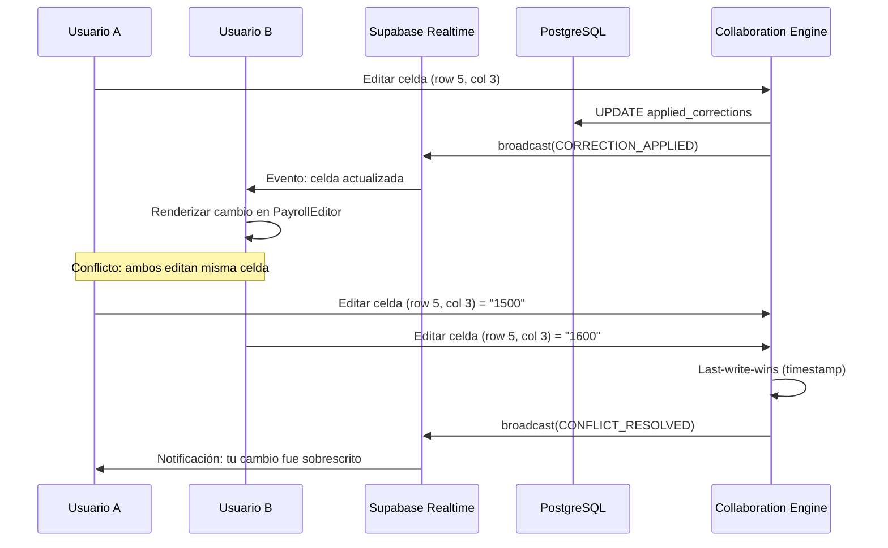
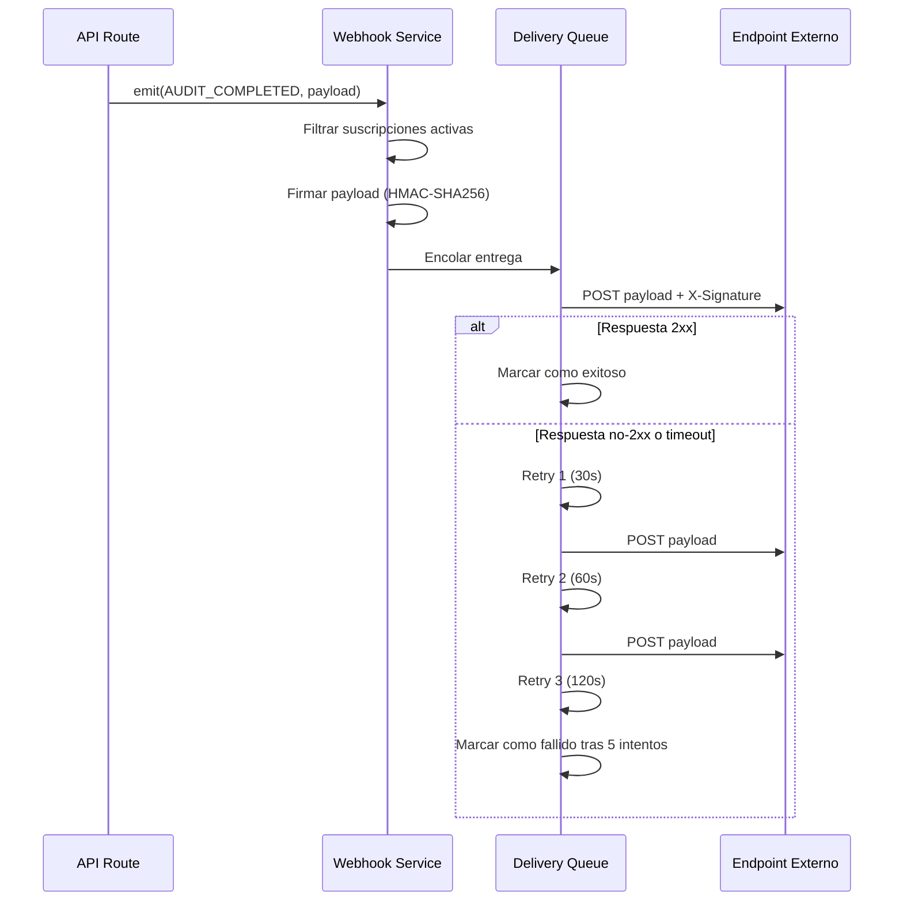

# Documento de Diseño — NominaSmart World-Class

## Visión General

Este documento describe el diseño técnico para elevar NominaSmart al nivel de referente internacional. Partiendo de la base funcional del overhaul (pipeline de 4 pasos, 7 agentes IA, RBAC, SSE streaming, i18n, 7 países), este diseño agrega 40 capacidades nuevas organizadas en 10 dominios:

1. **Enterprise**: SSO/SAML/OIDC, workspaces, audit trail, operaciones masivas, API keys
2. **IA Avanzada**: detección de anomalías, análisis predictivo, NLQ, recomendaciones inteligentes
3. **Colaboración**: tiempo real con Supabase Realtime, anotaciones, feed de actividad
4. **UI/UX**: component library (Radix), accesibilidad WCAG 2.1 AA, responsive/PWA, temas, dashboards personalizables
5. **Plataforma Developer**: API OpenAPI, versionado, SDK TypeScript, webhooks
6. **Rendimiento**: caché Redis, virtual scrolling, code splitting, Web Workers
7. **Cumplimiento**: SOC 2 readiness, GDPR, residencia de datos
8. **Reportería**: reportes programados, constructor visual, exportación PDF, benchmarking, comparativo entre periodos
9. **Onboarding**: tours guiados, tooltips contextuales, centro de ayuda
10. **Testing**: cobertura integral, E2E con Playwright, monitoreo y observabilidad

El diseño se integra con la arquitectura existente sin reescribir módulos funcionales. Las nuevas capacidades se implementan como capas adicionales sobre los servicios existentes.

Stack: Next.js 16, React 19, Supabase (PostgreSQL + RLS), Tailwind CSS 4, Vercel AI SDK, 5 proveedores IA, next-intl, Recharts, XLSX, Zod, Vitest + fast-check, Radix UI, Upstash Redis, Playwright.

## Arquitectura

### Arquitectura de Alto Nivel

```mermaid
graph TB
    subgraph Browser["Cliente (Browser)"]
        Pages["Páginas Next.js 16<br/>React 19 + Tailwind 4"]
        CompLib["Component Library<br/>Radix UI + Storybook"]
        PWA["Service Worker<br/>PWA + Offline"]
        RT["Supabase Realtime<br/>Colaboración"]
        SSE["EventSource<br/>SSE Streaming"]
        VScroll["Virtual Scrolling<br/>+ Web Workers"]
    end

    subgraph Edge["Edge Middleware"]
        MW["Middleware<br/>i18n + Auth + RBAC + SSO"]
    end

    subgraph Server["Next.js Server"]
        APIv1["API v1 Routes<br/>Guard + Rate Limit + Zod"]
        OpenAPI["OpenAPI 3.1<br/>Swagger/Scalar"]
        AgentSystem["Sistema Multi-Agente<br/>+ Anomaly + Predictive + NLQ"]
        WebhookSvc["Webhook Service<br/>HMAC-SHA256"]
        SchedulerSvc["Report Scheduler<br/>Cron Jobs"]
        CacheSvc["Cache Layer<br/>Upstash Redis"]
        CollabSvc["Collaboration Engine"]
        AuditSvc["Audit Trail Service"]
        PDFSvc["PDF Exporter"]
        BenchmarkSvc["Benchmark Engine"]
        SyncSvc["Sync Service"]
        EmailSvc["Email Service"]
        NotifSvc["Notification Service<br/>+ Web Push"]
        TourSvc["Guided Tour Service"]
    end

    subgraph AgentDetail["Agentes IA (existentes + nuevos)"]
        Dianis["👑 Dianis — Orquestador"]
        Juli["🔍 Juli — Auditora"]
        Wil["⚙️ Wil — Corrector"]
        Ana["📝 Ana — Redactora"]
        Gyoru["🐈 Gyoru — Mapeadora"]
        Luni["🐰 Luni — Experta"]
        Soul["🐕 Soul — Investigadora"]
        Anomaly["🔮 Anomaly Detector"]
        Predict["📊 Predictive Analytics"]
        NLQ["💬 NLQ Engine"]
        Recommend["💡 Recommendation Engine"]
        Bus["AgentBus v2"]
    end

    subgraph Providers["Proveedores IA"]
        OAI["OpenAI"] & ANT["Anthropic"] & GRQ["Groq"] & GOO["Google"] & ORT["OpenRouter"]
    end

    subgraph DB["Supabase"]
        PG["PostgreSQL<br/>RLS + 40+ tablas"]
        Auth["Auth + SSO<br/>SAML/OIDC"]
        Realtime["Realtime<br/>WebSocket"]
        Storage["Storage<br/>PDFs + Exports"]
    end

    subgraph External["Servicios Externos"]
        Redis["Upstash Redis<br/>Caché + Rate Limit"]
        ERP["ERPs<br/>SAP, Oracle, Workday..."]
        WebhookDest["Webhook Destinations"]
        IdP["Identity Providers<br/>SAML/OIDC"]
    end

    Pages --> MW
    CompLib --> Pages
    PWA --> Pages
    RT --> Realtime
    SSE --> APIv1
    VScroll --> Pages
    MW --> APIv1
    MW --> Auth
    APIv1 --> CacheSvc
    CacheSvc --> Redis
    APIv1 --> AgentSystem
    AgentSystem --> Bus
    Bus --> Dianis & Juli & Wil & Ana & Gyoru & Luni & Soul
    Bus --> Anomaly & Predict & NLQ & Recommend
    AgentSystem --> OAI & ANT & GRQ & GOO & ORT
    APIv1 --> PG
    APIv1 --> AuditSvc
    AuditSvc --> PG
    WebhookSvc --> WebhookDest
    SchedulerSvc --> PDFSvc
    SchedulerSvc --> EmailSvc
    CollabSvc --> Realtime
    BenchmarkSvc --> PG
    SyncSvc --> Soul
    Auth --> IdP
    APIv1 --> ERP
    PDFSvc --> Storage
```



### Flujo de Datos: Colaboración en Tiempo Real



### Flujo de Datos: Webhook Delivery



### Decisiones Arquitectónicas Clave

| Decisión | Justificación |
|----------|---------------|
| Supabase Realtime para colaboración | Ya integrado en el stack; WebSocket nativo con canales por planilla |
| Radix UI como base de Component Library | Accesibilidad nativa, composición via Slot, headless (compatible con Tailwind) |
| Upstash Redis para caché | Serverless, compatible con Vercel Edge, ya usado para rate limiting |
| API versionada con prefijo `/api/v1/` | Permite evolución sin romper integraciones; coexistencia de versiones |
| OpenAPI generado desde Zod | Single source of truth: Zod valida inputs Y genera documentación |
| PDF generado en servidor | Consistencia visual cross-browser; acceso a datos sin exponer al cliente |
| Webhooks con HMAC-SHA256 | Estándar de la industria para verificación de autenticidad |
| SSO via Supabase Auth + SAML/OIDC | Supabase soporta SAML nativamente en plan Pro; OIDC via custom provider |
| Workspaces como capa sobre companies | Extiende el modelo existente sin romper RLS por company_id |
| 4 nuevos agentes IA como extensiones del AgentBus | Se registran en el mismo bus; Dianis los orquesta como a los existentes |


## Componentes e Interfaces

### Nuevos Componentes UI

#### Enterprise y Workspaces (Req 1, 2)

| Componente | Archivo | Responsabilidad |
|-----------|---------|-----------------|
| `SSOSettings` | `src/components/admin/SSOSettings.tsx` | Configuración de Identity Provider: metadata URL, entity ID, certificado X.509, mapeo de grupos a roles |
| `WorkspaceSelector` | `src/components/layout/WorkspaceSelector.tsx` | Dropdown en Header para cambiar entre workspaces sin cerrar sesión |
| `WorkspaceManager` | `src/components/admin/WorkspaceManager.tsx` | CRUD de workspaces: nombre, descripción, país, miembros con roles (owner/editor/viewer) |
| `WorkspaceInvite` | `src/components/admin/WorkspaceInvite.tsx` | Formulario de invitación con enlace directo al workspace |

#### Audit Trail (Req 3)

| Componente | Archivo | Responsabilidad |
|-----------|---------|-----------------|
| `AuditTrailPage` | `src/app/[locale]/admin/audit-trail/page.tsx` | Página con registro cronológico, filtros (tipo, usuario, fechas, workspace, severidad) y paginación cursor |
| `AuditTrailDetail` | `src/components/admin/AuditTrailDetail.tsx` | Modal de detalle: usuario, timestamp, acción, datos antes/después, IP, user-agent |
| `AuditTrailExport` | `src/components/admin/AuditTrailExport.tsx` | Exportación a CSV y PDF del registro filtrado |

#### Operaciones Masivas (Req 4)

| Componente | Archivo | Responsabilidad |
|-----------|---------|-----------------|
| `BulkActionBar` | `src/components/ui/BulkActionBar.tsx` | Barra contextual con acciones masivas: exportar, eliminar, re-auditar, cambiar estado/prioridad |
| `BulkProgressModal` | `src/components/ui/BulkProgressModal.tsx` | Modal con barra de progreso, registros procesados/fallidos, opción de reintentar fallidos |
| `MultiFileUpload` | `src/components/ui/MultiFileUpload.tsx` | Extensión de UploadZone para múltiples archivos con procesamiento secuencial |

#### Reportería Avanzada (Req 5, 10, 27, 28)

| Componente | Archivo | Responsabilidad |
|-----------|---------|-----------------|
| `ScheduledReportForm` | `src/components/reports/ScheduledReportForm.tsx` | Configuración: tipo, filtros, formato, destinatarios, frecuencia (cron) |
| `ScheduledReportList` | `src/components/reports/ScheduledReportList.tsx` | Lista de reportes programados con pausar/reanudar/eliminar |
| `ComparativeView` | `src/components/reports/ComparativeView.tsx` | Vista lado a lado de dos periodos con diferencias resaltadas (>5%) |
| `ReportBuilder` | `src/components/reports/ReportBuilder.tsx` | Constructor visual drag-and-drop: campos, métricas, filtros, visualizaciones |
| `ReportBuilderCanvas` | `src/components/reports/ReportBuilderCanvas.tsx` | Área de diseño del reporte con vista previa en tiempo real |
| `PDFPreview` | `src/components/reports/PDFPreview.tsx` | Vista previa del PDF con indicador de progreso de generación |

#### Webhooks (Req 6)

| Componente | Archivo | Responsabilidad |
|-----------|---------|-----------------|
| `WebhookSettings` | `src/components/settings/WebhookSettings.tsx` | CRUD de webhooks: endpoint, eventos, secreto HMAC, test de entrega |
| `WebhookDeliveryLog` | `src/components/settings/WebhookDeliveryLog.tsx` | Log de entregas: estado, código HTTP, tiempo de respuesta |

#### IA Avanzada (Req 7, 8, 9, 39)

| Componente | Archivo | Responsabilidad |
|-----------|---------|-----------------|
| `AnomalyPanel` | `src/components/dashboard/AnomalyPanel.tsx` | Panel de anomalías con tendencias, drill-down por empleado/concepto |
| `ForecastChart` | `src/components/dashboard/ForecastChart.tsx` | Gráfico Recharts con bandas de confianza (optimista/esperado/pesimista) |
| `ForecastSettings` | `src/components/dashboard/ForecastSettings.tsx` | Ajuste de parámetros: tasa crecimiento, incremento salarial, cambios regulatorios |
| `NLQInput` | `src/components/ai/NLQInput.tsx` | Input de lenguaje natural integrado en AiSidebar con fuentes de datos |
| `RecommendationCards` | `src/components/dashboard/RecommendationCards.tsx` | Hasta 5 recomendaciones priorizadas con categoría, explicación y acción |

#### Colaboración (Req 11, 12, 13)

| Componente | Archivo | Responsabilidad |
|-----------|---------|-----------------|
| `PresenceIndicator` | `src/components/collab/PresenceIndicator.tsx` | Avatares y cursores de usuarios conectados a la misma planilla |
| `ConflictNotification` | `src/components/collab/ConflictNotification.tsx` | Notificación de conflicto con opción de revertir |
| `AnnotationThread` | `src/components/collab/AnnotationThread.tsx` | Hilo de comentarios asociado a celda/hallazgo/action item |
| `AnnotationBadge` | `src/components/collab/AnnotationBadge.tsx` | Indicador visual de anotaciones activas en celdas |
| `ActivityFeed` | `src/components/collab/ActivityFeed.tsx` | Flujo cronológico con filtros, agrupación y actualización en tiempo real |
| `ActivityWidget` | `src/components/dashboard/ActivityWidget.tsx` | Widget de últimas 10 actividades para el dashboard |

#### Component Library (Req 14)

| Componente | Archivo | Base |
|-----------|---------|------|
| `Button` | `src/components/ui/Button.tsx` | Radix Slot — variantes: primary, secondary, destructive, outline, ghost |
| `Input` | `src/components/ui/Input.tsx` | Radix — variantes: default, error, disabled |
| `Select` | `src/components/ui/Select.tsx` | Radix Select |
| `Checkbox` | `src/components/ui/Checkbox.tsx` | Radix Checkbox |
| `Dialog` | `src/components/ui/Dialog.tsx` | Radix Dialog — focus trap, escape to close |
| `Sheet` | `src/components/ui/Sheet.tsx` | Radix Dialog variant — drawer lateral |
| `DropdownMenu` | `src/components/ui/DropdownMenu.tsx` | Radix DropdownMenu |
| `CommandPalette` | `src/components/ui/CommandPalette.tsx` | Radix + cmdk — búsqueda global Cmd+K |
| `Toast` | `src/components/ui/Toast.tsx` | Radix Toast — notificaciones efímeras |
| `Tabs` | `src/components/ui/Tabs.tsx` | Radix Tabs |
| `Accordion` | `src/components/ui/Accordion.tsx` | Radix Accordion |
| `Tooltip` | `src/components/ui/Tooltip.tsx` | Radix Tooltip |
| `Popover` | `src/components/ui/Popover.tsx` | Radix Popover |
| `Pagination` | `src/components/ui/Pagination.tsx` | Custom — cursor-based |
| `Skeleton` | `src/components/ui/Skeleton.tsx` | Custom — loading placeholder |
| `Spinner` | `src/components/ui/Spinner.tsx` | Custom — loading indicator |
| `Toggle` | `src/components/ui/Toggle.tsx` | Radix Toggle |
| `Radio` | `src/components/ui/Radio.tsx` | Radix RadioGroup |
| `Textarea` | `src/components/ui/Textarea.tsx` | Custom — auto-resize |
| `Label` | `src/components/ui/Label.tsx` | Radix Label |
| `Badge` | `src/components/ui/Badge.tsx` | Custom — variantes por severidad |
| `Avatar` | `src/components/ui/Avatar.tsx` | Radix Avatar — fallback initials |
| `Alert` | `src/components/ui/Alert.tsx` | Custom — info, warning, error, success |

Todos exportados desde `src/components/ui/index.ts` (barrel file).

#### Accesibilidad y Responsive (Req 15, 16)

| Componente | Archivo | Responsabilidad |
|-----------|---------|-----------------|
| `SkipToContent` | `src/components/a11y/SkipToContent.tsx` | Enlace "Saltar al contenido" visible al Tab |
| `FocusTrap` | `src/components/a11y/FocusTrap.tsx` | Wrapper que atrapa foco dentro de modales |
| `LiveRegion` | `src/components/a11y/LiveRegion.tsx` | Región ARIA live para anuncios dinámicos |
| `MobileDrawer` | `src/components/layout/MobileDrawer.tsx` | Sidebar como drawer en viewport < 1024px |
| `ResponsivePayrollEditor` | `src/components/ui/ResponsivePayrollEditor.tsx` | PayrollEditor con columnas fijas y scroll horizontal en mobile |

#### Temas y Dashboard Personalizable (Req 17, 18)

| Componente | Archivo | Responsabilidad |
|-----------|---------|-----------------|
| `ThemeToggle` | `src/components/layout/ThemeToggle.tsx` | Selector claro/oscuro/auto en Header |
| `ThemeProvider` | `src/components/providers/ThemeProvider.tsx` | Provider que aplica tema via CSS custom properties |
| `DashboardGrid` | `src/components/dashboard/DashboardGrid.tsx` | Grid drag-and-drop de widgets con persistencia de layout |
| `WidgetCatalog` | `src/components/dashboard/WidgetCatalog.tsx` | Catálogo de widgets disponibles para agregar |
| `WidgetWrapper` | `src/components/dashboard/WidgetWrapper.tsx` | Wrapper con error boundary individual por widget |

#### Onboarding (Req 30, 31)

| Componente | Archivo | Responsabilidad |
|-----------|---------|-----------------|
| `GuidedTour` | `src/components/onboarding/GuidedTour.tsx` | Tour interactivo con overlay, tooltip, avanzar/retroceder/cancelar |
| `TourStep` | `src/components/onboarding/TourStep.tsx` | Paso individual con highlight de elemento y texto explicativo |
| `ContextualTooltip` | `src/components/onboarding/ContextualTooltip.tsx` | Icono ? con tooltip explicativo junto a campos complejos |
| `HelpCenter` | `src/components/help/HelpCenter.tsx` | Panel lateral de ayuda con búsqueda, FAQ, artículos contextuales |
| `FeedbackWidget` | `src/components/help/FeedbackWidget.tsx` | Widget de feedback con captura automática de contexto |

### Nuevos Servicios Backend

#### Servicios de Dominio

| Servicio | Archivo | Responsabilidad |
|----------|---------|-----------------|
| `WorkspaceService` | `src/lib/workspaces/workspace-service.ts` | CRUD workspaces, gestión de miembros, cambio de workspace activo |
| `SSOService` | `src/lib/auth/sso-service.ts` | Configuración SAML/OIDC, JIT provisioning, mapeo de atributos |
| `WebhookService` | `src/lib/webhooks/webhook-service.ts` | Registro, firma HMAC-SHA256, entrega con retry, log de entregas |
| `SchedulerService` | `src/lib/scheduler/scheduler-service.ts` | Programación de reportes, ejecución cron, historial de ejecuciones |
| `CollaborationEngine` | `src/lib/collab/collaboration-engine.ts` | Presencia, propagación de cambios via Realtime, resolución de conflictos |
| `AnnotationService` | `src/lib/collab/annotation-service.ts` | CRUD anotaciones, hilos, menciones, resolución |
| `ActivityService` | `src/lib/collab/activity-service.ts` | Registro y consulta de actividades, agrupación, tiempo real |
| `CacheLayer` | `src/lib/cache/cache-layer.ts` | Cache-aside con Redis, TTL configurable, invalidación, fallback a DB |
| `PDFExporter` | `src/lib/reports/pdf-exporter.ts` | Generación de PDF en servidor con logo, tablas, gráficos, índice |
| `ReportBuilderService` | `src/lib/reports/report-builder-service.ts` | Ejecución de reportes personalizados, plantillas predefinidas |
| `BenchmarkEngine` | `src/lib/benchmark/benchmark-engine.ts` | Datos agregados anonimizados, percentiles, actualización trimestral |
| `GuidedTourService` | `src/lib/onboarding/guided-tour-service.ts` | Progreso de tours, tours por rol, reinicio |
| `HelpService` | `src/lib/help/help-service.ts` | Artículos contextuales, búsqueda, FAQ localizado |
| `APIKeyService` | `src/lib/auth/api-key-service.ts` | Creación (hash SHA-256), validación, revocación, permisos |
| `DataResidencyService` | `src/lib/compliance/data-residency-service.ts` | Selección de región, verificación de residencia, transferencias |
| `GDPRService` | `src/lib/compliance/gdpr-service.ts` | Consentimiento, exportación de datos, derecho al olvido, ROPA |
| `HealthMonitor` | `src/lib/monitoring/health-monitor.ts` | Health checks: Supabase, Redis, proveedores IA, disco |
| `MetricsCollector` | `src/lib/monitoring/metrics-collector.ts` | Latencia API, tasa errores, Web Vitals, structured logging |

#### Nuevos Agentes IA

| Agente | Archivo | Responsabilidad |
|--------|---------|-----------------|
| `AnomalyDetector` | `src/lib/ai/agents/anomaly-detector.ts` | Detección de patrones atípicos: outliers, variaciones entre periodos, redondeo sospechoso |
| `PredictiveAnalytics` | `src/lib/ai/agents/predictive-analytics.ts` | Forecasting de costos: tendencias, estacionalidad, cambios regulatorios |
| `NLQEngine` | `src/lib/ai/agents/nlq-engine.ts` | Traducción de consultas en lenguaje natural a queries sobre datos de nómina |
| `RecommendationEngine` | `src/lib/ai/agents/recommendation-engine.ts` | Recomendaciones priorizadas basadas en patrones, hallazgos recurrentes, cambios regulatorios |

Estos agentes se registran en el `AgentBus v2` existente y son orquestados por Dianis:

```typescript
// Extensión del registro de agentes existente
function getAgentRegistry(): Map<string, AgentDefinition> {
  const registry = new Map<string, AgentDefinition>();
  // Agentes existentes
  registry.set('auditor', createAuditorAgent());
  registry.set('writer', createWriterAgent());
  registry.set('corrector', createCorrectorAgent());
  registry.set('mapper', createMapperAgent());
  registry.set('payroll-expert', createPayrollExpertAgent());
  registry.set('researcher', createResearcherAgent());
  // Nuevos agentes
  registry.set('anomaly-detector', createAnomalyDetectorAgent());
  registry.set('predictive', createPredictiveAnalyticsAgent());
  registry.set('nlq', createNLQEngineAgent());
  registry.set('recommender', createRecommendationEngineAgent());
  return registry;
}
```

### Nuevas API Routes

| Ruta | Método | Guard | Descripción |
|------|--------|-------|-------------|
| `/api/v1/workspaces` | GET/POST | requireAuth | CRUD workspaces |
| `/api/v1/workspaces/[id]/members` | GET/POST/DELETE | requireWorkspaceOwner | Gestión de miembros |
| `/api/v1/audit-trail` | GET | requireAdmin | Registro de auditoría con paginación cursor |
| `/api/v1/audit-trail/export` | POST | requireAdmin | Exportar a CSV/PDF |
| `/api/v1/bulk/payrolls` | POST | requireAnalystOrAdmin | Operaciones masivas sobre planillas |
| `/api/v1/bulk/actions` | PATCH | requireAnalystOrAdmin | Operaciones masivas sobre action items |
| `/api/v1/scheduled-reports` | GET/POST | requireAuth | CRUD reportes programados |
| `/api/v1/scheduled-reports/[id]` | PATCH/DELETE | requireAuth | Pausar/reanudar/eliminar |
| `/api/v1/scheduled-reports/[id]/execute` | POST | requireAuth | Ejecutar manualmente |
| `/api/v1/webhooks` | GET/POST | requireAdmin | CRUD webhooks |
| `/api/v1/webhooks/[id]/test` | POST | requireAdmin | Enviar evento de prueba |
| `/api/v1/webhooks/[id]/deliveries` | GET | requireAdmin | Log de entregas |
| `/api/v1/anomalies` | GET | requireAuth | Anomalías detectadas del workspace |
| `/api/v1/forecast` | GET/POST | requireAuth | Proyecciones de costos |
| `/api/v1/nlq` | POST | requireAuth | Consulta en lenguaje natural |
| `/api/v1/compare` | POST | requireAuth | Análisis comparativo entre periodos |
| `/api/v1/annotations` | GET/POST | requireAuth | CRUD anotaciones |
| `/api/v1/annotations/[id]/replies` | POST | requireAuth | Respuestas en hilo |
| `/api/v1/annotations/[id]/resolve` | PATCH | requireAuth | Resolver anotación |
| `/api/v1/activity` | GET | requireAuth | Feed de actividad del workspace |
| `/api/v1/reports/build` | POST | requireAuth | Ejecutar reporte personalizado |
| `/api/v1/reports/templates` | GET | requireAuth | Plantillas predefinidas |
| `/api/v1/reports/[id]/pdf` | GET | requireAuth | Descargar PDF generado |
| `/api/v1/benchmarks` | GET | requireAuth | Datos de benchmarking |
| `/api/v1/api-keys` | GET/POST | requireAdmin | CRUD API keys |
| `/api/v1/api-keys/[id]/revoke` | POST | requireAdmin | Revocar API key |
| `/api/v1/settings/sso` | GET/POST | requireAdmin | Configuración SSO |
| `/api/v1/settings/theme` | GET/PATCH | requireAuth | Preferencia de tema |
| `/api/v1/settings/notifications` | GET/PATCH | requireAuth | Preferencias de notificación |
| `/api/v1/settings/data-residency` | GET/PATCH | requireAdmin | Región de almacenamiento |
| `/api/v1/gdpr/export` | POST | requireAuth | Exportar datos personales |
| `/api/v1/gdpr/delete` | POST | requireAuth | Solicitar eliminación |
| `/api/v1/gdpr/consent` | GET/POST | requireAuth | Gestión de consentimiento |
| `/api/v1/tours/progress` | GET/PATCH | requireAuth | Progreso de tours guiados |
| `/api/v1/recommendations` | GET | requireAuth | Recomendaciones del dashboard |
| `/api/v1/recommendations/[id]/dismiss` | POST | requireAuth | Descartar recomendación |
| `/api/v1/health` | GET | — | Health check público |
| `/api/v1/docs/openapi.json` | GET | requireAuth | Especificación OpenAPI 3.1 |
| `/api/docs` | GET | requireAuth | Swagger UI / Scalar |

### Interfaces Clave

#### Webhook System

```typescript
interface WebhookConfig {
  id: string;
  workspaceId: string;
  url: string;
  secret: string; // Para HMAC-SHA256
  events: WebhookEvent[];
  isActive: boolean;
  createdBy: string;
}

type WebhookEvent =
  | 'payroll.uploaded'
  | 'audit.completed'
  | 'correction.applied'
  | 'report.generated'
  | 'rule.updated'
  | 'user.invited'
  | 'action.status_changed';

interface WebhookPayload {
  id: string;
  event: WebhookEvent;
  timestamp: string;
  data: Record<string, unknown>;
  signature: string; // HMAC-SHA256(secret, JSON.stringify(data))
}

interface WebhookDelivery {
  id: string;
  webhookId: string;
  event: WebhookEvent;
  status: 'success' | 'failed' | 'pending';
  httpStatus: number | null;
  responseTimeMs: number | null;
  attempts: number;
  lastAttemptAt: string;
  nextRetryAt: string | null;
}
```

#### Cache Layer

```typescript
interface CacheConfig {
  rules: { ttlSeconds: 3600 };       // 1 hora
  dashboard: { ttlSeconds: 300 };     // 5 minutos
  providers: { ttlSeconds: 900 };     // 15 minutos
  userProfile: { ttlSeconds: 600 };   // 10 minutos
}

interface CacheLayer {
  get<T>(key: string): Promise<T | null>;
  set<T>(key: string, value: T, ttlSeconds: number): Promise<void>;
  invalidate(pattern: string): Promise<void>;
  getOrFetch<T>(key: string, fetcher: () => Promise<T>, ttlSeconds: number): Promise<T>;
}
```

#### Collaboration Engine

```typescript
interface PresenceState {
  userId: string;
  userName: string;
  avatarUrl: string | null;
  cursorPosition: { row: number; col: number } | null;
  lastActiveAt: string;
}

interface CollaborationEvent {
  type: 'correction_applied' | 'presence_update' | 'conflict_resolved';
  payrollId: string;
  userId: string;
  data: Record<string, unknown>;
  timestamp: string;
}
```

#### API Key Management

```typescript
interface APIKey {
  id: string;
  name: string;
  keyHash: string; // SHA-256 del key
  keyPrefix: string; // Últimos 4 caracteres para display
  permissions: ('read' | 'write' | 'admin')[];
  workspaceId: string;
  createdBy: string;
  expiresAt: string | null;
  lastUsedAt: string | null;
  isRevoked: boolean;
}
```

#### Anomaly Detection

```typescript
interface AnomalyResult {
  id: string;
  payrollId: string;
  employeeDoc: string | null;
  category: 'potential_fraud' | 'systematic_error' | 'seasonal_variation' | 'legitimate_change';
  confidence: 'high' | 'medium' | 'low';
  description: string; // Explicación en lenguaje natural
  recommendation: string;
  dataPoints: {
    currentValue: number;
    historicalAverage: number;
    deviation: number;
    periods: { year: number; month: number; value: number }[];
  };
}
```

#### Report Scheduler

```typescript
interface ScheduledReport {
  id: string;
  workspaceId: string;
  createdBy: string;
  name: string;
  reportType: 'executive' | 'risk_detail' | 'comparative' | 'compliance' | 'cost_analysis' | 'custom';
  filters: {
    companyIds?: string[];
    countryCode?: string;
    periodRange?: { from: string; to: string };
  };
  outputFormat: 'excel' | 'pdf';
  recipients: string[]; // emails
  cronExpression: string;
  isActive: boolean;
  lastRunAt: string | null;
  lastRunStatus: 'success' | 'failed' | null;
  nextRunAt: string;
}
```


## Modelos de Datos

### Nuevas Tablas (PostgreSQL + RLS)

```mermaid
erDiagram
    workspaces ||--o{ workspace_members : "tiene"
    workspaces ||--o{ payroll_uploads : "contiene"
    workspaces ||--o{ webhooks : "configura"
    workspaces ||--o{ scheduled_reports : "programa"
    workspaces ||--o{ annotations : "contiene"
    workspaces ||--o{ activity_log : "registra"
    workspaces ||--o{ api_keys : "emite"
    workspaces ||--o{ benchmark_data : "compara"
    user_profiles ||--o{ workspace_members : "pertenece"
    user_profiles ||--o{ guided_tour_progress : "progresa"
    user_profiles ||--o{ notification_preferences : "configura"
    user_profiles ||--o{ dashboard_layouts : "personaliza"
    user_profiles ||--o{ recommendation_dismissals : "descarta"
    webhooks ||--o{ webhook_deliveries : "entrega"
    scheduled_reports ||--o{ scheduled_report_runs : "ejecuta"
    annotations ||--o{ annotation_replies : "responde"
    payroll_uploads ||--o{ anomaly_detections : "detecta"
    payroll_uploads ||--o{ forecast_snapshots : "proyecta"
    sso_configurations ||--|| workspaces : "configura"
    audit_trail_extended ||--o{ workspaces : "registra"

    workspaces {
        uuid id PK
        varchar name
        text description
        varchar default_country_code
        varchar data_region "na | sa | eu | ap"
        uuid organization_id FK
        timestamp created_at
        timestamp updated_at
    }

    workspace_members {
        uuid id PK
        uuid workspace_id FK
        uuid user_id FK
        varchar role "owner | editor | viewer"
        timestamp joined_at
        timestamp invited_at
        varchar invite_status "pending | accepted | expired"
    }

    sso_configurations {
        uuid id PK
        uuid workspace_id FK
        varchar protocol "saml | oidc"
        text metadata_url
        varchar entity_id
        text certificate_x509
        jsonb group_role_mapping
        varchar default_role "admin | analyst | client"
        boolean is_active
        timestamp created_at
    }

    audit_trail_extended {
        uuid id PK
        uuid workspace_id FK
        uuid user_id FK
        varchar action_type
        varchar resource_type
        uuid resource_id
        jsonb data_before
        jsonb data_after
        varchar ip_address
        varchar user_agent
        varchar severity "info | warning | critical"
        timestamp created_at
    }

    webhooks {
        uuid id PK
        uuid workspace_id FK
        varchar url
        text secret_encrypted
        varchar[] events
        boolean is_active
        uuid created_by FK
        timestamp created_at
    }

    webhook_deliveries {
        uuid id PK
        uuid webhook_id FK
        varchar event_type
        varchar status "success | failed | pending"
        int http_status
        int response_time_ms
        int attempts
        timestamp last_attempt_at
        timestamp next_retry_at
        jsonb payload_summary
        timestamp created_at
    }

    scheduled_reports {
        uuid id PK
        uuid workspace_id FK
        uuid created_by FK
        varchar name
        varchar report_type
        jsonb filters
        varchar output_format "excel | pdf"
        varchar[] recipients
        varchar cron_expression
        boolean is_active
        timestamp next_run_at
        timestamp created_at
    }

    scheduled_report_runs {
        uuid id PK
        uuid scheduled_report_id FK
        varchar status "success | failed"
        varchar file_url
        text error_message
        timestamp executed_at
    }

    annotations {
        uuid id PK
        uuid workspace_id FK
        uuid author_id FK
        varchar target_type "cell | finding | action_item | report_section"
        uuid target_id
        jsonb target_metadata
        text content
        varchar[] mentions
        boolean is_resolved
        timestamp created_at
        timestamp resolved_at
    }

    annotation_replies {
        uuid id PK
        uuid annotation_id FK
        uuid author_id FK
        text content
        varchar[] mentions
        timestamp created_at
    }

    activity_log {
        uuid id PK
        uuid workspace_id FK
        uuid user_id FK
        varchar activity_type
        varchar resource_type
        uuid resource_id
        jsonb metadata
        varchar group_key
        timestamp created_at
    }

    anomaly_detections {
        uuid id PK
        uuid payroll_id FK
        uuid workspace_id FK
        varchar employee_doc
        varchar category "potential_fraud | systematic_error | seasonal_variation | legitimate_change"
        varchar confidence "high | medium | low"
        text description
        text recommendation
        jsonb data_points
        timestamp created_at
    }

    forecast_snapshots {
        uuid id PK
        uuid workspace_id FK
        uuid company_id FK
        varchar country_code
        jsonb projections
        jsonb parameters
        timestamp generated_at
    }

    api_keys {
        uuid id PK
        uuid workspace_id FK
        uuid created_by FK
        varchar name
        varchar key_hash
        varchar key_prefix
        varchar[] permissions "read | write | admin"
        timestamp expires_at
        timestamp last_used_at
        boolean is_revoked
        timestamp created_at
    }

    benchmark_data {
        uuid id PK
        varchar industry
        varchar country_code
        varchar company_size "small | medium | large | enterprise"
        int period_year
        int period_quarter
        decimal avg_cost_per_employee
        decimal avg_contribution_ratio
        decimal avg_risk_score
        int sample_count
        timestamp calculated_at
    }

    guided_tour_progress {
        uuid id PK
        uuid user_id FK
        varchar tour_id
        int completed_steps
        int total_steps
        boolean is_completed
        boolean is_dismissed
        timestamp started_at
        timestamp completed_at
    }

    notification_preferences {
        uuid id PK
        uuid user_id FK
        varchar event_type
        boolean in_app
        boolean email
        boolean web_push
        varchar digest_frequency "none | daily | weekly"
    }

    dashboard_layouts {
        uuid id PK
        uuid user_id FK
        uuid workspace_id FK
        jsonb widget_config
        varchar preset "executive | analyst | admin | custom"
        timestamp updated_at
    }

    recommendation_dismissals {
        uuid id PK
        uuid user_id FK
        varchar recommendation_type
        varchar recommendation_key
        timestamp dismissed_at
        timestamp expires_at
    }

    gdpr_consent_log {
        uuid id PK
        uuid user_id FK
        varchar consent_type
        varchar policy_version
        varchar method "explicit_click | sso_acceptance"
        boolean granted
        timestamp created_at
    }

    gdpr_deletion_requests {
        uuid id PK
        uuid user_id FK
        varchar status "pending | processing | completed | cancelled"
        timestamp requested_at
        timestamp grace_period_ends_at
        timestamp completed_at
    }

    custom_reports {
        uuid id PK
        uuid workspace_id FK
        uuid created_by FK
        varchar name
        text description
        jsonb report_config
        boolean is_shared
        timestamp created_at
        timestamp updated_at
    }

    report_builder_templates {
        uuid id PK
        varchar template_key
        varchar name
        text description
        jsonb default_config
        varchar category
    }
```



### Esquemas de Validación (Zod) — Nuevos

```typescript
// Workspace
const WorkspaceSchema = z.object({
  name: z.string().min(1).max(100),
  description: z.string().max(500).optional(),
  default_country_code: z.string().length(2),
  data_region: z.enum(['na', 'sa', 'eu', 'ap']).default('sa'),
});

// Webhook
const WebhookSchema = z.object({
  url: z.string().url().max(500),
  events: z.array(z.enum([
    'payroll.uploaded', 'audit.completed', 'correction.applied',
    'report.generated', 'rule.updated', 'user.invited', 'action.status_changed',
  ])).min(1),
  is_active: z.boolean().default(true),
});

// Scheduled Report
const ScheduledReportSchema = z.object({
  name: z.string().min(1).max(200),
  report_type: z.enum(['executive', 'risk_detail', 'comparative', 'compliance', 'cost_analysis', 'custom']),
  filters: z.object({
    companyIds: z.array(z.string().uuid()).optional(),
    countryCode: z.string().length(2).optional(),
    periodRange: z.object({
      from: z.string(),
      to: z.string(),
    }).optional(),
  }),
  output_format: z.enum(['excel', 'pdf']),
  recipients: z.array(z.string().email()).min(1).max(20),
  cron_expression: z.string().min(1).max(100),
});

// Annotation
const AnnotationSchema = z.object({
  target_type: z.enum(['cell', 'finding', 'action_item', 'report_section']),
  target_id: z.string().uuid(),
  target_metadata: z.record(z.unknown()).optional(),
  content: z.string().min(1).max(5000),
  mentions: z.array(z.string().uuid()).optional(),
});

// API Key
const APIKeyCreateSchema = z.object({
  name: z.string().min(1).max(100),
  permissions: z.array(z.enum(['read', 'write', 'admin'])).min(1),
  expires_at: z.string().datetime().optional(),
});

// NLQ Query
const NLQQuerySchema = z.object({
  query: z.string().min(1).max(1000),
  locale: z.enum(['es', 'en', 'pt', 'fr', 'de']).default('es'),
  workspace_id: z.string().uuid(),
});

// Forecast Parameters
const ForecastParamsSchema = z.object({
  company_id: z.string().uuid(),
  months_ahead: z.enum([3, 6, 12] as const).default(6),
  growth_rate: z.number().min(-0.5).max(1.0).optional(),
  salary_increase: z.number().min(0).max(0.5).optional(),
  regulatory_changes: z.array(z.object({
    description: z.string(),
    impact_percentage: z.number(),
    effective_month: z.number().min(1).max(12),
  })).optional(),
});

// GDPR Consent
const GDPRConsentSchema = z.object({
  consent_type: z.enum(['data_processing', 'analytics', 'marketing']),
  policy_version: z.string(),
  granted: z.boolean(),
});

// Webhook HMAC Verification
const WebhookVerifySchema = z.object({
  payload: z.string(),
  signature: z.string(),
  secret: z.string(),
});

// Dashboard Layout
const DashboardLayoutSchema = z.object({
  widget_config: z.array(z.object({
    widget_id: z.string(),
    position: z.object({ x: z.number(), y: z.number(), w: z.number(), h: z.number() }),
    settings: z.record(z.unknown()).optional(),
  })),
  preset: z.enum(['executive', 'analyst', 'admin', 'custom']).default('custom'),
});

// Benchmark Query
const BenchmarkQuerySchema = z.object({
  industry: z.string().optional(),
  country_code: z.string().length(2).optional(),
  company_size: z.enum(['small', 'medium', 'large', 'enterprise']).optional(),
  period_year: z.number().int().min(2020).max(2030).optional(),
});

// Error Response (formato consistente Req 19.4)
const APIErrorSchema = z.object({
  error: z.string(),
  code: z.string(),
  details: z.record(z.unknown()).optional(),
  requestId: z.string(),
});
```

### Migración SQL

```sql
-- 007_world_class_tables.sql

-- Workspaces
CREATE TABLE workspaces (
  id UUID PRIMARY KEY DEFAULT gen_random_uuid(),
  name VARCHAR(100) NOT NULL,
  description TEXT,
  default_country_code VARCHAR(2) NOT NULL DEFAULT 'CO',
  data_region VARCHAR(2) NOT NULL DEFAULT 'sa',
  organization_id UUID,
  created_at TIMESTAMPTZ DEFAULT now(),
  updated_at TIMESTAMPTZ DEFAULT now()
);

CREATE TABLE workspace_members (
  id UUID PRIMARY KEY DEFAULT gen_random_uuid(),
  workspace_id UUID NOT NULL REFERENCES workspaces(id) ON DELETE CASCADE,
  user_id UUID NOT NULL REFERENCES user_profiles(id) ON DELETE CASCADE,
  role VARCHAR(10) NOT NULL CHECK (role IN ('owner', 'editor', 'viewer')),
  joined_at TIMESTAMPTZ,
  invited_at TIMESTAMPTZ DEFAULT now(),
  invite_status VARCHAR(10) NOT NULL DEFAULT 'pending' CHECK (invite_status IN ('pending', 'accepted', 'expired')),
  UNIQUE(workspace_id, user_id)
);

-- SSO
CREATE TABLE sso_configurations (
  id UUID PRIMARY KEY DEFAULT gen_random_uuid(),
  workspace_id UUID NOT NULL REFERENCES workspaces(id) ON DELETE CASCADE,
  protocol VARCHAR(4) NOT NULL CHECK (protocol IN ('saml', 'oidc')),
  metadata_url TEXT NOT NULL,
  entity_id VARCHAR(500),
  certificate_x509 TEXT,
  group_role_mapping JSONB DEFAULT '{}',
  default_role VARCHAR(10) NOT NULL DEFAULT 'client',
  is_active BOOLEAN DEFAULT false,
  created_at TIMESTAMPTZ DEFAULT now(),
  UNIQUE(workspace_id)
);

-- Audit Trail Extended
CREATE TABLE audit_trail_extended (
  id UUID PRIMARY KEY DEFAULT gen_random_uuid(),
  workspace_id UUID REFERENCES workspaces(id),
  user_id UUID REFERENCES user_profiles(id),
  action_type VARCHAR(50) NOT NULL,
  resource_type VARCHAR(50) NOT NULL,
  resource_id UUID,
  data_before JSONB,
  data_after JSONB,
  ip_address VARCHAR(45),
  user_agent TEXT,
  severity VARCHAR(10) DEFAULT 'info' CHECK (severity IN ('info', 'warning', 'critical')),
  created_at TIMESTAMPTZ DEFAULT now()
);
CREATE INDEX idx_audit_trail_workspace_created ON audit_trail_extended(workspace_id, created_at DESC);
CREATE INDEX idx_audit_trail_action_type ON audit_trail_extended(action_type);
CREATE INDEX idx_audit_trail_user ON audit_trail_extended(user_id);

-- Webhooks
CREATE TABLE webhooks (
  id UUID PRIMARY KEY DEFAULT gen_random_uuid(),
  workspace_id UUID NOT NULL REFERENCES workspaces(id) ON DELETE CASCADE,
  url VARCHAR(500) NOT NULL,
  secret_encrypted TEXT NOT NULL,
  events VARCHAR(50)[] NOT NULL,
  is_active BOOLEAN DEFAULT true,
  created_by UUID NOT NULL REFERENCES user_profiles(id),
  created_at TIMESTAMPTZ DEFAULT now()
);

CREATE TABLE webhook_deliveries (
  id UUID PRIMARY KEY DEFAULT gen_random_uuid(),
  webhook_id UUID NOT NULL REFERENCES webhooks(id) ON DELETE CASCADE,
  event_type VARCHAR(50) NOT NULL,
  status VARCHAR(10) NOT NULL DEFAULT 'pending' CHECK (status IN ('success', 'failed', 'pending')),
  http_status INT,
  response_time_ms INT,
  attempts INT DEFAULT 0,
  last_attempt_at TIMESTAMPTZ,
  next_retry_at TIMESTAMPTZ,
  payload_summary JSONB,
  created_at TIMESTAMPTZ DEFAULT now()
);

-- Scheduled Reports
CREATE TABLE scheduled_reports (
  id UUID PRIMARY KEY DEFAULT gen_random_uuid(),
  workspace_id UUID NOT NULL REFERENCES workspaces(id) ON DELETE CASCADE,
  created_by UUID NOT NULL REFERENCES user_profiles(id),
  name VARCHAR(200) NOT NULL,
  report_type VARCHAR(20) NOT NULL,
  filters JSONB DEFAULT '{}',
  output_format VARCHAR(5) NOT NULL DEFAULT 'pdf',
  recipients VARCHAR(255)[] NOT NULL,
  cron_expression VARCHAR(100) NOT NULL,
  is_active BOOLEAN DEFAULT true,
  next_run_at TIMESTAMPTZ,
  created_at TIMESTAMPTZ DEFAULT now()
);

CREATE TABLE scheduled_report_runs (
  id UUID PRIMARY KEY DEFAULT gen_random_uuid(),
  scheduled_report_id UUID NOT NULL REFERENCES scheduled_reports(id) ON DELETE CASCADE,
  status VARCHAR(10) NOT NULL CHECK (status IN ('success', 'failed')),
  file_url TEXT,
  error_message TEXT,
  executed_at TIMESTAMPTZ DEFAULT now()
);

-- Annotations
CREATE TABLE annotations (
  id UUID PRIMARY KEY DEFAULT gen_random_uuid(),
  workspace_id UUID NOT NULL REFERENCES workspaces(id) ON DELETE CASCADE,
  author_id UUID NOT NULL REFERENCES user_profiles(id),
  target_type VARCHAR(20) NOT NULL CHECK (target_type IN ('cell', 'finding', 'action_item', 'report_section')),
  target_id UUID NOT NULL,
  target_metadata JSONB,
  content TEXT NOT NULL,
  mentions UUID[],
  is_resolved BOOLEAN DEFAULT false,
  created_at TIMESTAMPTZ DEFAULT now(),
  resolved_at TIMESTAMPTZ
);

CREATE TABLE annotation_replies (
  id UUID PRIMARY KEY DEFAULT gen_random_uuid(),
  annotation_id UUID NOT NULL REFERENCES annotations(id) ON DELETE CASCADE,
  author_id UUID NOT NULL REFERENCES user_profiles(id),
  content TEXT NOT NULL,
  mentions UUID[],
  created_at TIMESTAMPTZ DEFAULT now()
);

-- Activity Log
CREATE TABLE activity_log (
  id UUID PRIMARY KEY DEFAULT gen_random_uuid(),
  workspace_id UUID NOT NULL REFERENCES workspaces(id) ON DELETE CASCADE,
  user_id UUID NOT NULL REFERENCES user_profiles(id),
  activity_type VARCHAR(50) NOT NULL,
  resource_type VARCHAR(50),
  resource_id UUID,
  metadata JSONB,
  group_key VARCHAR(200),
  created_at TIMESTAMPTZ DEFAULT now()
);
CREATE INDEX idx_activity_workspace_created ON activity_log(workspace_id, created_at DESC);

-- Anomaly Detections
CREATE TABLE anomaly_detections (
  id UUID PRIMARY KEY DEFAULT gen_random_uuid(),
  payroll_id UUID NOT NULL REFERENCES payroll_uploads(id) ON DELETE CASCADE,
  workspace_id UUID NOT NULL REFERENCES workspaces(id),
  employee_doc VARCHAR(50),
  category VARCHAR(30) NOT NULL CHECK (category IN ('potential_fraud', 'systematic_error', 'seasonal_variation', 'legitimate_change')),
  confidence VARCHAR(10) NOT NULL CHECK (confidence IN ('high', 'medium', 'low')),
  description TEXT NOT NULL,
  recommendation TEXT,
  data_points JSONB,
  created_at TIMESTAMPTZ DEFAULT now()
);

-- Forecast Snapshots
CREATE TABLE forecast_snapshots (
  id UUID PRIMARY KEY DEFAULT gen_random_uuid(),
  workspace_id UUID NOT NULL REFERENCES workspaces(id),
  company_id UUID NOT NULL REFERENCES companies(id),
  country_code VARCHAR(2) NOT NULL,
  projections JSONB NOT NULL,
  parameters JSONB,
  generated_at TIMESTAMPTZ DEFAULT now()
);

-- API Keys
CREATE TABLE api_keys (
  id UUID PRIMARY KEY DEFAULT gen_random_uuid(),
  workspace_id UUID NOT NULL REFERENCES workspaces(id) ON DELETE CASCADE,
  created_by UUID NOT NULL REFERENCES user_profiles(id),
  name VARCHAR(100) NOT NULL,
  key_hash VARCHAR(64) NOT NULL,
  key_prefix VARCHAR(8) NOT NULL,
  permissions VARCHAR(10)[] NOT NULL,
  expires_at TIMESTAMPTZ,
  last_used_at TIMESTAMPTZ,
  is_revoked BOOLEAN DEFAULT false,
  created_at TIMESTAMPTZ DEFAULT now()
);
CREATE UNIQUE INDEX idx_api_keys_hash ON api_keys(key_hash);

-- Benchmark Data
CREATE TABLE benchmark_data (
  id UUID PRIMARY KEY DEFAULT gen_random_uuid(),
  industry VARCHAR(100) NOT NULL,
  country_code VARCHAR(2) NOT NULL,
  company_size VARCHAR(15) NOT NULL CHECK (company_size IN ('small', 'medium', 'large', 'enterprise')),
  period_year INT NOT NULL,
  period_quarter INT NOT NULL CHECK (period_quarter BETWEEN 1 AND 4),
  avg_cost_per_employee DECIMAL(12,2),
  avg_contribution_ratio DECIMAL(5,4),
  avg_risk_score DECIMAL(5,2),
  sample_count INT NOT NULL DEFAULT 0,
  calculated_at TIMESTAMPTZ DEFAULT now(),
  UNIQUE(industry, country_code, company_size, period_year, period_quarter)
);

-- Guided Tour Progress
CREATE TABLE guided_tour_progress (
  id UUID PRIMARY KEY DEFAULT gen_random_uuid(),
  user_id UUID NOT NULL REFERENCES user_profiles(id) ON DELETE CASCADE,
  tour_id VARCHAR(50) NOT NULL,
  completed_steps INT DEFAULT 0,
  total_steps INT NOT NULL,
  is_completed BOOLEAN DEFAULT false,
  is_dismissed BOOLEAN DEFAULT false,
  started_at TIMESTAMPTZ DEFAULT now(),
  completed_at TIMESTAMPTZ,
  UNIQUE(user_id, tour_id)
);

-- Notification Preferences
CREATE TABLE notification_preferences (
  id UUID PRIMARY KEY DEFAULT gen_random_uuid(),
  user_id UUID NOT NULL REFERENCES user_profiles(id) ON DELETE CASCADE,
  event_type VARCHAR(50) NOT NULL,
  in_app BOOLEAN DEFAULT true,
  email BOOLEAN DEFAULT true,
  web_push BOOLEAN DEFAULT false,
  digest_frequency VARCHAR(10) DEFAULT 'none' CHECK (digest_frequency IN ('none', 'daily', 'weekly')),
  UNIQUE(user_id, event_type)
);

-- Dashboard Layouts
CREATE TABLE dashboard_layouts (
  id UUID PRIMARY KEY DEFAULT gen_random_uuid(),
  user_id UUID NOT NULL REFERENCES user_profiles(id) ON DELETE CASCADE,
  workspace_id UUID NOT NULL REFERENCES workspaces(id) ON DELETE CASCADE,
  widget_config JSONB NOT NULL DEFAULT '[]',
  preset VARCHAR(15) DEFAULT 'custom' CHECK (preset IN ('executive', 'analyst', 'admin', 'custom')),
  updated_at TIMESTAMPTZ DEFAULT now(),
  UNIQUE(user_id, workspace_id)
);

-- Recommendation Dismissals
CREATE TABLE recommendation_dismissals (
  id UUID PRIMARY KEY DEFAULT gen_random_uuid(),
  user_id UUID NOT NULL REFERENCES user_profiles(id) ON DELETE CASCADE,
  recommendation_type VARCHAR(50) NOT NULL,
  recommendation_key VARCHAR(200) NOT NULL,
  dismissed_at TIMESTAMPTZ DEFAULT now(),
  expires_at TIMESTAMPTZ NOT NULL
);

-- GDPR
CREATE TABLE gdpr_consent_log (
  id UUID PRIMARY KEY DEFAULT gen_random_uuid(),
  user_id UUID NOT NULL REFERENCES user_profiles(id),
  consent_type VARCHAR(30) NOT NULL,
  policy_version VARCHAR(20) NOT NULL,
  method VARCHAR(30) NOT NULL,
  granted BOOLEAN NOT NULL,
  created_at TIMESTAMPTZ DEFAULT now()
);

CREATE TABLE gdpr_deletion_requests (
  id UUID PRIMARY KEY DEFAULT gen_random_uuid(),
  user_id UUID NOT NULL REFERENCES user_profiles(id),
  status VARCHAR(15) NOT NULL DEFAULT 'pending' CHECK (status IN ('pending', 'processing', 'completed', 'cancelled')),
  requested_at TIMESTAMPTZ DEFAULT now(),
  grace_period_ends_at TIMESTAMPTZ NOT NULL,
  completed_at TIMESTAMPTZ
);

-- Custom Reports
CREATE TABLE custom_reports (
  id UUID PRIMARY KEY DEFAULT gen_random_uuid(),
  workspace_id UUID NOT NULL REFERENCES workspaces(id) ON DELETE CASCADE,
  created_by UUID NOT NULL REFERENCES user_profiles(id),
  name VARCHAR(200) NOT NULL,
  description TEXT,
  report_config JSONB NOT NULL,
  is_shared BOOLEAN DEFAULT false,
  created_at TIMESTAMPTZ DEFAULT now(),
  updated_at TIMESTAMPTZ DEFAULT now()
);

CREATE TABLE report_builder_templates (
  id UUID PRIMARY KEY DEFAULT gen_random_uuid(),
  template_key VARCHAR(50) NOT NULL UNIQUE,
  name VARCHAR(200) NOT NULL,
  description TEXT,
  default_config JSONB NOT NULL,
  category VARCHAR(50)
);

-- Agregar workspace_id a payroll_uploads (migración de datos existentes)
ALTER TABLE payroll_uploads ADD COLUMN IF NOT EXISTS workspace_id UUID REFERENCES workspaces(id);
ALTER TABLE user_profiles ADD COLUMN IF NOT EXISTS active_workspace_id UUID REFERENCES workspaces(id);
ALTER TABLE user_profiles ADD COLUMN IF NOT EXISTS theme_preference VARCHAR(10) DEFAULT 'auto' CHECK (theme_preference IN ('light', 'dark', 'auto'));

-- RLS policies para nuevas tablas
ALTER TABLE workspaces ENABLE ROW LEVEL SECURITY;
ALTER TABLE workspace_members ENABLE ROW LEVEL SECURITY;
ALTER TABLE audit_trail_extended ENABLE ROW LEVEL SECURITY;
ALTER TABLE webhooks ENABLE ROW LEVEL SECURITY;
ALTER TABLE scheduled_reports ENABLE ROW LEVEL SECURITY;
ALTER TABLE annotations ENABLE ROW LEVEL SECURITY;
ALTER TABLE activity_log ENABLE ROW LEVEL SECURITY;
ALTER TABLE api_keys ENABLE ROW LEVEL SECURITY;
ALTER TABLE dashboard_layouts ENABLE ROW LEVEL SECURITY;
ALTER TABLE notification_preferences ENABLE ROW LEVEL SECURITY;
ALTER TABLE guided_tour_progress ENABLE ROW LEVEL SECURITY;
ALTER TABLE gdpr_consent_log ENABLE ROW LEVEL SECURITY;
ALTER TABLE gdpr_deletion_requests ENABLE ROW LEVEL SECURITY;
ALTER TABLE anomaly_detections ENABLE ROW LEVEL SECURITY;
ALTER TABLE forecast_snapshots ENABLE ROW LEVEL SECURITY;
ALTER TABLE custom_reports ENABLE ROW LEVEL SECURITY;

-- Política base: usuarios solo ven datos de sus workspaces
CREATE POLICY workspace_member_access ON workspaces
  FOR ALL USING (
    id IN (SELECT workspace_id FROM workspace_members WHERE user_id = auth.uid())
  );
```
