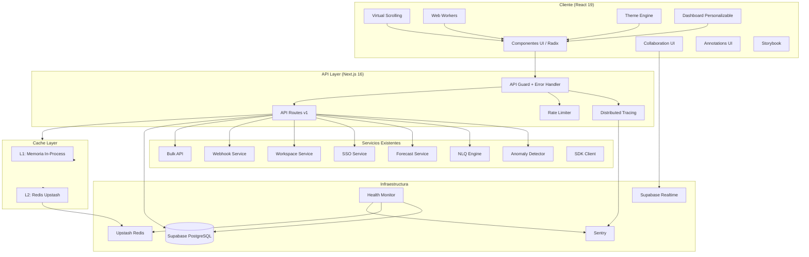

# Documento de Diseño — NominaSmart Platform Improvements

## Visión General

Este documento define el diseño técnico para la mejora integral de NominaSmart en 7 ejes: rendimiento, testing, UX, integración de módulos avanzados, capacidades enterprise, experiencia de desarrollador, y observabilidad. La plataforma ya cuenta con módulos independientes funcionales (anomalías, NLQ, forecasting, webhooks, workspaces, SSO, SDK, OpenAPI) que necesitan integrarse en el flujo principal, junto con mejoras de rendimiento, calidad y experiencia de usuario.

El stack tecnológico es: Next.js 16, React 19, Supabase (PostgreSQL + Realtime), Tailwind CSS 4, Radix UI, Vercel AI SDK 4.x, TypeScript 5, Zod, Vitest y fast-check.

## Arquitectura

### Diagrama de Arquitectura General



### Decisiones Arquitectónicas

1. **Cache de 2 niveles**: L1 en memoria (Map con LRU, máx 200 entradas) para acceso sub-milisegundo + L2 en Redis (Upstash) para caché distribuida. Degradación graceful si Redis no está disponible. Se extiende el `RedisCacheLayer` existente en `src/lib/cache/cache-layer.ts` con un wrapper de memoria L1.

2. **Web Workers con fallback**: Los cómputos pesados (parsing Excel, anomalías, forecasting) se delegan a Web Workers con comunicación via `postMessage`. Si el navegador no soporta Workers, se ejecutan en el hilo principal con aviso al usuario.

3. **Error handling centralizado**: Se extiende el `API_Guard` existente en `src/lib/api/guard.ts` con un formato de error estándar `{ error, code, details?, requestId }` y un wrapper `withApiHandler()` que captura excepciones y genera respuestas consistentes.

4. **Integración de módulos existentes**: Los servicios ya construidos (anomalías, NLQ, forecasting, SSO, workspaces, webhooks, bulk, SDK) se integran en la UI mediante componentes React que consumen sus endpoints existentes. No se reescriben los servicios.

5. **Observabilidad**: Sentry para error tracking + distributed tracing con trace IDs propagados via `X-Request-Id`. Se integra con el `Health_Monitor` existente.

6. **Theme Engine**: CSS custom properties con tokens semánticos. El tema oscuro (Obsidian Ledger) ya existe; se genera un tema claro como inversión semántica. Persistencia en `localStorage` con aplicación antes del primer render para evitar FOUC.

## Componentes e Interfaces

### 1. Virtual Scrolling (`src/lib/performance/virtual-scroll.ts`)

Se extiende el hook `useVirtualScroll` existente para soportar:
- Filas de altura variable (actualmente solo soporta altura fija)
- Columnas fijas (sticky columns) para identificación de empleado
- Preservación de estado de selección/edición al reciclar filas
- Fallback a paginación si no hay `IntersectionObserver`
- Umbral reducido de 100 a 50 filas

```typescript
interface VirtualScrollOptions {
  totalItems: number;
  itemHeight: number | ((index: number) => number); // Extensión: altura variable
  containerHeight: number;
  overscan?: number; // default 5
  stickyColumns?: number; // Columnas fijas al scroll horizontal
}
```

### 2. Cache Layer de 2 Niveles (`src/lib/cache/`)

Se extiende `RedisCacheLayer` existente con un wrapper `TwoLevelCache`:

```typescript
interface TwoLevelCacheConfig {
  maxMemoryEntries: number; // default 200
  ttlByStatus: {
    active: number;        // 3600s (1h)
    pending_review: number; // 300s (5min)
    draft: number;          // 300s (5min)
  };
}

class TwoLevelCache implements CacheLayer {
  private l1: Map<string, { value: unknown; expiry: number }>;
  private l2: RedisCacheLayer;
  // LRU eviction cuando l1.size > maxMemoryEntries
}
```

### 3. Web Worker Manager (`src/lib/workers/`)

Se extiende el worker existente `excel-parser.worker.ts` y se crea un manager unificado:

```typescript
interface WorkerTask<T> {
  type: 'excel-parse' | 'anomaly-detect' | 'forecast-calc';
  data: T;
  onProgress?: (percent: number) => void;
  signal?: AbortSignal;
}

interface WorkerManager {
  execute<T, R>(task: WorkerTask<T>): Promise<R>;
  cancel(taskId: string): void;
}
```

### 4. API Error Handler (`src/lib/api/`)

Se extiende `guard.ts` con formato de error estándar:

```typescript
interface ApiErrorResponse {
  error: string;
  code: string;
  details?: Record<string, unknown>;
  requestId: string;
}

function createApiError(code: string, message: string, details?: object): ApiErrorResponse;
function withApiHandler(handler: Function): Function; // Wrapper que captura excepciones
```

Códigos de error estándar: `VALIDATION_ERROR`, `UNAUTHORIZED`, `FORBIDDEN`, `RATE_LIMITED`, `NOT_FOUND`, `INTERNAL_ERROR`.

### 5. Theme Engine (`src/lib/design-tokens.ts` + `src/app/globals.css`)

Se extienden los design tokens existentes con soporte dual:

```typescript
type ThemeMode = 'light' | 'dark' | 'auto';

interface ThemeEngine {
  getTheme(): ThemeMode;
  setTheme(mode: ThemeMode): void;
  subscribe(callback: (mode: ThemeMode) => void): () => void;
}
```

Tokens semánticos para ambos temas: `background`, `foreground`, `primary`, `secondary`, `muted`, `accent`, `destructive`, `border`, `ring`, `card`, `popover`, `sidebar` (cada uno con variante `-foreground`).

### 6. Dashboard Personalizable (`src/components/dashboard/`)

```typescript
interface DashboardWidget {
  id: string;
  type: 'metrics' | 'risk-trend' | 'anomalies' | 'forecast' | 'activity' | 'ai-providers' | 'action-items' | 'system-health';
  position: { x: number; y: number; w: number; h: number };
}

interface DashboardLayout {
  widgets: DashboardWidget[];
  preset?: 'executive' | 'analyst' | 'admin';
}
```

Persistencia en `user_profiles` de Supabase. Drag-and-drop con grilla responsiva (1/2/3-4 columnas).

### 7. Collaboration Engine UI (`src/components/collab/`)

Se conecta al `collaboration-engine.ts` existente con componentes React:
- `PresenceIndicator`: avatares de usuarios conectados
- `CollaborationBanner`: conteo de editores activos
- `ConflictDialog`: resolución de conflictos con opción de revertir

### 8. Annotation System UI (`src/components/annotations/`)

Componentes para el sistema de anotaciones existente en `src/lib/collab/annotation-service.ts`:
- `AnnotationBadge`: indicador de anotaciones no resueltas
- `AnnotationThread`: hilo de comentarios con respuestas
- `AnnotationForm`: formulario con menciones (@usuario)

### 9. Integración de Módulos Avanzados

| Módulo | Servicio Existente | Integración UI |
|--------|-------------------|----------------|
| Anomalías | `src/lib/ai/agents/` | Widget dashboard + paso automático en pipeline |
| NLQ | `src/app/api/v1/nlq/` | Acción rápida en Sidebar IA + renderizado enriquecido |
| Forecasting | `src/app/api/v1/forecast/` | Widget dashboard + sección en Reports |
| SSO | `src/lib/auth/sso-service.ts` | Settings > Autenticación SSO + botón login |
| Workspaces | `src/lib/workspaces/workspace-service.ts` | Selector en header + Settings > Workspaces |
| Webhooks | `src/lib/webhooks/webhook-service.ts` | Settings > Webhooks + log de entregas |
| Bulk Ops | `src/app/api/v1/bulk/` | Checkboxes + barra de acciones masivas |
| OpenAPI | `src/lib/openapi/generate-spec.ts` | Swagger UI en `/api/docs` |
| SDK | `src/lib/sdk/nominasmart-client.ts` | Página de documentación del SDK |

### 10. Observabilidad

- **Sentry**: SDK cliente (React) + servidor (API routes). Source maps, filtrado de PII, Web Vitals.
- **Distributed Tracing**: Middleware que genera `X-Request-Id` (UUID v4) y lo propaga a todos los servicios internos. Spans para operaciones críticas.
- **Health Dashboard**: Página admin que consume `/api/v1/health` con auto-refresh cada 30s.

### 11. Testing

- **PBT con fast-check**: Propiedades para rule-engine, plan-serializer, encryption, model-selector, format-detector. Mínimo 100 iteraciones por propiedad.
- **E2E con Playwright**: Flujos críticos (login, pipeline, reportes, chat IA, reglas). Chromium + Firefox.
- **Storybook**: Stories para componentes UI principales + componentes compuestos de NominaSmart.

## Modelos de Datos

### Configuración de Dashboard (en `user_profiles`)

```sql
-- Columna adicional en user_profiles
ALTER TABLE user_profiles ADD COLUMN dashboard_layout JSONB DEFAULT NULL;
```

```typescript
// Esquema Zod
const DashboardLayoutSchema = z.object({
  widgets: z.array(z.object({
    id: z.string(),
    type: z.enum(['metrics', 'risk-trend', 'anomalies', 'forecast', 'activity', 'ai-providers', 'action-items', 'system-health']),
    position: z.object({ x: z.number(), y: z.number(), w: z.number(), h: z.number() }),
  })),
  preset: z.enum(['executive', 'analyst', 'admin']).optional(),
});
```

### Formato de Error Estándar API

```typescript
const ApiErrorSchema = z.object({
  error: z.string(),
  code: z.string(),
  details: z.record(z.unknown()).optional(),
  requestId: z.string().uuid(),
});
```

### Preferencia de Tema

```typescript
// localStorage key: 'nominasmart-theme'
type ThemePreference = 'light' | 'dark' | 'auto';
```

### Trace Span

```typescript
interface TraceSpan {
  traceId: string;      // UUID v4 del request
  spanId: string;       // UUID v4 del span
  parentSpanId?: string;
  operation: string;    // e.g. 'supabase.query', 'ai.invoke', 'webhook.send'
  startTime: number;
  duration: number;
  metadata?: Record<string, unknown>;
  status: 'ok' | 'error';
}
```

### Cache Entry (L1 en memoria)

```typescript
interface L1CacheEntry<T> {
  value: T;
  expiry: number;       // timestamp ms
  accessedAt: number;   // para LRU eviction
  key: string;
}
```


## Propiedades de Correctitud

*Una propiedad es una característica o comportamiento que debe mantenerse verdadero en todas las ejecuciones válidas de un sistema — esencialmente, una declaración formal sobre lo que el sistema debe hacer. Las propiedades sirven como puente entre especificaciones legibles por humanos y garantías de correctitud verificables por máquinas.*

### Propiedad 1: Virtual Scrolling renderiza solo filas visibles más buffer

*Para cualquier* conjunto de N filas y cualquier posición de scroll, el hook `useVirtualScroll` debe retornar exclusivamente las filas visibles en el viewport más un máximo de 5 filas de buffer arriba y 5 abajo, y ninguna fila fuera de ese rango.

**Valida: Requisitos 1.1**

### Propiedad 2: Virtual Scrolling preserva estado de filas (round-trip)

*Para cualquier* fila con estado de selección o edición, si la fila sale del viewport por scroll y luego vuelve a entrar, su estado debe ser idéntico al que tenía antes de salir.

**Valida: Requisitos 1.3**

### Propiedad 3: Virtual Scrolling recalcula filas visibles al filtrar

*Para cualquier* conjunto de filas y cualquier filtro aplicado, el conjunto de filas visibles retornado por `useVirtualScroll` debe contener exclusivamente filas que coincidan con el filtro, y el scroll debe posicionarse en el primer resultado.

**Valida: Requisitos 1.4**

### Propiedad 4: Virtual Scrolling calcula offsets correctos con alturas variables

*Para cualquier* función de altura variable `(index) => height` y cualquier posición de scroll, los offsets calculados para cada fila visible deben ser la suma acumulada de las alturas de todas las filas anteriores.

**Valida: Requisitos 1.5**

### Propiedad 5: Cache round-trip con clave compuesta país+año

*Para cualquier* regla normativa válida con país y año, almacenarla en el cache con clave `{país}:{año}` y luego recuperarla debe producir un objeto equivalente al original.

**Valida: Requisitos 2.1**

### Propiedad 6: Cache asigna TTL correcto según estado de regla

*Para cualquier* regla normativa, si su estado es "active" el TTL asignado debe ser 3600 segundos, y si su estado es "pending_review" o "draft" el TTL debe ser 300 segundos.

**Valida: Requisitos 2.2**

### Propiedad 7: Cache invalida entrada al actualizar regla

*Para cualquier* regla normativa cacheada, si la regla es actualizada, una consulta posterior al cache debe retornar `null` (cache miss) para esa clave.

**Valida: Requisitos 2.3**

### Propiedad 8: Cache L1 y L2 consistencia

*Para cualquier* valor almacenado en el cache de 2 niveles, debe ser recuperable primero desde L1 (memoria) y, si L1 no lo tiene, desde L2 (Redis), produciendo el mismo valor en ambos casos.

**Valida: Requisitos 2.4**

### Propiedad 9: Cache métricas reflejan operaciones

*Para cualquier* secuencia de operaciones get/set en el cache, las métricas reportadas (hits, misses, errors) deben sumar exactamente el número total de operaciones realizadas.

**Valida: Requisitos 2.6**

### Propiedad 10: Cache LRU evicta al superar 200 entradas

*Para cualquier* secuencia de inserciones que supere 200 entradas en L1, el tamaño de L1 nunca debe exceder 200, y la entrada evictada debe ser la menos recientemente accedida.

**Valida: Requisitos 2.7**

### Propiedad 11: Rule Engine produce resultados determinísticos

*Para cualquier* regla normativa válida y cualquier conjunto de datos de entrada, ejecutar las 14 verificaciones matemáticas dos veces con la misma entrada debe producir resultados idénticos.

**Valida: Requisitos 4.2**

### Propiedad 12: Plan Serializer round-trip

*Para cualquier* `DynamicPlan` válido (con steps, version y adaptations), `deserializePlan(serializePlan(plan))` debe producir un objeto equivalente al plan original.

**Valida: Requisitos 4.3**

### Propiedad 13: Encryption round-trip

*Para cualquier* cadena de texto y clave de cifrado válida, `decryptApiKey(encryptApiKey(text))` debe producir la cadena original.

**Valida: Requisitos 4.4**

### Propiedad 14: Model Selector retorna el modelo óptimo

*Para cualquier* configuración válida de proveedores con pesos y cualquier contexto de tarea, el modelo seleccionado por `selectModel` debe tener un score compuesto mayor o igual al de todos los demás candidatos.

**Valida: Requisitos 4.5**

### Propiedad 15: Format Detector identifica formato correctamente

*Para cualquier* archivo generado con formato conocido (CSV con delimitadores válidos, XLSX con magic bytes correctos), `detectFormat` debe retornar el formato correcto con confianza >= 0.8.

**Valida: Requisitos 4.6**

### Propiedad 16: API Error format estándar y createApiError

*Para cualquier* código de error, mensaje y detalles opcionales, `createApiError` debe producir un objeto que cumpla el esquema `{ error: string, code: string, details?: object, requestId: string(uuid) }`, y todas las respuestas de error de la API deben seguir este formato.

**Valida: Requisitos 6.1, 6.8**

### Propiedad 17: X-Request-Id presente en todas las respuestas API

*Para cualquier* respuesta de API (exitosa o de error), el header `X-Request-Id` debe estar presente y contener un UUID v4 válido.

**Valida: Requisitos 6.2, 23.2**

### Propiedad 18: Excepciones no controladas retornan 500 sin stack traces

*Para cualquier* excepción no controlada en un handler de API, la respuesta debe tener código HTTP 500, formato de error estándar, y no debe contener stack traces ni detalles internos del servidor.

**Valida: Requisitos 6.3**

### Propiedad 19: Validación Zod retorna 400 con detalles de campos

*Para cualquier* body inválido según un esquema Zod, la respuesta debe ser HTTP 400 con código "VALIDATION_ERROR" y el campo `details` debe contener los campos inválidos específicos.

**Valida: Requisitos 6.4**

### Propiedad 20: Theme persistence round-trip

*Para cualquier* preferencia de tema ('light', 'dark', 'auto'), guardarla en localStorage y luego leerla debe producir el mismo valor.

**Valida: Requisitos 7.3**

### Propiedad 21: Tokens semánticos definidos para ambos temas

*Para ambos* temas (claro y oscuro), todos los tokens semánticos requeridos (background, foreground, primary, secondary, muted, accent, destructive, border, ring, card, popover, sidebar y sus variantes -foreground) deben estar definidos y tener valores no vacíos.

**Valida: Requisitos 7.4**

### Propiedad 22: Dashboard layout persistence round-trip

*Para cualquier* configuración de layout de dashboard válida (widgets con posiciones y tamaños), guardarla en `user_profiles` y luego cargarla debe producir un layout equivalente al original.

**Valida: Requisitos 8.3**

### Propiedad 23: Dashboard widget error isolation

*Para cualquier* widget del dashboard que falle al cargar datos, los demás widgets deben continuar funcionando y mostrando sus datos correctamente.

**Valida: Requisitos 8.6**

### Propiedad 24: Colaboración conflicto last-write-wins

*Para cualquier* par de ediciones simultáneas a la misma celda, el resultado final debe ser el valor de la última escritura, y el usuario cuyo cambio fue sobrescrito debe recibir una notificación de conflicto.

**Valida: Requisitos 9.3**

### Propiedad 25: Colaboración reconexión preserva cambios (round-trip)

*Para cualquier* conjunto de cambios pendientes al momento de desconexión, al reconectarse dentro de 5 minutos, todos los cambios deben sincronizarse y estar presentes en el estado del servidor.

**Valida: Requisitos 9.4**

### Propiedad 26: Colaboración máximo 10 usuarios por planilla

*Para cualquier* planilla, el número de usuarios simultáneos conectados nunca debe exceder 10. El intento de un 11° usuario debe ser rechazado.

**Valida: Requisitos 9.6**

### Propiedad 27: Anotaciones creación y recuperación por tipo de entidad

*Para cualquier* tipo de entidad soportado (celda, hallazgo, action_item, reporte) y cualquier datos de anotación válidos, crear una anotación vía POST y luego consultarla debe retornar todos los campos registrados (autor, timestamp, texto, tipo, entityId, menciones).

**Valida: Requisitos 10.1, 10.2**

### Propiedad 28: Anotaciones hilos con parent_id

*Para cualquier* anotación con `parent_id`, debe formar un hilo válido donde el parent existe y las respuestas se ordenan cronológicamente.

**Valida: Requisitos 10.4**

### Propiedad 29: Anotaciones resolución sin eliminación

*Para cualquier* anotación marcada como resuelta vía PATCH, debe seguir siendo recuperable del historial con su estado actualizado a "resolved".

**Valida: Requisitos 10.5**

### Propiedad 30: Anotaciones badge count invariante

*Para cualquier* entidad con N anotaciones activas no resueltas, el conteo del badge debe ser exactamente N.

**Valida: Requisitos 10.6**

### Propiedad 31: Anomaly Detector compara con periodos históricos

*Para cualquier* dataset con datos históricos disponibles, el Anomaly Detector debe comparar contra hasta 6 periodos anteriores de la misma empresa.

**Valida: Requisitos 11.5**

### Propiedad 32: Anomaly Detector genera explicaciones no vacías

*Para cualquier* anomalía detectada, la explicación en lenguaje natural debe ser no vacía y contener la categoría de la anomalía.

**Valida: Requisitos 11.7**

### Propiedad 33: NLQ respeta RBAC

*Para cualquier* usuario con un rol dado y cualquier consulta NLQ, los datos retornados deben pertenecer exclusivamente a entidades a las que el usuario tiene acceso según su rol y workspace.

**Valida: Requisitos 12.5**

### Propiedad 34: NLQ incluye fuentes de datos

*Para cualquier* respuesta NLQ con datos, debe incluir las fuentes utilizadas (tabla, periodo, empresa) como metadatos verificables.

**Valida: Requisitos 12.6**

### Propiedad 35: Forecast considera factores requeridos

*Para cualquier* cálculo de forecast, los parámetros de entrada deben incluir tendencias históricas, cambios regulatorios, estacionalidad y tasa de crecimiento.

**Valida: Requisitos 13.4**

### Propiedad 36: Forecast alerta cuando incremento > 15%

*Para cualquier* proyección de forecast que indique un incremento de costos superior al 15% respecto al periodo anterior, el sistema debe generar una notificación de alerta.

**Valida: Requisitos 13.5**

### Propiedad 37: SSO mapeo de atributos IdP a perfil NominaSmart

*Para cualquier* conjunto de atributos de Identity Provider (email, nombre, grupo), el SSO service debe mapearlos correctamente al perfil de usuario y rol de NominaSmart según la configuración de mapeo.

**Valida: Requisitos 14.4**

### Propiedad 38: SSO JIT provisioning crea perfil con rol predeterminado

*Para cualquier* usuario que se autentica por primera vez vía SSO, el sistema debe crear un perfil con el rol predeterminado configurado por el administrador.

**Valida: Requisitos 14.6**

### Propiedad 39: Dashboard filtra datos por workspace activo

*Para cualquier* workspace activo, todas las métricas y datos del dashboard deben pertenecer exclusivamente a ese workspace_id.

**Valida: Requisitos 15.5**

### Propiedad 40: Workspace RLS aislamiento de datos

*Para cualquier* par de workspaces, una consulta desde el contexto de un workspace nunca debe retornar datos pertenecientes al otro workspace.

**Valida: Requisitos 15.7**

### Propiedad 41: Webhook genera secreto HMAC-SHA256 único

*Para cualquier* webhook creado, debe tener un secreto HMAC-SHA256 único generado automáticamente, y dos webhooks distintos nunca deben compartir el mismo secreto.

**Valida: Requisitos 16.2**

### Propiedad 42: Webhook delivery log registra estado completo

*Para cualquier* entrega de webhook, el log debe contener: estado (exitoso/fallido/pendiente), código HTTP, tiempo de respuesta.

**Valida: Requisitos 16.4**

### Propiedad 43: Webhook HMAC-SHA256 firma verificable (round-trip)

*Para cualquier* payload y secreto de webhook, firmar el payload con HMAC-SHA256 y luego verificar la firma con el mismo secreto debe ser exitoso.

**Valida: Requisitos 16.5**

### Propiedad 44: Webhook retry con backoff exponencial

*Para cualquier* webhook fallido, los intervalos de reintento deben seguir el patrón exponencial (30s, 60s, 120s) hasta un máximo de 5 intentos.

**Valida: Requisitos 16.6**

### Propiedad 45: Webhook máximo 10 por workspace

*Para cualquier* workspace, el número de webhooks nunca debe exceder 10. El intento de crear un 11° debe ser rechazado.

**Valida: Requisitos 16.7**

### Propiedad 46: Bulk operations manejo de fallos parciales

*Para cualquier* operación masiva donde algunos registros fallan, los registros exitosos deben completarse, los fallidos deben reportarse con detalle del error, y el conteo de exitosos + fallidos debe igualar el total de registros procesados.

**Valida: Requisitos 17.4**

### Propiedad 47: OpenAPI spec generada desde esquemas Zod

*Para cualquier* esquema Zod registrado en `src/lib/schemas/`, la especificación OpenAPI generada debe contener un JSON Schema equivalente.

**Valida: Requisitos 18.3**

### Propiedad 48: OpenAPI documentación completa por endpoint

*Para cualquier* endpoint documentado en la spec OpenAPI, debe incluir: descripción, parámetros, request body con esquema, respuestas con códigos HTTP, y esquemas de respuesta.

**Valida: Requisitos 18.4**

### Propiedad 49: SDK tipos TypeScript consistentes con Zod

*Para cualquier* esquema Zod del proyecto, los tipos TypeScript del SDK deben ser compatibles con la inferencia de tipos de Zod (`z.infer`).

**Valida: Requisitos 19.2**

### Propiedad 50: SDK respeta configuración de base URL, timeout y headers

*Para cualquier* configuración del SDK (base URL, timeout, headers custom), todas las peticiones HTTP generadas deben usar esos valores.

**Valida: Requisitos 19.6**

### Propiedad 51: Storybook renderiza componentes en ambos temas

*Para cualquier* story de Storybook, debe renderizarse correctamente tanto en tema claro como en tema oscuro sin errores de consola.

**Valida: Requisitos 20.3**

### Propiedad 52: Health Dashboard muestra detalles por servicio

*Para cualquier* servicio monitoreado, el Health Dashboard debe mostrar: estado (healthy/degraded/down), latencia, último check exitoso, y mensaje de error cuando aplique.

**Valida: Requisitos 21.2**

### Propiedad 53: Health notificación al cambiar estado de servicio

*Para cualquier* servicio que cambie de estado healthy a degraded o down, el sistema debe crear una notificación de severidad "critical" para todos los usuarios admin.

**Valida: Requisitos 21.4**

### Propiedad 54: Health métricas agregadas correctas

*Para cualquier* servicio y periodo de 7 días, el uptime porcentual debe calcularse como (checks exitosos / total checks) * 100, la latencia promedio como la media aritmética de todas las latencias, y el conteo de incidentes como el número de transiciones a estado no-healthy.

**Valida: Requisitos 21.6**

### Propiedad 55: Health checks registrados en MetricsCollector

*Para cualquier* verificación de salud ejecutada, debe quedar registrada en el MetricsCollector con timestamp, servicio, estado y latencia.

**Valida: Requisitos 21.7**

### Propiedad 56: Sentry evento completo y etiquetado

*Para cualquier* error capturado por Sentry, el evento debe incluir: stack trace, breadcrumbs, contexto del usuario (ID, rol, workspace), URL, navegador, versión de la app, y tags de entorno, versión, locale y workspace.

**Valida: Requisitos 22.2, 22.6**

### Propiedad 57: Sentry filtrado de PII

*Para cualquier* evento enviado a Sentry, no debe contener API keys, tokens de autenticación, datos de nómina de empleados, ni información personal identificable (PII).

**Valida: Requisitos 22.4**

### Propiedad 58: Trace ID único por request

*Para cualquier* solicitud entrante, el sistema debe generar un trace ID UUID v4 único, y dos solicitudes distintas nunca deben compartir el mismo trace ID.

**Valida: Requisitos 23.1**

### Propiedad 59: Trace ID presente en todos los logs

*Para cualquier* entrada de log generada durante el procesamiento de una solicitud, el trace ID de esa solicitud debe estar presente en la entrada.

**Valida: Requisitos 23.3**

### Propiedad 60: Spans creados para operaciones críticas

*Para cualquier* solicitud que involucre operaciones críticas (autenticación, validación, consulta DB, invocación IA, serialización, envío de webhooks) o múltiples agentes IA, debe crearse un span con nombre de operación, duración y estado, incluyendo spans hijos para cada agente con tokens consumidos.

**Valida: Requisitos 23.4, 23.5**

## Manejo de Errores

### Estrategia General

1. **API Layer**: Todas las excepciones se capturan en `withApiHandler()` y se transforman al formato estándar `ApiErrorResponse`. Nunca se exponen stack traces al cliente.

2. **Cache Layer**: Degradación graceful — si Redis falla, se opera solo con L1 en memoria. Si L1 falla, se consulta directamente la fuente de datos. Los errores de cache nunca bloquean la operación principal.

3. **Web Workers**: Si un Worker falla o el navegador no los soporta, se ejecuta en el hilo principal con aviso al usuario. La cancelación de Workers tiene timeout de 1 segundo antes de `terminate()`.

4. **Colaboración en Tiempo Real**: Conflictos de edición simultánea se resuelven con last-write-wins. Desconexiones preservan cambios pendientes por 5 minutos. Si la reconexión falla, se notifica al usuario.

5. **Webhooks**: Fallos de entrega se reintentan con backoff exponencial (30s, 60s, 120s) hasta 5 intentos. Después del 5° fallo, el webhook se marca como "failing" y se notifica al admin.

6. **SSO**: Timeout de 10 segundos para respuesta del IdP. Si falla, se ofrece login alternativo con email/contraseña.

7. **Bulk Operations**: Fallos parciales no detienen la operación completa. Se completan los exitosos, se reportan los fallidos con detalle, y se ofrece reintentar solo los fallidos.

8. **Sentry**: Filtrado de PII antes de enviar eventos. Si Sentry no está disponible, los errores se registran en logs locales sin pérdida de funcionalidad.

### Códigos de Error Estándar

| Código | HTTP | Descripción |
|--------|------|-------------|
| `VALIDATION_ERROR` | 400 | Body inválido según esquema Zod |
| `UNAUTHORIZED` | 401 | Sin autenticación válida |
| `FORBIDDEN` | 403 | Sin permisos suficientes |
| `NOT_FOUND` | 404 | Recurso no encontrado |
| `RATE_LIMITED` | 429 | Límite de tasa excedido |
| `INTERNAL_ERROR` | 500 | Error interno del servidor |

## Estrategia de Testing

### Enfoque Dual: Unit Tests + Property-Based Tests

La estrategia de testing combina pruebas unitarias para ejemplos específicos y casos borde con pruebas basadas en propiedades (PBT) para verificar invariantes universales.

### Property-Based Testing con fast-check

- **Biblioteca**: `fast-check` (ya instalada en el proyecto)
- **Runner**: Vitest (ya configurado con `npm run test`)
- **Iteraciones mínimas**: 100 por propiedad (`{ numRuns: 100 }`)
- **Cada test PBT debe referenciar su propiedad del documento de diseño**
- **Formato de tag**: `Feature: platform-improvements, Property {N}: {título}`
- **Cada propiedad de correctitud debe implementarse con UN SOLO test PBT**

### Módulos con PBT Obligatorio

1. **rule-engine** (`src/lib/ai/rule-engine.ts`): Determinismo de verificaciones (Propiedad 11)
2. **plan-serializer** (`src/lib/ai/plan-serializer.ts`): Round-trip serialización (Propiedad 12)
3. **encryption** (`src/lib/ai/encryption.ts`): Round-trip cifrado (Propiedad 13)
4. **model-selector** (`src/lib/ai/model-selector.ts`): Optimalidad de selección (Propiedad 14)
5. **format-detector** (`src/lib/payroll/format-detector.ts`): Detección correcta de formato (Propiedad 15)
6. **cache-layer** (`src/lib/cache/cache-layer.ts`): Round-trip, TTL, LRU, métricas (Propiedades 5-10)
7. **virtual-scroll** (`src/lib/performance/virtual-scroll.ts`): Cálculo de filas visibles (Propiedades 1, 3, 4)
8. **api-guard** (`src/lib/api/guard.ts`): Formato de error, validación (Propiedades 16-19)
9. **webhook-service** (`src/lib/webhooks/webhook-service.ts`): HMAC, retry, límites (Propiedades 41-45)
10. **collaboration-engine** (`src/lib/collab/collaboration-engine.ts`): Conflictos, límites (Propiedades 24-26)
11. **annotation-service** (`src/lib/collab/annotation-service.ts`): CRUD, hilos, resolución (Propiedades 27-30)

### Tests E2E con Playwright

- **Framework**: Playwright
- **Navegadores**: Chromium + Firefox
- **Script**: `npm run test:e2e`
- **Fixtures**: Datos de prueba aislados por test
- **Flujos cubiertos**: Login, pipeline de carga, reportes, chat IA, gestión de reglas

### Unit Tests (Vitest)

- Ejemplos específicos para cada módulo
- Edge cases: Redis no disponible, Workers no soportados, IdP timeout, bulk parcial
- Integración entre componentes (pipeline + anomalías, sidebar + NLQ)

### Storybook

- **Framework**: Storybook 8+ con React 19 + Tailwind CSS 4
- **Script**: `npm run storybook`
- **Componentes**: 15 componentes base + 4 componentes compuestos de NominaSmart
- **Temas**: Cada story renderizada en claro y oscuro
- **Documentación**: Props, variantes, ejemplos de composición, design tokens
