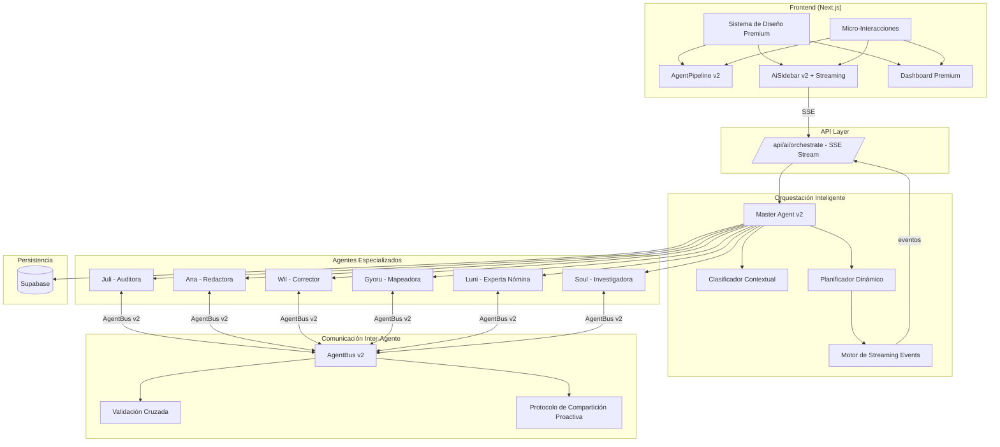
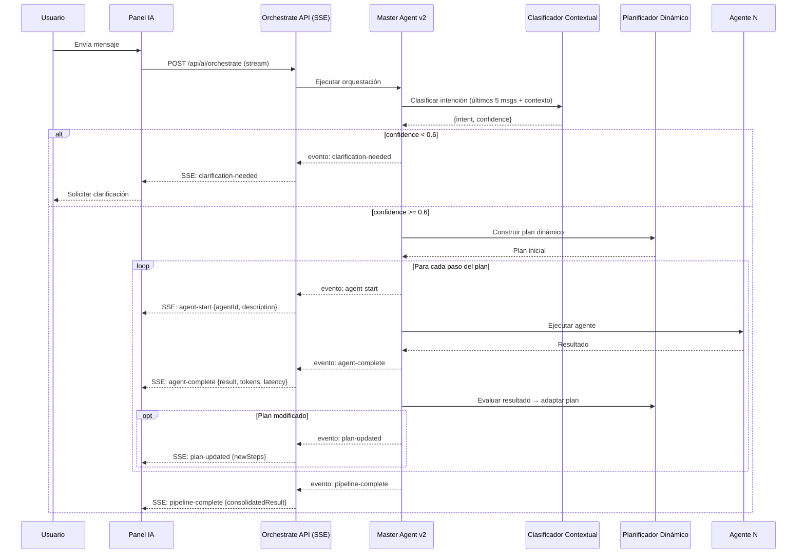

# Documento de Diseño: Platform Premium Upgrade

## Visión General

Este diseño abarca la evolución de NominaSmart en dos ejes: un rediseño visual premium y una mejora sustancial de la inteligencia de los agentes de IA. El rediseño visual introduce un sistema de diseño formalizado con tokens semánticos, animaciones fluidas y componentes mejorados. La mejora de agentes introduce clasificación contextual, planificación dinámica adaptativa, comunicación proactiva inter-agente, validación cruzada y streaming en tiempo real.

La arquitectura existente (Next.js + Tailwind + Vercel AI SDK + Supabase) se mantiene. Los cambios se implementan como extensiones de los componentes y módulos existentes, no como reescrituras.

## Arquitectura

### Diagrama de Arquitectura General



### Flujo de Orquestación Dinámica



## Componentes e Interfaces

### 1. Sistema de Diseño Premium (`src/lib/design-tokens.ts`)

Archivo centralizado de tokens de diseño que reemplaza los valores hardcodeados actuales en los componentes.

```typescript
// Escala tipográfica
interface TypographyScale {
  display: { size: string; weight: number; lineHeight: string };
  heading: { size: string; weight: number; lineHeight: string };
  subheading: { size: string; weight: number; lineHeight: string };
  body: { size: string; weight: number; lineHeight: string };
  caption: { size: string; weight: number; lineHeight: string };
  overline: { size: string; weight: number; lineHeight: string };
}

// Paleta semántica
interface SemanticColors {
  surface: string;
  onSurface: string;
  primary: string;
  secondary: string;
  error: string;
  success: string;
  warning: string;
  // Variantes con opacidad
  surfaceContainer: { low: string; default: string; high: string; max: string };
}

// Escala de espaciado (múltiplos de 4px)
type SpacingScale = Record<'xs' | 'sm' | 'md' | 'lg' | 'xl' | '2xl' | '3xl' | '4xl', string>;

// Niveles de elevación
interface ElevationLevels {
  flat: string;
  low: string;
  medium: string;
  high: string;
}
```

### 2. Clasificador Contextual de Intención (`src/lib/ai/agents/intent-classifier.ts`)

Módulo separado que reemplaza la clasificación actual en `master.ts`. Considera historial conversacional y emite confianza.

```typescript
interface IntentClassificationResult {
  intent: UserIntent;
  confidence: number;       // 0.0 – 1.0
  reasoning: string;
  contextUsed: number;      // cantidad de mensajes de historial usados
}

async function classifyIntentContextual(
  messages: ChatMessage[],
  payrollContext: { hasData: boolean; countryCode: string },
  model: LanguageModel,
): Promise<IntentClassificationResult>;
```

### 3. Planificador Dinámico (`src/lib/ai/agents/dynamic-planner.ts`)

Reemplaza la función `buildPlan()` estática actual. Evalúa resultados intermedios y adapta el plan.

```typescript
interface DynamicPlan extends OrchestratorPlan {
  version: number;
  adaptations: PlanAdaptation[];
}

interface PlanAdaptation {
  trigger: string;          // qué resultado causó la adaptación
  action: 'add_step' | 'remove_step' | 'reorder';
  stepAdded?: OrchestratorPlan['steps'][0];
  reason: string;
}

function buildDynamicPlan(intent: UserIntent, context: PlanContext): DynamicPlan;

function evaluateAndAdapt(
  plan: DynamicPlan,
  stepResult: AgentResult,
  stepIndex: number,
): DynamicPlan;
```

### 4. AgentBus v2 (`src/lib/ai/agents/agent-bus.ts`)

Extensión del AgentBus actual con soporte para comunicación proactiva, validación cruzada y emisión de eventos.

```typescript
interface AgentBusV2Config extends AgentBusConfig {
  onMessage?: (message: AgentMessage) => void;  // callback para streaming
}

interface CrossValidationRequest {
  fromAgent: string;
  toAgent: string;
  dataToValidate: unknown;
  validationType: 'numeric-check' | 'report-data-check' | 'correction-verify';
}

interface CrossValidationResult {
  isConsistent: boolean;
  discrepancies?: string[];
}

class AgentBusV2 extends AgentBus {
  async sendWithEvent(message: Omit<AgentMessage, 'timestamp'>): Promise<AgentResult>;
  async requestCrossValidation(request: CrossValidationRequest): Promise<CrossValidationResult>;
}
```

### 5. Motor de Streaming (`src/lib/ai/streaming.ts`)

Emite eventos SSE al cliente durante la ejecución del pipeline.

```typescript
type StreamEventType = 
  | 'agent-start' 
  | 'agent-complete' 
  | 'agent-communication' 
  | 'plan-updated' 
  | 'pipeline-complete'
  | 'clarification-needed'
  | 'error';

interface StreamEvent {
  type: StreamEventType;
  data: Record<string, unknown>;
  timestamp: number;
}

class PipelineStreamEmitter {
  constructor(writer: WritableStreamDefaultWriter<Uint8Array>);
  emit(event: StreamEvent): void;
  close(): void;
}
```

### 6. AgentPipeline v2 (`src/components/ui/AgentPipeline.tsx`)

Extensión del componente actual con soporte para streaming, animaciones de conexión inter-agente y adaptaciones dinámicas del plan.

Cambios principales:
- Acepta eventos de streaming para actualizar estado en tiempo real
- Animación de línea de conexión entre agentes cuando hay comunicación inter-agente
- Indicador visual cuando el plan se adapta dinámicamente
- Transiciones suaves entre estados (pending → running → done)

### 7. AiSidebar v2 (`src/components/ui/AiSidebar.tsx`)

Extensión del sidebar actual con streaming SSE, indicadores de escritura por agente y mejor UX conversacional.

Cambios principales:
- Conexión SSE en lugar de fetch simple
- Indicador de escritura que muestra el agente activo con avatar
- Renderizado incremental de contenido durante streaming
- Reconexión automática si se pierde la conexión SSE

### 8. Serialización de Planes (`src/lib/ai/plan-serializer.ts`)

Módulo para serializar/deserializar planes de ejecución a JSON.

```typescript
function serializePlan(plan: DynamicPlan): string;
function deserializePlan(json: string): DynamicPlan;
```

## Modelos de Datos

### IntentClassificationResult

```typescript
interface IntentClassificationResult {
  intent: UserIntent;
  confidence: number;
  reasoning: string;
  contextUsed: number;
}
```

### DynamicPlan

```typescript
interface DynamicPlan {
  steps: Array<{
    agentName: string;
    inputFrom?: string;
    description: string;
  }>;
  version: number;
  adaptations: PlanAdaptation[];
}

interface PlanAdaptation {
  trigger: string;
  action: 'add_step' | 'remove_step' | 'reorder';
  stepAdded?: DynamicPlan['steps'][0];
  reason: string;
}
```

### StreamEvent

```typescript
interface StreamEvent {
  type: 'agent-start' | 'agent-complete' | 'agent-communication' | 'plan-updated' | 'pipeline-complete' | 'clarification-needed' | 'error';
  data: Record<string, unknown>;
  timestamp: number;
}
```

### CrossValidationResult

```typescript
interface CrossValidationResult {
  isConsistent: boolean;
  discrepancies?: string[];
}
```

### Tokens de Diseño (CSS Custom Properties)

```css
:root {
  /* Tipografía */
  --ns-font-display: 2rem / 1.2;
  --ns-font-heading: 1.5rem / 1.3;
  --ns-font-subheading: 1.125rem / 1.4;
  --ns-font-body: 0.875rem / 1.5;
  --ns-font-caption: 0.75rem / 1.4;
  --ns-font-overline: 0.625rem / 1.2;

  /* Colores semánticos */
  --ns-surface: #0b1326;
  --ns-on-surface: #dae2fd;
  --ns-primary: #a078ff;
  --ns-secondary: #d0bcff;
  --ns-error: #ffb4ab;
  --ns-success: #4edea3;
  --ns-warning: #f59e0b;

  /* Contenedores */
  --ns-container-low: #131b2e;
  --ns-container: #171f33;
  --ns-container-high: #222a3d;
  --ns-container-max: #2d3449;

  /* Espaciado */
  --ns-space-xs: 4px;
  --ns-space-sm: 8px;
  --ns-space-md: 16px;
  --ns-space-lg: 24px;
  --ns-space-xl: 32px;
  --ns-space-2xl: 48px;
  --ns-space-3xl: 64px;

  /* Elevación */
  --ns-elevation-flat: none;
  --ns-elevation-low: 0 1px 3px rgba(0,0,0,0.3);
  --ns-elevation-medium: 0 4px 12px rgba(0,0,0,0.4);
  --ns-elevation-high: 0 8px 24px rgba(0,0,0,0.5);
}
```


## Propiedades de Correctitud

*Una propiedad es una característica o comportamiento que debe mantenerse verdadero en todas las ejecuciones válidas de un sistema — esencialmente, una declaración formal sobre lo que el sistema debe hacer. Las propiedades sirven como puente entre especificaciones legibles por humanos y garantías de correctitud verificables por máquinas.*

### Property 1: Los valores de espaciado son múltiplos de 4

*Para cualquier* valor en la escala de espaciado del Sistema de Diseño, dicho valor en píxeles debe ser un múltiplo exacto de 4.

**Validates: Requirements 1.3**

### Property 2: La agregación de resumen del pipeline es correcta

*Para cualquier* conjunto de pasos de pipeline completados con tokens y latencia, el resumen consolidado debe contener la suma exacta de tokens, la suma exacta de latencias y el conteo exacto de agentes participantes.

**Validates: Requirements 2.4**

### Property 3: El pipeline maneja entre 1 y 7 pasos sin error

*Para cualquier* arreglo de pasos de pipeline con longitud entre 1 y 7, la función de renderizado del pipeline debe producir una estructura válida sin errores.

**Validates: Requirements 2.5**

### Property 4: Ida y vuelta de persistencia del historial de chat

*Para cualquier* arreglo de mensajes de chat válidos, serializar a almacenamiento local y luego deserializar debe producir un arreglo equivalente al original.

**Validates: Requirements 3.5**

### Property 5: El cálculo de indicadores de tendencia es correcto

*Para cualquier* par de valores (período actual, período anterior), el indicador de tendencia debe reflejar correctamente si el valor subió, bajó o se mantuvo igual, con el porcentaje de cambio calculado como `(actual - anterior) / anterior * 100`.

**Validates: Requirements 4.1**

### Property 6: La distribución de hallazgos por severidad es consistente

*Para cualquier* conjunto de hallazgos de auditoría, la suma de hallazgos agrupados por severidad (alta + media + baja) debe ser igual al total de hallazgos.

**Validates: Requirements 4.3**

### Property 7: El clasificador usa como máximo 5 mensajes del historial

*Para cualquier* historial de conversación de longitud N, el clasificador contextual debe usar exactamente `min(N, 5)` mensajes para la clasificación.

**Validates: Requirements 6.1**

### Property 8: La confianza de clasificación está entre 0 y 1

*Para cualquier* resultado de clasificación de intención, el campo de confianza debe ser un número mayor o igual a 0 y menor o igual a 1.

**Validates: Requirements 6.2**

### Property 9: Confianza baja dispara solicitud de clarificación

*Para cualquier* resultado de clasificación con confianza menor a 0.6, el sistema debe producir un evento de tipo "clarification-needed" en lugar de ejecutar el plan.

**Validates: Requirements 6.3**

### Property 10: Hallazgos de alta severidad agregan el corrector al plan

*Para cualquier* resultado de auditoría que contenga al menos un hallazgo de severidad "alta", el planificador dinámico debe adaptar el plan para incluir un paso del agente corrector si no estaba previamente incluido.

**Validates: Requirements 7.2**

### Property 11: Hallazgos no determinísticos agregan el experto al plan

*Para cualquier* resultado de corrección que contenga hallazgos omitidos (no determinísticos) con `skipped > 0`, el planificador dinámico debe adaptar el plan para incluir un paso del agente experto en nómina.

**Validates: Requirements 7.3**

### Property 12: Fallo de un agente preserva resultados de los demás

*Para cualquier* pipeline con N agentes donde el agente en posición K falla (0 ≤ K < N), los resultados de los agentes en posiciones distintas a K que completaron exitosamente deben estar presentes en la respuesta consolidada.

**Validates: Requirements 7.4, 12.1**

### Property 13: Adaptación del plan emite evento de notificación

*Para cualquier* adaptación del plan dinámico (agregar paso, eliminar paso, reordenar), el motor de streaming debe emitir exactamente un evento de tipo "plan-updated" con los detalles de la adaptación.

**Validates: Requirements 7.5**

### Property 14: El AgentBus enruta mensajes entre cualquier par de agentes registrados

*Para cualquier* par de agentes registrados en el bus y cualquier mensaje válido, el AgentBus debe entregar el mensaje al agente destino y retornar su resultado.

**Validates: Requirements 8.1, 8.2, 8.3**

### Property 15: El AgentBus registra todas las comunicaciones con campos requeridos

*Para cualquier* mensaje enviado a través del AgentBus, el historial de comunicaciones debe contener un registro con timestamp, agente origen, agente destino, tipo de mensaje y payload.

**Validates: Requirements 8.4**

### Property 16: Timeout del AgentBus retorna error sin bloquear

*Para cualquier* mensaje enviado a un agente cuyo handler excede el timeout configurado, el AgentBus debe retornar un resultado con `success: false` en un tiempo no mayor al timeout + 100ms de margen.

**Validates: Requirements 8.5**

### Property 17: El AgentBus previene ciclos a profundidad máxima 5

*Para cualquier* cadena de llamadas anidadas entre agentes que exceda 5 niveles de profundidad, el AgentBus debe retornar un resultado con `success: false` y un mensaje indicando que se excedió la profundidad máxima.

**Validates: Requirements 8.6**

### Property 18: Validación cruzada de correcciones por el auditor

*Para cualquier* conjunto de correcciones propuestas por el corrector, la validación cruzada debe ejecutar las reglas del auditor sobre los valores corregidos y reportar si son consistentes con las reglas normativas.

**Validates: Requirements 9.1**

### Property 19: Validación cruzada de datos numéricos en reportes

*Para cualquier* reporte generado por el redactor que contenga datos numéricos, la validación cruzada debe verificar que cada dato numérico citado coincida con los hallazgos originales del auditor.

**Validates: Requirements 9.2**

### Property 20: Inconsistencias generan advertencia visible

*Para cualquier* resultado de validación cruzada donde `isConsistent` es `false`, la respuesta consolidada al usuario debe contener una advertencia que mencione las discrepancias encontradas.

**Validates: Requirements 9.3**

### Property 21: Detección automática de formato de archivo

*Para cualquier* archivo con extensión o contenido de tipo CSV, XLSX o JSON, el detector de formato debe identificar correctamente el tipo de archivo.

**Validates: Requirements 10.1**

### Property 22: Mapeo de baja confianza presenta 3 opciones

*Para cualquier* columna cuyo mapeo automático tenga confianza ≤ 0.7, el resultado del mapeador debe incluir exactamente 3 sugerencias de mapeo alternativas.

**Validates: Requirements 10.3**

### Property 23: Columnas no reconocidas generan campos personalizados

*Para cualquier* conjunto de columnas donde al menos una no es reconocida por el diccionario de sinónimos ni por la IA, el mapeador debe crear un campo personalizado para cada columna no reconocida.

**Validates: Requirements 10.5**

### Property 24: Eventos de streaming corresponden a fases del ciclo de vida

*Para cualquier* ejecución de pipeline, el motor de streaming debe emitir un evento "agent-start" antes de cada ejecución de agente, un evento "agent-complete" después de cada ejecución, y un evento "agent-communication" por cada mensaje inter-agente.

**Validates: Requirements 11.2, 11.3, 11.4**

### Property 25: Errores se registran con contexto completo

*Para cualquier* error durante la ejecución del pipeline, el registro de error debe contener el nombre del agente, el paso del plan, el timestamp y un mensaje descriptivo del error.

**Validates: Requirements 12.3**

### Property 26: Ida y vuelta de serialización de planes de ejecución

*Para cualquier* plan de ejecución dinámico válido, serializar a JSON y luego deserializar debe producir un plan equivalente al original con todos los pasos, dependencias y adaptaciones intactos.

**Validates: Requirements 13.3**

## Manejo de Errores

### Errores en el Pipeline de Agentes

| Escenario | Comportamiento | Recuperación |
|-----------|---------------|-------------|
| Agente individual falla | Registrar error, continuar pipeline | Resultados parciales se preservan |
| Proveedor de IA no disponible | Fallback al siguiente proveedor en prioridad | Transparente para el usuario |
| Todos los agentes fallan | Mensaje descriptivo al usuario | Sugerir acciones alternativas |
| Timeout de agente | Resultado de error, pipeline continúa | Agente marcado como fallido |

### Errores en Comunicación Inter-Agente

| Escenario | Comportamiento | Recuperación |
|-----------|---------------|-------------|
| Agente destino no registrado | Retornar error inmediato | Agente solicitante continúa |
| Timeout de comunicación | Retornar error tras timeout | No bloquea al solicitante |
| Ciclo detectado (profundidad > 5) | Retornar error de profundidad | Previene recursión infinita |
| Validación cruzada falla | Registrar, incluir advertencia | Resultado original se mantiene |

### Errores en Streaming

| Escenario | Comportamiento | Recuperación |
|-----------|---------------|-------------|
| Conexión SSE interrumpida | Cliente detecta desconexión | Reconexión automática con retry |
| Error durante emisión de evento | Log del error, continuar pipeline | Evento perdido, pipeline no afectado |
| Cliente desconectado | Detectar cierre de stream | Pipeline continúa, resultados se descartan |

### Errores en Clasificación de Intención

| Escenario | Comportamiento | Recuperación |
|-----------|---------------|-------------|
| Confianza < 0.6 | Emitir evento clarification-needed | Solicitar clarificación al usuario |
| Clasificación falla completamente | Fallback a intención "consultation" | Agente experto responde |
| Historial vacío | Clasificar solo con mensaje actual | Comportamiento degradado graceful |

## Estrategia de Testing

### Enfoque Dual: Tests Unitarios + Tests Basados en Propiedades

Se utilizará un enfoque complementario:

- **Tests unitarios**: Verifican ejemplos específicos, casos borde y condiciones de error
- **Tests basados en propiedades**: Verifican propiedades universales sobre todos los inputs posibles

### Librería de Property-Based Testing

Se utilizará **fast-check** (`fc`) como librería de property-based testing para TypeScript, integrada con **vitest** como test runner (ya configurado en el proyecto).

### Configuración de Tests de Propiedades

- Mínimo **100 iteraciones** por test de propiedad
- Cada test debe referenciar la propiedad del documento de diseño
- Formato de tag: **Feature: platform-premium-upgrade, Property {N}: {título}**
- Cada propiedad de correctitud debe ser implementada por un **único** test basado en propiedades

### Estructura de Tests

```
src/
├── lib/
│   ├── ai/
│   │   ├── agents/
│   │   │   ├── agent-bus.test.ts          # Props 14-17 + unit tests
│   │   │   ├── intent-classifier.test.ts  # Props 7-9 + unit tests
│   │   │   ├── dynamic-planner.test.ts    # Props 10-13 + unit tests
│   │   │   └── cross-validator.test.ts    # Props 18-20 + unit tests
│   │   ├── streaming.test.ts              # Prop 24 + unit tests
│   │   ├── plan-serializer.test.ts        # Prop 26 + unit tests
│   │   └── error-logger.test.ts           # Prop 25 + unit tests
│   ├── design-tokens.test.ts              # Props 1, 5, 6 + unit tests
│   └── payroll/
│       └── format-detector.test.ts        # Prop 21 + unit tests
├── components/
│   └── ui/
│       ├── AgentPipeline.test.tsx          # Props 2, 3 + unit tests
│       └── AiSidebar.test.tsx             # Props 4, 27 + unit tests
```

### Tests Unitarios (Ejemplos y Casos Borde)

- Clasificación de intención con mensajes específicos conocidos
- Detección de formato con archivos CSV, XLSX y JSON reales
- Serialización de planes con estructuras complejas (muchos pasos, dependencias circulares)
- Manejo de errores con proveedores no disponibles
- Validación cruzada con datos inconsistentes conocidos
- AgentBus con agentes no registrados
- Pipeline con 0 pasos (caso borde)
- Historial de chat vacío

### Tests de Propiedades (Propiedades Universales)

Cada propiedad del documento de diseño (Properties 1-26) se implementará como un test basado en propiedades usando fast-check con generadores apropiados:

- Generadores de planes de ejecución aleatorios (pasos, dependencias, adaptaciones)
- Generadores de mensajes de chat con roles y contenido aleatorio
- Generadores de hallazgos de auditoría con severidades y categorías aleatorias
- Generadores de resultados de agentes con éxito/fallo aleatorio
- Generadores de archivos con formatos y delimitadores aleatorios
- Generadores de columnas de nómina con nombres en múltiples idiomas
