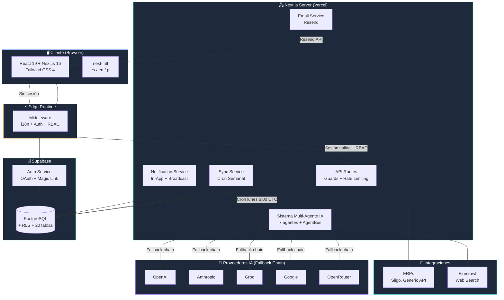
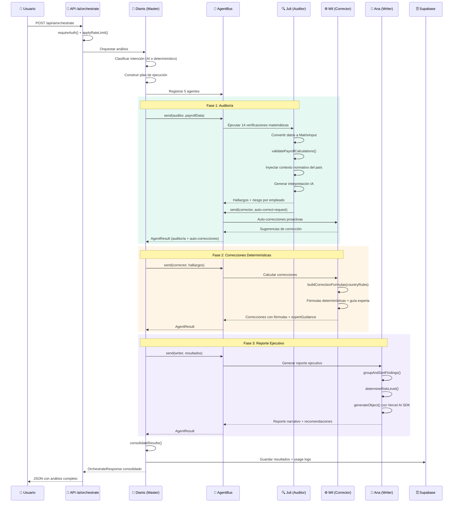
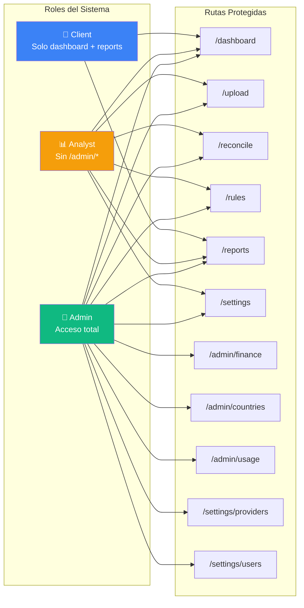
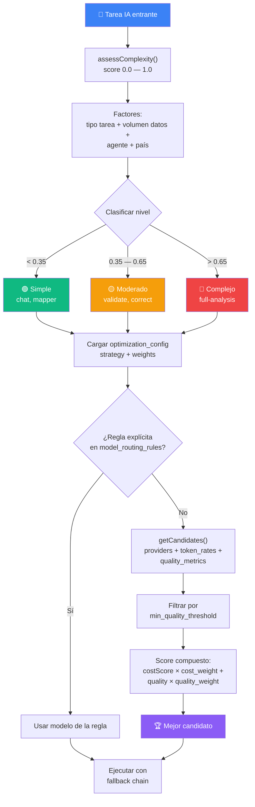
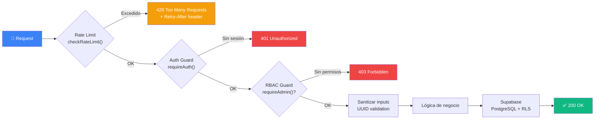
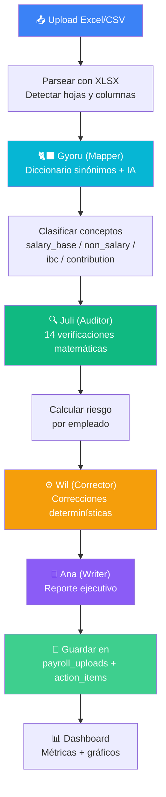

<div align="center">
  
  
  # Nomina Smart

  **Plataforma de Nómina Inteligente Multi-País con IA Multi-Agente**

  <p align="center">
    <a href="#-visión-del-proyecto">Visión</a> •
    <a href="#-qué-es-nomina-smart">¿Qué es?</a> •
    <a href="#-características-principales">Características</a> •
    <a href="#-diagramas-de-arquitectura">Diagramas</a> •
    <a href="#-tech-stack">Tech Stack</a> •
    <a href="#-guía-de-inicio-rápido">Inicio Rápido</a> •
    <a href="#-configuración-detallada">Configuración</a> •
    <a href="#-esquema-de-base-de-datos">Base de Datos</a> •
    <a href="#-referencia-de-api">API</a> •
    <a href="#-design-system-obsidian-ledger">Design System</a> •
    <a href="#-seguridad">Seguridad</a> •
    <a href="#-testing">Testing</a> •
    <a href="#-despliegue">Despliegue</a> •
    <a href="#-troubleshooting">Troubleshooting</a>
  </p>

  
  
  
  
  
  
  
</div>

---

## 🎯 Visión del Proyecto

**Nomina Smart** es una plataforma de clase mundial para gestión, auditoría y cumplimiento de nómina, diseñada para empresas que operan en múltiples países de Latinoamérica y Estados Unidos.

### Objetivos Estratégicos

| Pilar | Descripción |
|-------|-------------|
| 🔒 **Confiabilidad** | Cálculos precisos garantizados, auditoría continua con 14 verificaciones matemáticas y cumplimiento normativo al 100% |
| 🎨 **Usabilidad** | Interfaz oscura premium (Obsidian Ledger) con glassmorphism, agentes IA con personalidad y experiencia conversacional |
| ⚡ **Eficiencia** | Automatización inteligente que reduce tiempos de procesamiento de nómina de días a minutos |
| 🌎 **Escalabilidad** | Arquitectura multi-país (7 países), multi-idioma (3 idiomas) y multi-proveedor IA (5 proveedores) |

### Principios de Desarrollo

- **Security First**: Encriptación AES-256-GCM, RBAC en middleware y API routes, rate limiting por IP, RLS en PostgreSQL
- **AI-Native**: Sistema multi-agente con 7 agentes especializados, selección inteligente de modelos y fallback chain
- **Multi-Country**: Reglas normativas dinámicas por país/año, sincronización regulatoria automática semanal
- **Observable**: Logs de auditoría con retención 5 años, tracking de uso IA (tokens, latencia, costo), notificaciones in-app

---

## 🧠 ¿Qué es Nomina Smart?

Nomina Smart revoluciona el proceso de gestión y auditoría salarial mediante un sistema de **"Triple Match"** que cruza inteligentemente:

1. **Nómina Interna** — Archivos fuente extraídos desde tu ERP (Excel/CSV)
2. **Pago PILA / Seguridad Social** — Planilla de aportes del país correspondiente
3. **Estándar Regulatorio** — Cálculo normativo oficial (UGPP en CO, IMSS en MX, CLT en BR, etc.)

El sistema utiliza **7 agentes de IA especializados** para inferir mapeos automáticos, detectar inconsistencias críticas, calcular el nivel de riesgo por empleado, sugerir correcciones determinísticas y generar reportes ejecutivos narrativos.

---

## 🚀 Características Principales

### Sistema Multi-Agente de IA

Nomina Smart implementa un sistema de agentes con personalidades únicas que colaboran a través de un **AgentBus** (bus de comunicación inter-agente):

| Agente | Persona | Avatar | Rol | Descripción |
|--------|---------|--------|-----|-------------|
| 👑 **Dianis** | Master | 👩 Mujer | Directora de Orquestación | Coordina a todo el equipo, clasifica intención del usuario, construye plan de ejecución y consolida resultados |
| 🔍 **Juli** | Auditor | 👩 Mujer | Auditora de Nómina | Ejecuta 14 verificaciones matemáticas y normativas. Inyecta contexto normativo del país en el prompt. Solicita auto-correcciones al Corrector vía AgentBus |
| 📝 **Ana** | Writer | 👩 Mujer | Redactora de Reportes | Genera reportes ejecutivos narrativos con hallazgos agrupados por categoría y priorizados por severidad |
| ⚙️ **Wil** | Corrector | 👨 Hombre | Ingeniero de Correcciones | Propone correcciones numéricas determinísticas con fórmulas normativas. Incluye guía experta para hallazgos no determinísticos |
| 🐈‍⬛ **Gyoru** | Mapper | 🐱 Gato | Mapeadora de Campos | Mapea columnas de archivos Excel a campos estándar con diccionario de sinónimos + fuzzy matching IA |
| 🐰 **Luni** | Payroll Expert | 🐰 Conejo | Experta en Nómina Multi-País | Asistente conversacional de normativa laboral para 7 países con cálculos paso a paso y gestión CRUD de reglas |
| 🐕 **Soul** | Researcher | 🐕 Perro | Investigadora Regulatoria | Investiga normativa laboral vigente por país/año con búsqueda web (Firecrawl), resolución de conflictos entre fuentes y fallback a REGULATION_DB |

### 14 Verificaciones Matemáticas del Auditor

| # | Verificación | Fórmula / Regla |
|---|-------------|-----------------|
| 1 | IBC Ley 1393 | Pagos no salariales ≤ 40% del total devengado |
| 2 | Deducción Salud Empleado | 4% del IBC |
| 3 | Deducción Pensión Empleado | 4% del IBC |
| 4 | Cesantías | Salario × días / 360 |
| 5 | Intereses Cesantías | Cesantías × días × 12% / 360 |
| 6 | Prima de Servicios | Salario × días / 360 |
| 7 | Vacaciones | Salario base × días / 720 |
| 8 | Parafiscales SENA | 2% del IBC |
| 9 | Parafiscales ICBF | 3% del IBC |
| 10 | Caja de Compensación | 4% del IBC |
| 11 | ARL | Según nivel de riesgo (I: 0.522% — V: 6.960%) |
| 12 | Auxilio de Transporte | Aplica si salario ≤ 2 SMMLV |
| 13 | Tope IBC Máximo | Máximo 25 SMMLV |
| 14 | Tope IBC Mínimo | Mínimo 1 SMMLV |

> Los porcentajes y valores se cargan dinámicamente desde `country_year_rules` según el país y año del contexto. Los valores anteriores son los defaults para Colombia.

### Países Soportados

| País | Código | Normativa Principal | Moneda |
|------|--------|-------------------|--------|
| 🇨🇴 Colombia | CO | UGPP, Ley 100, CST, PILA, Ley 1393 | COP |
| 🇲🇽 México | MX | IMSS, ISR, LFT, INFONAVIT, SAR | MXN |
| 🇵🇪 Perú | PE | AFP, ONP, EsSalud, CTS, Gratificaciones | PEN |
| 🇨🇱 Chile | CL | AFP, FONASA/Isapre, Seguro Cesantía, Código del Trabajo | CLP |
| 🇧🇷 Brasil | BR | CLT, INSS, FGTS, IRRF, 13º Salário, Férias | BRL |
| 🇦🇷 Argentina | AR | SIPA, Obra Social, ART, Convenios Colectivos, Aguinaldo | ARS |
| 🇺🇸 Estados Unidos | US | FICA, FUTA, SUTA, Federal/State Withholding, 401(k) | USD |

### Características Transversales

| Característica | Descripción |
|----------------|-------------|
| **Rate Limiting** | 7 presets por endpoint: auth (10/min), AI (20/min), chat (30/min), admin writes (30/min), reads (60/min), writes (40/min), cron (5/min). Soporta Redis distribuido (Upstash) con fallback in-memory |
| **Sincronización Regulatoria** | Cron semanal (lunes 6:00 UTC) con investigación web, borradores de reglas N+1, notificaciones y reintentos con backoff exponencial. Bootstrap automático para países nuevos |
| **Panel Financiero de IA** | KPIs financieros, desglose por proveedor/cliente, gráficos de tendencia y exportación CSV |
| **Optimización de Tokens** | Selección inteligente de modelos por complejidad (score 0.0–1.0), score compuesto (costo × calidad), estrategias: cost-first, quality-first, balanced |
| **i18n** | Español (default), Inglés y Portugués con rutas localizadas via next-intl |
| **Email Transaccional** | Resend: invitaciones, alertas regulatorias, resúmenes semanales. Plantillas localizadas con retry y backoff exponencial |
| **Notificaciones In-App** | Severidad (info/warning/critical), tipos: cambio regulatorio, sync completado, regla pendiente. Broadcast a admins |
| **Auditoría de Cambios** | Registro de cambios en reglas con retención 5 años. Trazabilidad de origen (manual/automático) y fuentes |
| **Integraciones** | Framework extensible de conectores para ERPs (Siigo, Generic API). Interfaz `IntegrationConnector` para agregar nuevos sistemas |
| **Design System** | Obsidian Ledger: tokens de diseño oscuro con jerarquía de superficies tonales (6 niveles), paleta semántica, glassmorphism. Compatible con Material Design 3 |

---

## 📊 Diagramas de Arquitectura

### Arquitectura General del Sistema



### Flujo de Orquestación Multi-Agente



### Flujo de Autenticación y Middleware RBAC

```mermaid
flowchart TD
    REQ[📨 Request entrante] --> MW{Middleware Edge}
    MW --> STRIP[Extraer locale del path<br/>stripLocale]
    STRIP --> PUB{¿Ruta pública?<br/>/, /pricing, /login,<br/>/contact, /about, /manual}
    
    PUB -->|Sí| INTL[Aplicar i18n<br/>next-intl middleware]
    INTL --> RES_OK[✅ Response OK]
    
    PUB -->|No| SUPA[Crear cliente Supabase<br/>en Edge Runtime]
    SUPA --> SESSION{¿Sesión válida?<br/>supabase.auth.getUser}
    
    SESSION -->|No| REDIR[🔒 Redirect a<br/>/{locale}/login?redirectTo=...]
    
    SESSION -->|Sí| ROLE[Obtener rol via REST<br/>user_profiles → role]
    ROLE --> PERM{checkPermission<br/>role + path}
    
    PERM -->|admin: acceso total| INTL_AUTH[Aplicar i18n<br/>+ cookies auth refresh]
    PERM -->|analyst: sin /admin/*| CHECK_A{¿Ruta admin?}
    PERM -->|client: solo dashboard/reports| CHECK_C{¿Ruta permitida?}
    
    CHECK_A -->|No| INTL_AUTH
    CHECK_A -->|Sí| REDIR_DASH[↩️ Redirect a<br/>/{locale}/dashboard]
    
    CHECK_C -->|Sí| INTL_AUTH
    CHECK_C -->|No| REDIR_DASH
    
    INTL_AUTH --> RES_OK

    style REQ fill:#3b82f6,color:#fff
    style RES_OK fill:#10b981,color:#fff
    style REDIR fill:#ef4444,color:#fff
    style REDIR_DASH fill:#f59e0b,color:#fff
```

### Permisos por Rol



### Pipeline de Sincronización Regulatoria

```mermaid
flowchart LR
    CRON["⏰ Vercel Cron<br/>Lunes 6:00 UTC"] --> API["/api/sync/run<br/>CRON_SECRET"]
    API --> LOAD["Cargar países activos<br/>supported_countries"]
    LOAD --> BOOTSTRAP{"¿Tiene reglas<br/>en country_year_rules?"}
    
    BOOTSTRAP -->|No| BOOT["🚀 Bootstrap:<br/>Soul investiga y crea<br/>reglas iniciales"]
    BOOTSTRAP -->|Sí| DRAFT["Crear borrador<br/>reglas año N+1"]
    BOOT --> FREQ
    DRAFT --> FREQ{"¿Frecuencia<br/>cumplida? (weekly)"}
    
    FREQ -->|No| SKIP["⏭️ Omitir"]
    FREQ -->|Sí| RESEARCH["🐕 Soul (Researcher)<br/>Investigar normativa"]
    
    RESEARCH --> WEB{"¿Firecrawl<br/>disponible?"}
    WEB -->|Sí| WEBSEARCH["🌐 Búsqueda web<br/>fuentes gubernamentales"]
    WEB -->|No| FALLBACK["📚 REGULATION_DB<br/>fallback (confianza baja)"]
    
    WEBSEARCH --> CONFLICT["Resolver conflictos<br/>entre fuentes"]
    FALLBACK --> CONFLICT
    CONFLICT --> RETRY{"¿Éxito?"}
    
    RETRY -->|No, intento < 3| BACKOFF["⏳ Backoff exponencial<br/>1s → 2s → 4s"]
    BACKOFF --> RESEARCH
    RETRY -->|No, 3 intentos| FAIL["❌ Marcar failed<br/>en sync_history"]
    
    RETRY -->|Sí| CHANGES{"¿Cambios<br/>detectados?"}
    CHANGES -->|No| NOTIFY_OK["📬 Notificación:<br/>Sin cambios"]
    CHANGES -->|Sí| UPDATE["Actualizar regla<br/>→ pending_review"]
    UPDATE --> AUDIT["📋 Log auditoría<br/>rule_audit_log"]
    AUDIT --> NOTIFY_CHANGE["🔔 Notificación:<br/>Cambio regulatorio"]
    NOTIFY_CHANGE --> EMAIL_ALERT["📧 Email alerta<br/>a usuarios suscritos"]

    style CRON fill:#3b82f6,color:#fff
    style BOOT fill:#8b5cf6,color:#fff
    style RESEARCH fill:#06b6d4,color:#fff
    style FAIL fill:#ef4444,color:#fff
    style NOTIFY_OK fill:#10b981,color:#fff
    style NOTIFY_CHANGE fill:#f59e0b,color:#fff
```



### Selección Inteligente de Modelos IA



### Diagrama Entidad-Relación (Base de Datos)

```mermaid
erDiagram
    companies ||--o{ employees : "tiene"
    companies ||--o{ audits : "tiene"
    companies ||--o{ payroll_uploads : "tiene"
    audits ||--o{ reconciliation_records : "contiene"
    employees ||--o{ reconciliation_records : "referencia"
    payroll_uploads ||--o{ payroll_action_items : "genera"
    payroll_uploads ||--o{ applied_corrections : "recibe"
    auth_users ||--|| user_profiles : "tiene"
    user_profiles }o--|| companies : "pertenece a"
    auth_users ||--o{ ai_providers : "configura"
    ai_providers ||--o{ ai_usage_logs : "registra"
    ai_usage_logs }o--|| companies : "asociado a"
    country_year_rules ||--o{ rule_audit_log : "auditado por"
    country_year_rules ||--o{ research_sources : "documentado por"
    supported_countries ||--o{ sync_history : "sincronizado"
    auth_users ||--o{ notifications : "recibe"

    companies {
        uuid id PK
        varchar nit UK
        varchar name
        varchar industry
        timestamp created_at
    }
    employees {
        uuid id PK
        uuid company_id FK
        varchar document_type
        varchar document_number
        decimal current_salary
        varchar status
    }
    payroll_uploads {
        uuid id PK
        uuid company_id FK
        varchar country_code
        int period_year
        int period_month
        jsonb risk_report
        jsonb ai_validation_report
        jsonb employee_risk_summary
    }
    user_profiles {
        uuid id PK_FK
        varchar role
        uuid company_id FK
        varchar preferred_locale
        varchar email
        jsonb alert_countries
    }
    ai_providers {
        uuid id PK
        uuid user_id FK
        varchar provider_type
        text api_key_encrypted
        varchar model_id
        int priority
        boolean is_active
    }
    country_year_rules {
        uuid id PK
        varchar country_code
        int rule_year
        varchar label
        jsonb required_fields
        jsonb required_calculations
        jsonb checks
        varchar status
    }
    optimization_config {
        uuid id PK
        varchar strategy
        decimal cost_weight
        decimal quality_weight
        decimal max_cost_per_task_usd
        boolean enable_auto_routing
    }
    notifications {
        uuid id PK
        uuid user_id FK
        varchar type
        varchar severity
        varchar title
        text body
        boolean is_read
    }
    sync_history {
        uuid id PK
        varchar country_code
        int rule_year
        varchar status
        varchar trigger_type
        int retry_count
        varchar confidence
    }
```

### Ciclo de Vida de un Request API



### Flujo de Carga y Procesamiento de Nómina



---

## 🛠️ Tech Stack

### Frontend

| Tecnología | Versión | Propósito |
|------------|---------|-----------|
| **Next.js** | 16.1.6 | Framework principal con App Router + Turbopack |
| **React** | 19.2.3 | UI library con Server Components |
| **Tailwind CSS** | 4.x | Sistema de diseño utilitario responsivo |
| **Obsidian Ledger** | Custom | Design system oscuro con superficies tonales (Material Design 3) |
| **Lucide React** | 0.575+ | Iconografía moderna y accesible |
| **Recharts** | 3.7+ | Visualización de datos y gráficos ejecutivos |
| **next-intl** | 4.8+ | Internacionalización con rutas localizadas |

### Backend & IA

| Tecnología | Versión | Propósito |
|------------|---------|-----------|
| **Supabase** | 2.98+ | PostgreSQL con Row Level Security + Auth |
| **Vercel AI SDK** | 4.x | Orquestación multi-agente y streaming |
| **@ai-sdk/openai** | 3.x | Proveedor OpenAI |
| **@ai-sdk/anthropic** | 3.x | Proveedor Anthropic |
| **@ai-sdk/groq** | 1.x | Proveedor Groq |
| **@ai-sdk/google** | 3.x | Proveedor Google |
| **@openrouter/ai-sdk-provider** | 0.7+ | Proveedor OpenRouter |
| **Resend** | API | Correos transaccionales |
| **Firecrawl** | API | Web search + scraping para investigación regulatoria |

### Herramientas

| Tecnología | Propósito |
|------------|-----------|
| **TypeScript** | Tipado estático estricto |
| **Zod** | Validación de esquemas en runtime |
| **XLSX** | Procesamiento de hojas de cálculo |
| **Vitest** | Testing unitario con fast-check (property-based) |
| **ESLint** | Linting con eslint-config-next |

---

## 📁 Estructura del Proyecto

```
nomina-smart/
├── .kiro/
│   ├── hooks/                    # Agent hooks (automatización de eventos del IDE)
│   └── settings/
│       └── mcp.json              # Servidores MCP (Supabase + Vercel) — excluido de git
├── messages/                     # Diccionarios i18n
│   ├── en.json                   #   Inglés
│   ├── es.json                   #   Español (default)
│   └── pt.json                   #   Portugués
├── scripts/                      # Migraciones SQL (001–006) + utilidades
│   ├── 001_setup_schema.sql      #   Tablas base (companies, employees, audits, payroll_uploads)
│   ├── 002_refactor_tables.sql   #   user_profiles, ai_providers, ai_usage_logs + trigger
│   ├── 003_multi_country_tables.sql  # supported_countries, token_rates, corrections, sources
│   ├── 004_regulatory_sync_tables.sql # sync_history, rule_audit_log, notifications, email_log
│   ├── 005_finance_token_optimization.sql # routing_rules, quality_metrics, optimization_config
│   ├── 006_proper_rls_policies.sql    # Políticas RLS completas
│   ├── check-db.cjs              #   Diagnóstico de BD: verifica 24 tablas via API REST Supabase
│   ├── run-managed.cjs           #   Ejecutor gestionado del servidor de desarrollo
│   └── stop-app.cjs              #   Detiene procesos de la aplicación
├── src/
│   ├── app/
│   │   ├── [locale]/             # Rutas multilenguaje (es/en/pt)
│   │   │   ├── (public)/         #   Landing, about, contact, pricing, manual (sin auth) — incluye página de planes/precios y manual de usuario completo con navegación lateral
│   │   │   ├── login/            #   Autenticación
│   │   │   ├── admin/            #   Paneles admin (finanzas, países, uso, optimización)
│   │   │   ├── dashboard/        #   Dashboard ejecutivo con métricas
│   │   │   ├── reconcile/        #   Conciliación y validación
│   │   │   ├── reports/          #   Reportes ejecutivos
│   │   │   ├── rules/            #   Reglas normativas por país
│   │   │   ├── settings/         #   Configuración (proveedores IA, usuarios)
│   │   │   └── upload/           #   Carga de archivos Excel/CSV
│   │   ├── api/                  # Endpoints REST (11 categorías)
│   │   │   ├── ai/               #   chat, corrections, mapping, orchestrate, validation
│   │   │   ├── admin/            #   countries, finance, optimization, rules, users
│   │   │   ├── sync/             #   bootstrap, history, run (cron)
│   │   │   ├── settings/         #   providers (CRUD + reorder + test), usage
│   │   │   ├── actions/          #   Action items CRUD
│   │   │   ├── audit/            #   Audit trail por regla
│   │   │   ├── companies/        #   Empresas
│   │   │   ├── integrations/     #   Conectores externos + test
│   │   │   ├── notifications/    #   Listado + marcar leída
│   │   │   ├── payrolls/         #   Cargas de nómina
│   │   │   └── rules/            #   Reglas normativas
│   │   └── auth/callback/        # OAuth callback Supabase
│   ├── components/
│   │   ├── layout/               # Sidebar, Header, AppShell
│   │   └── ui/                   # 25+ componentes UI (Cards, Charts, Tables, AI Sidebar...)
│   ├── i18n/                     # Configuración next-intl (routing + request)
│   ├── lib/
│   │   ├── ai/                   # Capa IA completa
│   │   │   ├── agents/           #   7 agentes + AgentBus v2 + clasificador + planificador + validador cruzado
│   │   │   ├── providers.ts      #   Registry multi-proveedor (5 proveedores)
│   │   │   ├── fallback.ts       #   Cadena de fallback con retry
│   │   │   ├── model-selector.ts #   Selector inteligente por complejidad
│   │   │   ├── cost-calculator.ts#   Calculadora de costos por tarea
│   │   │   ├── encryption.ts     #   AES-256-GCM para API keys
│   │   │   ├── rule-engine.ts    #   Motor de reglas multi-país
│   │   │   ├── streaming.ts      #   Motor de streaming SSE para pipeline
│   │   │   ├── plan-serializer.ts#   Serialización/deserialización de planes dinámicos
│   │   │   ├── usage-logger.ts   #   Logger de uso IA (tokens, latencia, costo)
│   │   │   ├── schemas.ts        #   Esquemas Zod compartidos
│   │   │   └── types.ts          #   Tipos TypeScript del sistema IA
│   │   ├── api/                  # Guard (auth + RBAC) + Rate limiter (Redis/memory)
│   │   ├── audit/                # Servicio de auditoría de reglas (retención 5 años)
│   │   ├── auth/                 # User profile y permisos
│   │   ├── email/                # Email service (Resend) + plantillas localizadas
│   │   ├── integrations/         # Framework de conectores (Siigo, Generic API)
│   │   ├── notifications/        # Notificaciones in-app + broadcast a admins
│   │   ├── payroll/              # Lógica de nómina (actions, classifier, risk, validation, format-detector)
│   │   ├── sync/                 # Sincronización regulatoria (cron + bootstrap)
│   │   ├── supabase/             # Clientes Supabase (client, server, admin)
│   │   └── types/                # Tipos compartidos
│   └── middleware.ts             # Edge: i18n + Auth + RBAC
├── vercel.json                   # Cron jobs configuration
├── vitest.config.ts              # Testing configuration
└── tsconfig.json                 # TypeScript strict mode
```

---

## ⚡ Guía de Inicio Rápido

### Requisitos Previos

- **Node.js** v20+ ([descargar](https://nodejs.org))
- **npm** (incluido con Node.js)
- **Cuenta Supabase** ([crear gratis](https://supabase.com/))

### Instalación

```bash
# 1. Clonar el repositorio
git clone https://github.com/tu-usuario/nomina-smart.git
cd nomina-smart

# 2. Instalar dependencias
npm install

# 3. Configurar variables de entorno
cp .env.local.example .env.local
# Editar .env.local con tus credenciales

# 4. Iniciar servidor de desarrollo
npm run dev
```

Accede en: `http://localhost:3000/es` (o `/en`, `/pt`)

### Scripts Disponibles

| Script | Descripción |
|--------|-------------|
| `npm run dev` | Servidor de desarrollo con Turbopack |
| `npm run dev:managed` | Servidor con gestión de procesos |
| `npm run build` | Build de producción |
| `npm run start` | Servidor de producción |
| `npm run lint` | Ejecutar ESLint |
| `npm run test` | Ejecutar tests con Vitest (single run) |
| `npm run test:watch` | Tests en modo watch |
| `npm run stop` | Detener servidor managed |

---

## ⚙️ Configuración Detallada

### Variables de Entorno

| Variable | Requerida | Descripción |
|----------|-----------|-------------|
| `NEXT_PUBLIC_SUPABASE_URL` | ✅ | URL del proyecto Supabase |
| `NEXT_PUBLIC_SUPABASE_ANON_KEY` | ✅ | Clave pública anónima |
| `SUPABASE_SERVICE_ROLE_KEY` | ✅ | Clave de servicio (admin, server-side only) |
| `RESEND_API_KEY` | ✅ | API key de Resend para emails transaccionales |
| `RESEND_FROM_EMAIL` | ✅ | Dirección de remitente (ej: `noreply@nominasmart.com`) |
| `ENCRYPTION_KEY` | ✅ | Clave AES-256 (64 chars hex) para cifrar API keys de proveedores IA |
| `CRON_SECRET` | ✅ | Secret para autenticar cron jobs de Vercel |
| `FIRECRAWL_API_KEY` | ⬜ | API key de [Firecrawl](https://www.firecrawl.dev/) para investigación regulatoria web. Sin ella, el agente investigador usa REGULATION_DB como fallback |
| `UPSTASH_REDIS_REST_URL` | ⬜ | URL REST de [Upstash Redis](https://console.upstash.com/) para rate limiting distribuido. Sin ella, usa store in-memory |
| `UPSTASH_REDIS_REST_TOKEN` | ⬜ | Token de autenticación de Upstash Redis |

#### Generar ENCRYPTION_KEY

```bash
node -e "console.log(require('crypto').randomBytes(32).toString('hex'))"
```

### Credenciales Supabase

En [supabase.com](https://supabase.com) → Settings → API:
- **Project URL** → `NEXT_PUBLIC_SUPABASE_URL`
- **Anon Public Key** → `NEXT_PUBLIC_SUPABASE_ANON_KEY`
- **Service Role Key** → `SUPABASE_SERVICE_ROLE_KEY`

### Inicializar Base de Datos

Ejecuta los scripts SQL en orden desde el SQL Editor de Supabase:

```
001_setup_schema.sql              → Tablas base (companies, employees, audits, payroll_uploads, action_items)
002_refactor_tables.sql           → user_profiles, ai_providers, ai_usage_logs + trigger on_auth_user_created
003_multi_country_tables.sql      → supported_countries, token_rates, applied_corrections, agent_communications, research_sources
004_regulatory_sync_tables.sql    → sync_history, rule_audit_log, notifications, email_log
005_finance_token_optimization.sql → model_routing_rules, quality_metrics, optimization_config
006_proper_rls_policies.sql       → Políticas RLS completas para todas las tablas
```

### Proveedores IA

Se configuran desde `/settings/providers` (requiere rol admin). Tipos soportados:

| Proveedor | Tipo | Modelos Ejemplo |
|-----------|------|-----------------|
| OpenAI | `openai` | gpt-4.1, gpt-4.1-mini, o4-mini, gpt-4o-mini |
| Anthropic | `anthropic` | claude-sonnet-4-20250514, claude-opus-4-20250514, claude-3-5-haiku |
| Groq | `groq` | llama-3.3-70b, llama-3.1-8b, deepseek-r1-distill-llama-70b |
| Google | `google` | gemini-2.5-flash, gemini-2.5-pro, gemini-2.0-flash |
| OpenRouter | `openrouter` | Cualquier modelo disponible en OpenRouter (incluye modelos gratuitos de Gemini, DeepSeek, Llama, Qwen) |

Cada proveedor tiene: `api_key` (cifrada con AES-256-GCM), `model_id`, `priority` (orden de fallback), `is_active`.

### Optimización de Tokens

Configurable desde `/admin/settings/optimization`:

| Parámetro | Default | Descripción |
|-----------|---------|-------------|
| `strategy` | `balanced` | `cost-first`, `quality-first`, `balanced` |
| `cost_weight` | `0.5` | Peso del costo en score compuesto (0.0–1.0) |
| `quality_weight` | `0.5` | Peso de la calidad en score compuesto (0.0–1.0) |
| `max_cost_per_task_usd` | `0.50` | Límite de costo por tarea |
| `min_quality_threshold` | `0.7` | Umbral mínimo de calidad para candidatos |
| `enable_auto_routing` | `true` | Habilitar enrutamiento automático por reglas |

> `cost_weight + quality_weight` debe sumar 1.0.

### Cron Jobs (Vercel)

```json
{
  "crons": [
    { "path": "/api/sync/run", "schedule": "0 6 * * 1" }
  ]
}
```

Lunes 6:00 UTC. Autenticado con `CRON_SECRET` como Bearer token. Rate limit: 5 req/min.

#### Bootstrap Manual de Reglas

```bash
# Bootstrap de todos los países
curl -X POST https://tu-app.vercel.app/api/sync/bootstrap \
  -H "Authorization: Bearer tu-CRON_SECRET"

# Bootstrap de un país específico
curl -X POST https://tu-app.vercel.app/api/sync/bootstrap \
  -H "Authorization: Bearer tu-CRON_SECRET" \
  -H "Content-Type: application/json" \
  -d '{"countryCode": "CO", "year": 2026}'
```

---

## 🗄️ Esquema de Base de Datos

### Migraciones SQL

| Script | Tablas Creadas |
|--------|---------------|
| `001_setup_schema.sql` | `companies`, `employees`, `audits`, `reconciliation_records`, `country_year_rules`, `payroll_uploads`, `payroll_action_items` |
| `002_refactor_tables.sql` | `user_profiles`, `ai_providers`, `ai_usage_logs` + trigger `handle_new_user` |
| `003_multi_country_tables.sql` | `supported_countries`, `task_pricing`, `infrastructure_costs`, `provider_token_rates`, `applied_corrections`, `agent_communications`, `research_sources` |
| `004_regulatory_sync_tables.sql` | `sync_history`, `rule_audit_log`, `notifications`, `email_log` |
| `005_finance_token_optimization.sql` | `model_routing_rules`, `quality_metrics`, `optimization_config` |
| `006_proper_rls_policies.sql` | Políticas RLS para todas las tablas |

### Tablas Principales (20+)

| Tabla | Descripción | Relaciones |
|-------|-------------|------------|
| `companies` | Empresas (NIT, nombre, industria) | → employees, audits, payroll_uploads |
| `employees` | Empleados con datos salariales y estado | → company_id |
| `audits` | Auditorías por empresa/período con risk score | → reconciliation_records |
| `reconciliation_records` | Registros de conciliación triple-match | → audit_id, employee_id |
| `payroll_uploads` | Cargas de nómina con mapeos, validaciones y reportes (JSONB) | → action_items, corrections |
| `payroll_action_items` | Hallazgos/tickets con prioridad, severidad y resolución | → payroll_id |
| `country_year_rules` | Reglas normativas por país/año (status: draft/pending_review/approved/rejected) | → audit_log, sources |
| `user_profiles` | Perfiles con rol (admin/analyst/client), locale, alert_countries | → auth.users (PK=FK) |
| `ai_providers` | Proveedores IA con API key cifrada AES-256-GCM | → user_id |
| `ai_usage_logs` | Uso IA: tokens in/out, latencia, costo, complejidad, modelo | → provider_id, company_id |
| `supported_countries` | 7 países con moneda, formato y frecuencia de sync | → sync_history |
| `sync_history` | Historial de sincronizaciones (status, reintentos, confianza) | → country_code |
| `rule_audit_log` | Auditoría de cambios en reglas (retención 5 años) | → rule_id, user_id |
| `notifications` | Notificaciones in-app (tipo, severidad, metadata JSONB) | → user_id |
| `email_log` | Registro de emails vía Resend (status, retry_count) | — |
| `model_routing_rules` | Enrutamiento de modelos por tarea/agente/complejidad | — |
| `quality_metrics` | Métricas de calidad por proveedor/modelo/agente | — |
| `optimization_config` | Estrategia de optimización global (singleton) | — |
| `applied_corrections` | Correcciones aplicadas con fórmula y revalidación | → payroll_upload_id |
| `agent_communications` | Comunicaciones inter-agente (AgentBus history) | — |
| `research_sources` | Fuentes del agente investigador (URL, título, fecha) | → country_year_rule_id |
| `provider_token_rates` | Tarifas por 1K tokens por proveedor/modelo | — |

### RLS y Triggers

- **RLS habilitado** en todas las tablas. `user_profiles` y `ai_providers` restringidos por `auth.uid()`.
- **Trigger `on_auth_user_created`**: Auto-crea `user_profiles` con rol `client` al registrar usuario.
- **Políticas completas** definidas en `006_proper_rls_policies.sql`.

---

## 📡 Referencia de API

### Endpoints de IA

| Método | Ruta | Auth | Rate Limit | Descripción |
|--------|------|------|------------|-------------|
| POST | `/api/ai/orchestrate` | requireAuth | ai (20/min) | Orquestación multi-agente (full-analysis, validate, map, correct, chat) |
| POST | `/api/ai/chat` | requireAuth | aiChat (30/min) | Chat conversacional con Payroll Expert |
| POST | `/api/ai/mapping` | requireAuth | ai (20/min) | Mapeo de columnas Excel → campos estándar |
| POST | `/api/ai/validation` | requireAuth | ai (20/min) | Validación de nómina con 14 verificaciones |
| POST | `/api/ai/corrections` | requireAuth | ai (20/min) | Correcciones determinísticas |

### Endpoints de Nómina

| Método | Ruta | Auth | Rate Limit | Descripción |
|--------|------|------|------------|-------------|
| GET/POST | `/api/payrolls` | requireAuth | read/write | Listar y crear cargas de nómina |
| GET | `/api/companies` | requireAuth | read | Listar empresas |
| GET/POST/PATCH | `/api/actions` | requireAuth | read/write | Action items (hallazgos) |
| GET/PATCH | `/api/actions/[id]` | requireAuth | read/write | Action item individual |
| GET/POST/DELETE | `/api/rules` | requireAuth/Admin | read/adminWrite | Reglas normativas |

### Endpoints de Administración

| Método | Ruta | Auth | Rate Limit | Descripción |
|--------|------|------|------------|-------------|
| GET | `/api/admin/finance` | requireAdmin | read | Dashboard financiero IA |
| GET | `/api/admin/finance/export` | requireAdmin | read | Exportar datos financieros CSV |
| GET | `/api/admin/countries` | requireAdmin | read | Países soportados |
| GET/POST | `/api/admin/users` | requireAdmin | read/adminWrite | Gestión de usuarios |
| POST | `/api/admin/users/invite` | requireAdmin | adminWrite | Invitar usuario (envía email) |
| PATCH/DELETE | `/api/admin/users/[id]` | requireAdmin | adminWrite | Editar/eliminar usuario |
| POST | `/api/admin/users/[id]/resend-invite` | requireAdmin | adminWrite | Reenviar invitación |
| POST | `/api/admin/rules/[id]/approve` | requireAdmin | adminWrite | Aprobar regla |
| POST | `/api/admin/rules/[id]/reject` | requireAdmin | adminWrite | Rechazar regla |
| GET/PUT | `/api/admin/optimization-config` | requireAdmin | read/adminWrite | Configuración de optimización |
| GET/POST | `/api/admin/optimization-config/rules` | requireAdmin | read/adminWrite | Reglas de enrutamiento de modelos |
| PUT/DELETE | `/api/admin/optimization-config/rules/[id]` | requireAdmin | adminWrite | Regla individual |

### Endpoints de Sincronización

| Método | Ruta | Auth | Rate Limit | Descripción |
|--------|------|------|------------|-------------|
| POST | `/api/sync/run` | CRON_SECRET | cron (5/min) | Ejecutar sincronización regulatoria |
| POST | `/api/sync/bootstrap` | CRON_SECRET | cron (5/min) | Bootstrap de reglas para países nuevos |
| GET | `/api/sync/history` | requireAdmin | read | Historial de sincronizaciones |

### Endpoints de Configuración

| Método | Ruta | Auth | Rate Limit | Descripción |
|--------|------|------|------------|-------------|
| GET/POST | `/api/settings/providers` | requireAuth | read/write | Proveedores IA (CRUD) |
| PUT/DELETE | `/api/settings/providers/[id]` | requireAuth | write | Proveedor individual |
| POST | `/api/settings/providers/[id]/test` | requireAuth | ai | Test de conexión |
| POST | `/api/settings/providers/reorder` | requireAuth | write | Reordenar prioridad |
| GET | `/api/settings/usage` | requireAuth | read | Uso de IA |

### Otros Endpoints

| Método | Ruta | Auth | Rate Limit | Descripción |
|--------|------|------|------------|-------------|
| GET | `/api/audit/[ruleId]` | requireAuth | read | Trail de auditoría por regla |
| GET/POST | `/api/integrations` | requireAuth | read/write | Integraciones externas |
| POST | `/api/integrations/test` | requireAuth | write | Test de integración |
| GET | `/api/notifications` | requireAuth | read | Notificaciones del usuario |
| POST | `/api/notifications/[id]/read` | requireAuth | write | Marcar notificación como leída |

---

## 🎨 Design System: Obsidian Ledger

Nomina Smart utiliza un design system oscuro premium llamado **Obsidian Ledger**, inspirado en Material Design 3 con superficies tonales y glassmorphism.

### Jerarquía de Superficies (Nesting Principle)

Cada nivel sube ~4-6 puntos de luminosidad para crear profundidad visual:

```
surface (#0b1326) → container-low (#131b2e) → container (#171f33) → 
container-high (#222a3d) → container-highest (#2d3449) → bright (#31394d)
```

### Paleta Semántica

| Token | Color | Uso |
|-------|-------|-----|
| `--ol-primary` | `#d0bcff` (violeta claro) | Acciones principales, acentos |
| `--ol-secondary` | `#4edea3` (esmeralda) | Éxito, cumplimiento |
| `--ol-tertiary` | `#ffb2b7` (rosa) | Advertencias, riesgo medio |
| `--ol-error` | `#ffb4ab` (salmón) | Errores, riesgo alto |
| `--ol-on-surface` | `#dae2fd` | Texto principal |
| `--ol-on-surface-variant` | `#cbc3d7` | Texto secundario |

### Clases Utilitarias

```css
.glass-panel          /* Glassmorphism: blur(20px) + border sutil + shadow */
.ol-surface           /* Superficie base */
.ol-surface-low       /* Superficie baja */
.ol-surface-container /* Superficie contenedor */
.ol-surface-high      /* Superficie alta */
.ol-surface-highest   /* Superficie más alta */
.ol-surface-bright    /* Superficie brillante */
.ol-ghost-border      /* Borde fantasma (glint de luz en borde de vidrio) */
.ol-pulse-indicator   /* Indicador de pulso para procesamiento IA en tiempo real */
```

### Animaciones

| Clase | Efecto |
|-------|--------|
| `.animate-float` | Flotación suave (4s) |
| `.animate-pulse-glow` | Pulso con glow esmeralda (2s) |
| `.animate-fade-in` | Fade in con slide up (0.3s) |
| `.animate-shimmer` | Shimmer de carga (2s) |
| `.animate-avatar-float` | Flotación de avatares de agentes (3s) |

### Micro-interacciones (Req 5.1–5.4)

| Clase | Efecto | Duración |
|-------|--------|----------|
| `.ns-interactive` | Transición hover (scale + brightness) y focus-visible con anillo violeta | 120ms |
| `.ns-state-enter` | Entrada con fade + scale up | 300ms |
| `.ns-state-exit` | Salida con fade + scale down | 200ms |
| `.ns-state-error` | Shake horizontal + flash rojo para errores | 400ms |
| `.ns-confirm` | Confirmación con bounce elástico | 300ms |
| `.ns-success-ring` | Anillo expansivo esmeralda para acciones exitosas | 400ms |
| `.ns-skeleton` | Esqueleto de carga con shimmer animado | 1.8s loop |
| `.ns-skeleton-text` | Esqueleto para líneas de texto (h: 0.875rem) | — |
| `.ns-skeleton-heading` | Esqueleto para títulos (h: 1.5rem) | — |
| `.ns-skeleton-card` | Esqueleto para tarjetas (h: 120px, 90px en móvil) | — |
| `.ns-skeleton-avatar` | Esqueleto circular para avatares (40×40px) | — |
| `.ns-responsive-stack` | Apila layouts horizontales en columna bajo 768px | — |

### Background

El fondo global usa gradientes radiales con violeta y esmeralda sobre base `#060913`:

```css
background-image: 
  radial-gradient(ellipse at 85% 5%, rgba(124, 58, 237, 0.15), transparent 45%),
  radial-gradient(ellipse at 15% 95%, rgba(16, 185, 129, 0.15), transparent 45%);
```

### Utilidades de Dashboard

El módulo `src/lib/design-tokens.ts` también exporta funciones utilitarias para el dashboard:

| Función | Descripción |
|---------|-------------|
| `calculateTrend(current, previous)` | Calcula indicador de tendencia (up/down/stable) con porcentaje de cambio |
| `aggregateFindingsBySeverity(findings)` | Agrupa hallazgos de auditoría por severidad (alta/media/baja) |
| `spacingToPx(value)` | Convierte valor de espaciado ("16px") a número |

### Integración con Componentes

Los componentes UI (`AgentPipeline`, `AiSidebar`, `DashboardMetrics`, etc.) consumen los tokens de diseño a través de dos mecanismos:

- **CSS custom properties** (`cssVars`): para clases Tailwind dinámicas (ej: `` bg-[${cssVars.colors.surface}] ``)
- **Constantes directas** (`colors`, `elevation`): para estilos inline donde se necesitan valores calculados (ej: `boxShadow`, opacidades)

---

## 🔒 Seguridad

### Capas de Seguridad

| Capa | Implementación |
|------|---------------|
| **Encriptación** | AES-256-GCM para API keys de proveedores IA (`src/lib/ai/encryption.ts`) |
| **Autenticación** | Supabase Auth (OAuth + Magic Link) validado en Edge middleware |
| **Autorización** | RBAC con 3 roles (admin/analyst/client) en middleware + API guards |
| **Rate Limiting** | 7 presets por IP con soporte Redis distribuido (Upstash) + fallback in-memory |
| **RLS** | Row Level Security en PostgreSQL para todas las tablas |
| **Input Validation** | Sanitización de UUIDs, validación con Zod en API routes |
| **CRON Auth** | Bearer token (`CRON_SECRET`) para endpoints de sincronización |
| **Cookie Security** | Cookies httpOnly con refresh automático en middleware |

### Rate Limiting Detallado

```
┌─────────────┬──────────┬──────────┐
│   Preset    │  Límite  │ Ventana  │
├─────────────┼──────────┼──────────┤
│ auth        │ 10/min   │ 60s      │
│ ai          │ 20/min   │ 60s      │
│ aiChat      │ 30/min   │ 60s      │
│ adminWrite  │ 30/min   │ 60s      │
│ read        │ 60/min   │ 60s      │
│ write       │ 40/min   │ 60s      │
│ cron        │  5/min   │ 60s      │
└─────────────┴──────────┴──────────┘
```

Cuando se excede el límite, retorna `429 Too Many Requests` con header `Retry-After`.

---

## 🧪 Testing

El proyecto usa **Vitest** con **fast-check** para property-based testing.

```bash
# Ejecutar todos los tests
npm run test

# Tests en modo watch
npm run test:watch
```

### Tests Existentes

| Archivo | Cobertura |
|---------|-----------|
| `src/lib/design-tokens.test.ts` | Tokens de diseño premium, cálculo de tendencias y agregación de severidad |
| `src/lib/ai/agents/auditor.test.ts` | Verificaciones matemáticas del auditor |
| `src/lib/ai/agents/agent-bus.test.ts` | AgentBus v2: enrutamiento, logging, timeout y prevención de ciclos |
| `src/lib/ai/agents/intent-classifier.test.ts` | Clasificador contextual de intención |
| `src/lib/ai/agents/dynamic-planner.test.ts` | Planificador dinámico adaptativo |
| `src/lib/ai/agents/cross-validator.test.ts` | Validación cruzada entre agentes |
| `src/lib/ai/agents/researcher.test.ts` | Investigación regulatoria y resolución de conflictos |
| `src/lib/ai/encryption.test.ts` | Encriptación/desencriptación AES-256-GCM |
| `src/lib/ai/model-selector.test.ts` | Selección inteligente de modelos |
| `src/lib/ai/providers.test.ts` | Registry de proveedores y fallback |
| `src/lib/ai/streaming.test.ts` | Motor de streaming SSE para pipeline de agentes |
| `src/lib/ai/plan-serializer.test.ts` | Serialización/deserialización de planes de ejecución |
| `src/lib/ai/rule-engine.test.ts` | Motor de reglas multi-país |
| `src/lib/audit/audit-service.test.ts` | Servicio de auditoría |
| `src/lib/email/email-service.test.ts` | Servicio de email |
| `src/lib/email/templates/index.test.ts` | Plantillas de email |
| `src/lib/notifications/notification-service.test.ts` | Servicio de notificaciones |
| `src/lib/payroll/format-detector.test.ts` | Detección automática de formato de archivo (CSV, XLSX, JSON) |
| `src/lib/sync/sync-service.test.ts` | Servicio de sincronización regulatoria |
| `src/hooks/usePipelineStream.test.ts` | Hook SSE centralizado: backoff, mapeo de eventos, síntesis, parser SSE |
| `src/hooks/usePipelineStream.property.test.ts` | PBT: mapeo SSE→LogEntry, backoff exponencial, síntesis completa, acumulación incremental (Properties 5, 6, 7, 12) |
| `src/components/ui/ProviderStatusPanel.property.test.tsx` | PBT: conteo de proveedores, renderizado completo, alertas de test fallido (Properties 1, 2, 3) |
| `src/components/ui/ProcessFlowPanel.property.test.tsx` | PBT: agentes visibles en cada paso del flujo de proceso (Property 4) |
| `src/components/ui/AiSidebar.property.test.tsx` | PBT: ausencia de detalles técnicos en sidebar simplificado (Property 8) |
| `src/components/ui/i18n-keys.property.test.ts` | PBT: claves de traducción existen en los 3 idiomas para componentes del dashboard (Property 11) |
| `src/components/ui/LiveLogsPanel.test.tsx` | Panel de logs en tiempo real: estado vacío, renderizado de entradas, botón limpiar |
| `src/components/ui/LiveSynthesisPanel.test.tsx` | Panel de síntesis IA: estado vacío, carga, renderizado completo con datos |

---

## 🚀 Despliegue

### Vercel (Recomendado)

1. Conecta tu repositorio GitHub a [Vercel](https://vercel.com)
2. Configura las variables de entorno en el dashboard de Vercel
3. El cron job se activa automáticamente desde `vercel.json`
4. Deploy automático en cada push a `main`

### Variables de Entorno en Vercel

Asegúrate de configurar todas las variables marcadas como ✅ en la sección de [Configuración](#-configuración-detallada), más las opcionales que necesites.

### Verificar Cron Job

Después del deploy, verifica que el cron job esté activo en Vercel Dashboard → Settings → Cron Jobs. Debería mostrar:

```
/api/sync/run — Every Monday at 6:00 AM UTC
```

---

## 🔧 Troubleshooting

### Problemas Comunes

| Problema | Solución |
|----------|----------|
| `No active AI providers configured` | Configura al menos un proveedor IA en `/settings/providers` con una API key válida |
| `ENCRYPTION_KEY is not configured` | Genera una clave de 64 caracteres hex y agrégala a `.env.local` |
| `Rate limit exceeded (429)` | Espera el tiempo indicado en `Retry-After` header. Ajusta presets si es necesario |
| `Researcher agent falls back to REGULATION_DB` | Configura `FIRECRAWL_API_KEY` para habilitar búsqueda web real |
| `No rules found for country` | Ejecuta el bootstrap manual: `POST /api/sync/bootstrap` con el `CRON_SECRET` |
| `User has no permissions` | Verifica el rol en `user_profiles`. El trigger auto-asigna `client` por defecto |
| `Email not sending` | Verifica `RESEND_API_KEY` y `RESEND_FROM_EMAIL`. Revisa `email_log` en Supabase |
| `Sync not running` | Verifica `CRON_SECRET` en Vercel y que el cron esté activo en el dashboard |
| `Redis rate limiting not working` | Verifica `UPSTASH_REDIS_REST_URL` y `UPSTASH_REDIS_REST_TOKEN`. El sistema usa in-memory como fallback |

### Logs Útiles

- **Sync History**: Tabla `sync_history` en Supabase (status, error_message, retry_count)
- **Email Log**: Tabla `email_log` (status, resend_message_id, error_message)
- **AI Usage**: Tabla `ai_usage_logs` (tokens, latency, cost, model, agent)
- **Audit Trail**: Tabla `rule_audit_log` (action, origin, previous/new values)
- **Notifications**: Tabla `notifications` (type, severity, metadata)

---

## 🤖 Configuración MCP (Model Context Protocol)

El proyecto incluye configuración de servidores MCP en `.kiro/settings/mcp.json` para integración con el IDE Kiro. Estos servidores permiten interactuar con servicios externos directamente desde el asistente IA del IDE.

### Servidores Configurados

| Servidor | Tipo | Propósito |
|----------|------|-----------|
| **Supabase** | CLI (`npx`) | Gestión de base de datos, migraciones, tablas y funciones Edge directamente desde el IDE. Requiere un Personal Access Token de Supabase |
| **Vercel** | URL remota | Gestión de despliegues, proyectos, equipos y logs de build. Conecta al MCP oficial de Vercel |

### Configuración

El archivo `.kiro/settings/mcp.json` define los servidores MCP del workspace:

- **supabase**: Ejecuta `@supabase/mcp-server-supabase@latest` vía `npx`. Requiere un Personal Access Token válido generado en [supabase.com/dashboard/account/tokens](https://supabase.com/dashboard/account/tokens). Todas las herramientas están auto-aprobadas (`"*"`).
- **vercel**: Conecta vía URL remota a `https://mcp.vercel.com`. La autenticación se maneja automáticamente a través de la sesión de Vercel del usuario. Todas las herramientas están auto-aprobadas (`"*"`).

> **Nota**: El archivo `mcp.json` contiene tokens de acceso personal. Está excluido de git via `.gitignore` (entrada `.kiro/settings/mcp.json`). Nunca commitear este archivo.

---

## 📄 Licencia

Proyecto privado. Todos los derechos reservados.

---

<div align="center">
  <sub>Construido con ❤️ usando Next.js 16, React 19, Supabase, Vercel AI SDK y mucho café ☕</sub>
</div>
