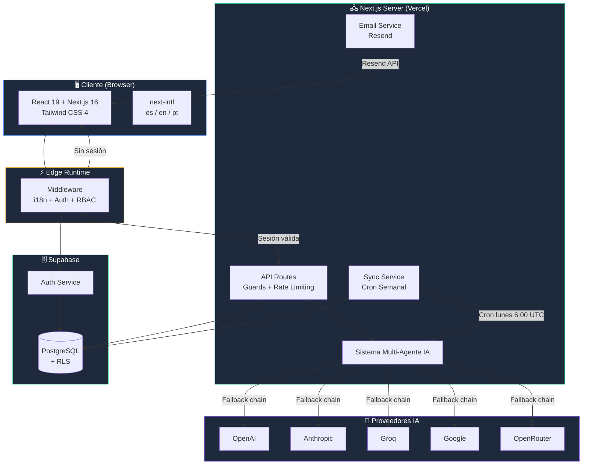
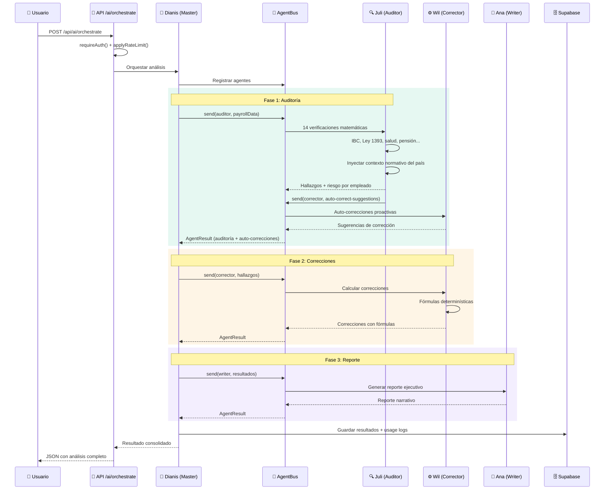
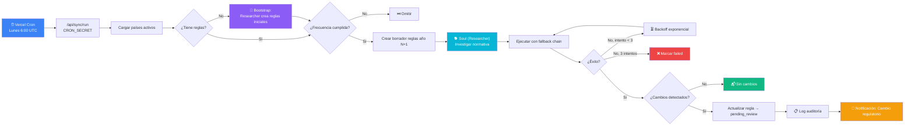
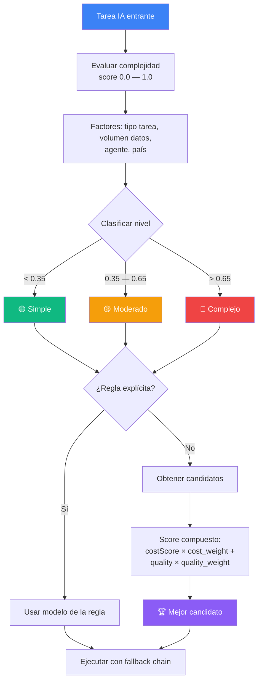
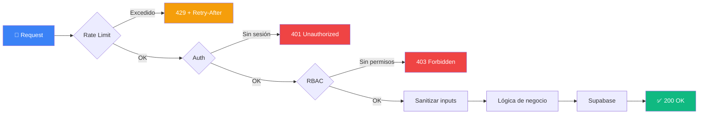
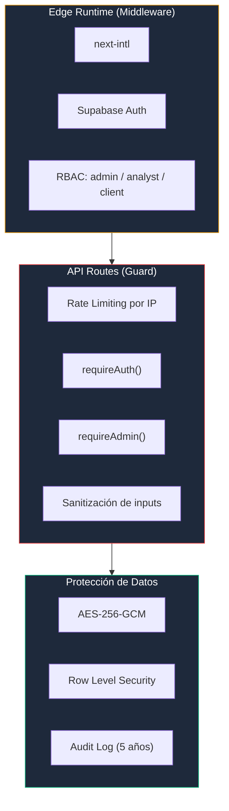

<div align="center">
  
  
  # Nomina Smart
  
  **Plataforma de Nómina de Clase Mundial: Confiable, Intuitiva y Altamente Eficiente**

  <p align="center">
    <a href="#visión-del-proyecto">Visión</a> •
    <a href="#características-principales">Características</a> •
    <a href="#diagramas">Diagramas</a> •
    <a href="#tecnologías-tech-stack">Tecnologías</a> •
    <a href="#guía-de-inicio-rápido">Inicio Rápido</a> •
    <a href="#configuración-detallada">Configuración</a> •
    <a href="#esquema-de-base-de-datos">Base de Datos</a> •
    <a href="#referencia-de-api">API</a> •
    <a href="#seguridad">Seguridad</a> •
    <a href="#troubleshooting">Troubleshooting</a>
  </p>

  
  
  
  
  
</div>

---

## Visión del Proyecto

**Nomina Smart** tiene como objetivo convertirse en una de las mejores aplicaciones de nómina del mercado, destacándose por su **alta confiabilidad**, **experiencia de usuario excepcional** y **eficiencia operativa**.

### Objetivos Estratégicos

| Pilar | Descripción |
|-------|-------------|
| **Confiabilidad** | Cálculos precisos garantizados, auditoría continua y cumplimiento normativo al 100%. |
| **Usabilidad** | Interfaz intuitiva que reduce la curva de aprendizaje. |
| **Eficiencia** | Automatización inteligente que reduce tiempos de procesamiento de nómina de días a minutos. |
| **Escalabilidad** | Arquitectura diseñada para crecer desde PYMEs hasta grandes corporaciones. |

### Principios de Desarrollo

- **Seguridad First**: Encriptación AES-256-GCM, RBAC en middleware y API routes, rate limiting por IP, sanitización de inputs, validación de UUIDs, logs de auditoría.
- **Mantenibilidad**: Código limpio, modular y bien documentado.
- **Responsividad**: Experiencia fluida en cualquier dispositivo.
- **Integración Continua**: APIs robustas para conectar con ERPs, sistemas contables y plataformas bancarias (roadmap).

---

## ¿Qué es Nomina Smart?

**Nomina Smart** revoluciona el proceso de gestión y auditoría salarial. Realiza una verificación de **"Triple Match"**, cruzando inteligentemente información entre:

1. **Nómina Interna** (Archivos fuente extraídos desde tu ERP).
2. **Pago PILA** (Planilla Integrada de Liquidación de Aportes).
3. **Estándar UGPP** (Cálculo normativo oficial y regulatorio).

El sistema utiliza IA para inferir mapeos automáticos, detectar inconsistencias críticas, calcular el **Nivel de Riesgo por Empleado**, sugerir reparaciones proactivas y gestionar hallazgos a través de un panel colaborativo.

---

## Características Principales

### Sistema Multi-Agente de IA

| Agente | Persona | Rol | Descripción |
|--------|---------|-----|-------------|
| 👑 **Dianis** (Master) | Mujer | Directora de Orquestación | Coordina a todo el equipo, decide qué agentes invocar y en qué orden |
| 🔍 **Juli** (Auditor) | Mujer | Auditora de Nómina | Ejecuta 14 verificaciones matemáticas y normativas (IBC, Ley 1393, UGPP). Inyecta contexto normativo del país en el prompt de IA y solicita auto-correcciones al Corrector vía AgentBus |
| 📝 **Ana** (Writer) | Mujer | Redactora de Reportes | Genera reportes ejecutivos narrativos con hallazgos priorizados |
| ⚙️ **Wil** (Corrector) | Hombre | Ingeniero de Correcciones | Propone correcciones numéricas determinísticas con fórmulas normativas. Incluye guía experta para hallazgos no determinísticos |
| 🐈‍⬛ **Gyoru** (Mapper) | Gato | Mapeadora de Campos | Mapea columnas de archivos Excel a campos estándar con fuzzy matching |
| 💼 **Dianis** (Payroll Expert) | Mujer | Experta en Nómina Multi-País | Asistente conversacional de normativa laboral para 7 países (CO, MX, PE, CL, BR, AR, US) con cálculos paso a paso, comparación entre países y gestión CRUD de reglas |
| 🐕 **Soul** (Researcher) | Perro | Investigadora Regulatoria | Investiga normativa laboral vigente por país/año, compara cambios y registra fuentes |

### 14 Verificaciones Matemáticas del Auditor

| # | Verificación | Fórmula / Regla |
|---|-------------|-----------------|
| 1 | IBC Ley 1393 | Pagos no salariales ≤ 40% del total devengado |
| 2 | Deducción Salud | 4% del IBC |
| 3 | Deducción Pensión | 4% del IBC |
| 4 | Cesantías | Salario × días / 360 |
| 5 | Intereses Cesantías | Cesantías × días × 12% / 360 |
| 6 | Prima de Servicios | Salario × días / 360 |
| 7 | Vacaciones | Salario base × días / 720 |
| 8 | Parafiscales SENA | 2% del IBC |
| 9 | Parafiscales ICBF | 3% del IBC |
| 10 | Caja de Compensación | 4% del IBC |
| 11 | ARL | Según nivel de riesgo (I: 0.522% — V: 6.960%) |
| 12 | Auxilio de Transporte | Aplica si salario ≤ 2 SMMLV |
| 13 | Tope IBC Máximo | Máximo 25 SMMLV |
| 14 | Tope IBC Mínimo | Mínimo 1 SMMLV |

### Características Transversales

| Característica | Descripción |
|----------------|-------------|
| **Rate Limiting** | Presets por endpoint: auth (10/min), AI (20/min), chat (30/min), admin writes (30/min), reads (60/min), writes (40/min), cron (5/min). |
| **Sincronización Regulatoria** | Cron semanal (lunes 6:00 UTC) con investigación web, borradores de reglas, notificaciones y reintentos con backoff exponencial. Bootstrap automático de reglas iniciales para países nuevos o despliegues frescos. |
| **Panel Financiero de IA** | KPIs financieros, desglose por proveedor/cliente, gráficos de tendencia y exportación CSV. |
| **Optimización de Tokens** | Selección inteligente de modelos por complejidad, score compuesto (costo × calidad), estrategias: cost-first, quality-first, balanced. |
| **i18n** | Español, Inglés y Portugués con rutas localizadas. |
| **Multi-País** | 7 países: CO, MX, PE, CL, BR, AR, US. Cada uno con moneda, formato y reglas propias. El auditor inyecta dinámicamente las reglas normativas del país en el prompt de IA para interpretaciones contextualizadas. |
| **Email Transaccional** | Resend: invitaciones, alertas regulatorias, resúmenes semanales. Plantillas localizadas con retry. |
| **Notificaciones In-App** | Severidad (info/warning/critical), tipos: cambio regulatorio, sync completado, regla pendiente. |
| **Auditoría de Cambios** | Registro de cambios en reglas con retención 5 años. Trazabilidad de origen y fuentes. |
| **Obsidian Ledger (Design System)** | Tokens de diseño oscuro con jerarquía de superficies tonales (6 niveles), paleta semántica (primary/secondary/tertiary/error) y clases utilitarias glassmorphism. Compatible con Material Design 3. |

---

## Diagramas

### Arquitectura General del Sistema



### Flujo de Orquestación Multi-Agente



### Flujo de Autenticación y Middleware

```mermaid
flowchart TD
    REQ[Request entrante] --> MW{Middleware Edge}
    MW --> STRIP[Extraer locale del path]
    STRIP --> PUB{¿Ruta pública?<br/>/, /pricing, /login...}
    
    PUB -->|Sí| INTL[Aplicar i18n<br/>next-intl]
    INTL --> RES_OK[✅ Response]
    
    PUB -->|No| SUPA[Crear cliente Supabase<br/>en Edge]
    SUPA --> SESSION{¿Sesión válida?<br/>getUser()}
    
    SESSION -->|No| REDIR[🔒 Redirect a<br/>/{locale}/login?redirectTo=...]
    
    SESSION -->|Sí| ROLE[Obtener rol<br/>REST → user_profiles]
    ROLE --> PERM{¿Tiene permisos?}
    
    PERM -->|Admin: acceso total| INTL_AUTH[Aplicar i18n<br/>+ cookies auth]
    PERM -->|Analyst: sin /admin| INTL_AUTH
    PERM -->|Client: solo dashboard/reports| CHECK_ROUTE{¿Ruta permitida?}
    
    CHECK_ROUTE -->|Sí| INTL_AUTH
    CHECK_ROUTE -->|No| REDIR_DASH[↩️ Redirect a<br/>/{locale}/dashboard]
    
    INTL_AUTH --> RES_OK

    style REQ fill:#3b82f6,color:#fff
    style RES_OK fill:#10b981,color:#fff
    style REDIR fill:#ef4444,color:#fff
    style REDIR_DASH fill:#f59e0b,color:#fff
```

### Pipeline de Sincronización Regulatoria



### Selección Inteligente de Modelos IA



### Diagrama Entidad-Relación (Tablas Principales)

```mermaid
erDiagram
    companies ||--o{ employees : "tiene"
    companies ||--o{ audits : "tiene"
    companies ||--o{ payroll_uploads : "tiene"
    audits ||--o{ reconciliation_records : "contiene"
    employees ||--o{ reconciliation_records : "referencia"
    payroll_uploads ||--o{ payroll_action_items : "genera"
    payroll_uploads ||--o{ applied_corrections : "recibe"
    auth_users ||--|| user_profiles : "tiene"
    user_profiles }o--|| companies : "pertenece a"
    auth_users ||--o{ ai_providers : "configura"
    ai_providers ||--o{ ai_usage_logs : "registra"
    ai_usage_logs }o--|| companies : "asociado a"
    country_year_rules ||--o{ rule_audit_log : "auditado por"
    country_year_rules ||--o{ research_sources : "documentado por"
    supported_countries ||--o{ sync_history : "sincronizado"
    auth_users ||--o{ notifications : "recibe"

    companies {
        uuid id PK
        varchar nit UK
        varchar name
        varchar industry
    }
    employees {
        uuid id PK
        uuid company_id FK
        varchar document_number
        decimal current_salary
    }
    payroll_uploads {
        uuid id PK
        uuid company_id FK
        varchar country_code
        int period_year
        jsonb risk_report
    }
    user_profiles {
        uuid id PK_FK
        varchar role
        uuid company_id FK
        varchar preferred_locale
    }
    ai_providers {
        uuid id PK
        uuid user_id FK
        varchar provider_type
        text api_key_encrypted
        int priority
    }
    country_year_rules {
        uuid id PK
        varchar country_code
        int rule_year
        jsonb checks
        varchar status
    }
    optimization_config {
        uuid id PK
        varchar strategy
        decimal cost_weight
        decimal quality_weight
    }
```

### Ciclo de Vida de un Request API



---

## Tecnologías (Tech Stack)

### Frontend
| Tecnología | Propósito |
|------------|-----------|
| **React 19** & **Next.js 16** | Framework principal con App Router y Turbopack |
| **Tailwind CSS 4** | Sistema de diseño utilitario responsivo |
| **Obsidian Ledger** | Sistema de tokens de diseño oscuro con superficies tonales (Material Design 3) |
| **Lucide React** | Iconografía moderna y accesible |
| **Recharts** | Visualización de datos y gráficos ejecutivos |

### Backend & Base de Datos
| Tecnología | Propósito |
|------------|-----------|
| **Supabase (PostgreSQL)** | BD transaccional con Row Level Security |
| **API Routes (Next.js)** | Endpoints serverless |
| **Vercel AI SDK v4** | Orquestación multi-agente (OpenAI, Anthropic, Groq, Google, OpenRouter) |
| **Resend** | Correos transaccionales |
| **Vercel Cron Jobs** | Sincronización regulatoria automática |

### Herramientas
| Tecnología | Propósito |
|------------|-----------|
| **TypeScript** | Tipado estático |
| **next-intl** | Internacionalización y rutas localizadas |
| **XLSX** | Procesamiento de hojas de cálculo |
| **Vitest** | Testing unitario |
| **Zod** | Validación de esquemas en runtime |

---

## Arquitectura del Proyecto

```
nomina-smart/
├── messages/                     # Diccionarios i18n (es.json, en.json, pt.json)
├── scripts/                      # Migraciones SQL (001–005)
├── src/
│   ├── app/
│   │   ├── [locale]/             # Rutas multilenguaje
│   │   │   ├── (public)/         # Landing, about, contact, pricing (sin auth)
│   │   │   ├── login/            # Autenticación
│   │   │   ├── admin/            # Paneles admin (finanzas, países, uso, optimización)
│   │   │   ├── dashboard/        # Dashboard ejecutivo
│   │   │   ├── reconcile/        # Conciliación y validación
│   │   │   ├── reports/          # Reportes
│   │   │   ├── rules/            # Reglas de negocio
│   │   │   ├── settings/         # Configuración (proveedores, usuarios)
│   │   │   └── upload/           # Carga de archivos
│   │   ├── api/                  # Endpoints REST
│   │   │   ├── ai/               # IA: chat, corrections, mapping, orchestrate, validation
│   │   │   ├── admin/            # Admin: countries, finance, optimization, rules, users
│   │   │   ├── sync/             # Sincronización regulatoria (cron)
│   │   │   └── settings/         # Proveedores IA y uso
│   │   └── auth/callback/        # OAuth callback Supabase
│   ├── components/               # UI y layout
│   ├── i18n/                     # Configuración i18n
│   ├── lib/
│   │   ├── ai/                   # Capa IA multi-agente
│   │   │   ├── agents/           # 7 agentes + AgentBus
│   │   │   ├── providers.ts      # Registry multi-proveedor
│   │   │   ├── fallback.ts       # Cadena de fallback
│   │   │   ├── model-selector.ts # Selector inteligente
│   │   │   ├── cost-calculator.ts# Calculadora de costos
│   │   │   ├── encryption.ts     # AES-256-GCM
│   │   │   └── rule-engine.ts    # Motor de reglas multi-país
│   │   ├── api/                  # Guard + Rate limiter
│   │   ├── audit/                # Auditoría de reglas
│   │   ├── email/                # Email (Resend) + plantillas
│   │   ├── notifications/        # Notificaciones in-app
│   │   ├── payroll/              # Lógica de nómina
│   │   ├── sync/                 # Sincronización regulatoria
│   │   └── supabase/             # Clientes Supabase
│   └── middleware.ts             # Edge: i18n + Auth + RBAC
├── vercel.json                   # Cron jobs
└── tsconfig.json
```

---

## Guía de Inicio Rápido

### Requisitos Previos
- **Node.js** v20+ ([descargar](https://nodejs.org))
- **npm** (incluido con Node.js)
- **Cuenta Supabase** ([crear gratis](https://supabase.com/))

### Instalación

```bash
npm install
cp .env.local.example .env.local   # Edita con tus credenciales
npm run dev
```

Accede en: http://localhost:3000/es (o `/en`, `/pt`)

### Credenciales Supabase

En [supabase.com](https://supabase.com) → Settings → API:
- **Project URL** → `NEXT_PUBLIC_SUPABASE_URL`
- **Anon Public Key** → `NEXT_PUBLIC_SUPABASE_ANON_KEY`
- **Service Role Key** → `SUPABASE_SERVICE_ROLE_KEY`

### Inicializar Base de Datos

Ejecuta los scripts SQL en orden desde el SQL Editor de Supabase:

```
001_setup_schema.sql        → Tablas base
002_refactor_tables.sql     → user_profiles, ai_providers, ai_usage_logs
003_multi_country_tables.sql → Multi-país, token rates, correcciones
004_regulatory_sync_tables.sql → sync_history, notifications, email_log
005_finance_token_optimization.sql → routing_rules, quality_metrics, optimization_config
```

---

## Configuración Detallada

### Variables de Entorno

| Variable | Requerida | Descripción |
|----------|-----------|-------------|
| `NEXT_PUBLIC_SUPABASE_URL` | ✅ | URL del proyecto Supabase |
| `NEXT_PUBLIC_SUPABASE_ANON_KEY` | ✅ | Clave pública anónima |
| `SUPABASE_SERVICE_ROLE_KEY` | ✅ | Clave de servicio (admin) |
| `RESEND_API_KEY` | ✅ | API key de Resend para emails |
| `RESEND_FROM_EMAIL` | ✅ | Dirección de remitente |
| `ENCRYPTION_KEY` | ✅ | Clave AES-256 (64 chars hex) |
| `CRON_SECRET` | ✅ | Secret para cron jobs de Vercel |
| `FIRECRAWL_API_KEY` | ⬜ | API key de Firecrawl para investigación regulatoria (búsqueda web + scraping). [Obtener key](https://www.firecrawl.dev/). Si no se configura, el agente investigador usa datos de respaldo (REGULATION_DB) con confianza baja. |

Generar `ENCRYPTION_KEY`:
```bash
node -e "console.log(require('crypto').randomBytes(32).toString('hex'))"
```

### Proveedores IA

Se configuran desde `/settings/providers` (rol admin). Tipos soportados: `openai`, `anthropic`, `groq`, `google`, `openrouter`.

Cada proveedor tiene: `api_key` (cifrada con AES-256-GCM), `model_id`, `priority` (orden de fallback), `is_active`.

### Optimización de Tokens

Desde `/admin/settings/optimization`:

| Parámetro | Default | Descripción |
|-----------|---------|-------------|
| `strategy` | `balanced` | `cost-first`, `quality-first`, `balanced` |
| `cost_weight` | `0.5` | Peso del costo (0.0–1.0) |
| `quality_weight` | `0.5` | Peso de la calidad (0.0–1.0) |
| `max_cost_per_task_usd` | `0.50` | Límite de costo por tarea |
| `min_quality_threshold` | `0.7` | Umbral mínimo de calidad |
| `enable_auto_routing` | `true` | Enrutamiento automático |

> `cost_weight + quality_weight` debe sumar 1.0.

### Cron Jobs (Vercel)

```json
{ "crons": [{ "path": "/api/sync/run", "schedule": "0 6 * * 1" }] }
```

Lunes 6:00 UTC. Autenticado con `CRON_SECRET` como Bearer token. Rate limit: 5 req/min.

#### Bootstrap Automático de Reglas

En el primer despliegue (o al activar un nuevo país), la tabla `country_year_rules` estará vacía. El sistema resuelve esto automáticamente:

1. El cron (o un sync manual) detecta que un país no tiene reglas.
2. Invoca al agente investigador (Soul) que busca en la web regulaciones vigentes.
3. Si la búsqueda web falla, usa `REGULATION_DB` como fallback (confianza baja).
4. Crea las reglas en `country_year_rules` con status `pending_review`.
5. Notifica al admin para revisión.

También existe un endpoint manual para forzar el bootstrap:

```bash
# Bootstrap de todos los países
curl -X POST https://tu-app.vercel.app/api/sync/bootstrap \
  -H "Authorization: Bearer tu-CRON_SECRET"

# Bootstrap de un país específico
curl -X POST https://tu-app.vercel.app/api/sync/bootstrap \
  -H "Authorization: Bearer tu-CRON_SECRET" \
  -H "Content-Type: application/json" \
  -d '{"countryCode": "CO", "year": 2026}'
```

### Internacionalización

Locales: `es` (default), `en`, `pt`. Prefijo siempre visible en URL. Diccionarios en `messages/`.

### Rate Limiting

| Preset | Límite | Uso |
|--------|--------|-----|
| `auth` | 10/min | Login |
| `ai` | 20/min | Endpoints IA |
| `aiChat` | 30/min | Chat AI |
| `adminWrite` | 30/min | Escrituras admin |
| `read` | 60/min | Lecturas |
| `write` | 40/min | Escrituras |
| `cron` | 5/min | Sync/cron |

> In-memory (no distribuido). Para producción multi-instancia, usar Redis (Upstash).

---

## Esquema de Base de Datos

### Migraciones SQL

| Script | Tablas |
|--------|--------|
| `001_setup_schema.sql` | `companies`, `employees`, `audits`, `reconciliation_records`, `country_year_rules`, `payroll_uploads`, `payroll_action_items` |
| `002_refactor_tables.sql` | `user_profiles`, `ai_providers`, `ai_usage_logs` + trigger `handle_new_user` |
| `003_multi_country_tables.sql` | `supported_countries`, `task_pricing`, `infrastructure_costs`, `provider_token_rates`, `applied_corrections`, `agent_communications`, `research_sources` |
| `004_regulatory_sync_tables.sql` | `sync_history`, `rule_audit_log`, `notifications`, `email_log` |
| `005_finance_token_optimization.sql` | `model_routing_rules`, `quality_metrics`, `optimization_config` |

### Tablas Principales

| Tabla | Descripción | FK |
|-------|-------------|-----|
| `companies` | Empresas (NIT, nombre, industria) | → employees, audits, payroll_uploads |
| `employees` | Empleados con datos salariales | → company_id |
| `audits` | Auditorías por empresa/período | → reconciliation_records |
| `payroll_uploads` | Cargas de nómina con mapeos y validaciones (JSONB) | → action_items, corrections |
| `payroll_action_items` | Hallazgos/tickets con prioridad y resolución | → payroll_id |
| `country_year_rules` | Reglas normativas por país/año (status: draft/pending_review/approved/rejected) | → audit_log, sources |
| `user_profiles` | Perfiles con rol (admin/analyst/client) | → auth.users (PK=FK) |
| `ai_providers` | Proveedores IA con API key cifrada | → user_id |
| `ai_usage_logs` | Uso IA: tokens, latencia, costo, complejidad | → provider_id, company_id |
| `supported_countries` | 7 países con moneda y formato | → sync_history |
| `sync_history` | Historial de sincronizaciones (status, reintentos) | → country_code |
| `rule_audit_log` | Auditoría de cambios en reglas (retención 5 años) | → rule_id, user_id |
| `notifications` | Notificaciones in-app (tipo, severidad) | → user_id |
| `email_log` | Registro de emails vía Resend | — |
| `model_routing_rules` | Enrutamiento de modelos por tarea/agente/complejidad | — |
| `quality_metrics` | Métricas de calidad por proveedor/modelo | — |
| `optimization_config` | Estrategia de optimización global | — |
| `applied_corrections` | Correcciones aplicadas con fórmula | → payroll_upload_id |
| `agent_communications` | Comunicaciones inter-agente (AgentBus) | — |
| `research_sources` | Fuentes del agente investigador | → country_year_rule_id |
| `provider_token_rates` | Tarifas por 1K tokens por proveedor/modelo | — |

### RLS y Triggers

- **RLS habilitado** en todas las tablas. `user_profiles` y `ai_providers` restringidos por `auth.uid()`. Demás tablas: permisivas (pendiente restringir).
- **Trigger `on_auth_user_created`**: Auto-crea `user_profiles` con rol `client` al registrar usuario.

---

## Referencia de API

### Endpoints de IA

| Método | Ruta | Auth | Rate Limit |
|--------|------|------|------------|
| POST | `/api/ai/orchestrate` | requireAuth | ai (20/min) |
| POST | `/api/ai/chat` | requireAuth | aiChat (30/min) |
| POST | `/api/ai/mapping` | requireAuth | ai (20/min) |
| POST | `/api/ai/validation` | requireAuth | ai (20/min) |
| POST | `/api/ai/corrections` | requireAuth | ai (20/min) |

### Endpoints de Nómina

| Método | Ruta | Auth | Rate Limit |
|--------|------|------|------------|
| GET/POST | `/api/payrolls` | requireAuth | read/write |
| GET | `/api/companies` | requireAuth | read |
| GET/POST/PATCH | `/api/actions` | requireAuth | read/write |
| GET/PATCH | `/api/actions/[id]` | requireAuth | read/write |
| GET | `/api/rules` | requireAuth | read |
| POST/DELETE | `/api/rules` | requireAdmin | adminWrite |

### Endpoints de Administración

| Método | Ruta | Auth | Rate Limit |
|--------|------|------|------------|
| GET | `/api/admin/finance` | requireAdmin | read |
| GET | `/api/admin/finance/export` | requireAdmin | read |
| GET | `/api/admin/countries` | requireAdmin | read |
| GET/POST | `/api/admin/users` | requireAdmin | read/adminWrite |
| POST | `/api/admin/users/invite` | requireAdmin | adminWrite |
| PATCH/DELETE | `/api/admin/users/[id]` | requireAdmin | adminWrite |
| POST | `/api/admin/rules/[id]/approve` | requireAdmin | adminWrite |
| POST | `/api/admin/rules/[id]/reject` | requireAdmin | adminWrite |
| GET/PUT | `/api/admin/optimization-config` | requireAdmin | read/adminWrite |
| GET/POST | `/api/admin/optimization-config/rules` | requireAdmin | read/adminWrite |

### Endpoints de Configuración y Sync

| Método | Ruta | Auth | Rate Limit |
|--------|------|------|------------|
| GET/POST | `/api/settings/providers` | requireAdmin | read/adminWrite |
| PUT/DELETE | `/api/settings/providers/[id]` | requireAdmin | adminWrite |
| POST | `/api/settings/providers/[id]/test` | requireAdmin | ai |
| POST | `/api/settings/providers/reorder` | requireAdmin | adminWrite |
| GET | `/api/settings/usage` | requireAdmin | read |
| POST | `/api/sync/run` | CRON_SECRET | cron (5/min) |
| POST | `/api/sync/bootstrap` | requireAdmin / CRON_SECRET | cron (5/min) |
| GET | `/api/sync/history` | requireAuth | read |
| GET | `/api/notifications` | requireAuth | read |
| POST | `/api/notifications/[id]/read` | requireAuth | write |
| GET | `/api/audit/[ruleId]` | requireAuth | read |

---

## Seguridad

### Arquitectura de Seguridad



### Capas de Protección

| Capa | Descripción |
|------|-------------|
| **Edge Middleware** | i18n, sesión Supabase, RBAC, propagación de cookies, redirect con `redirectTo` |
| **Rate Limiting** | Sliding window in-memory por IP. 7 presets. Header `Retry-After` en 429. |
| **Autenticación** | `requireAuth()` verifica sesión Supabase. Cron usa `CRON_SECRET` como Bearer. |
| **Autorización** | `requireAdmin()`, `requireAnalystOrAdmin()`. Tres roles. |
| **Sanitización** | `sanitizeString()`, `sanitizeEmail()`, `isValidUuid()`, `isValidCountryCode()`, `sanitizeNumber()`, `sanitizeStringArray()` |
| **Encriptación** | AES-256-GCM: IV 12 bytes + AuthTag 16 bytes. Formato: `base64(IV + authTag + ciphertext)` |
| **RLS** | Políticas por tabla. user_profiles y ai_providers por `auth.uid()`. |
| **Auditoría** | Cambios en reglas con retención 5 años. Origen, valores anteriores/nuevos, fuentes. |

### Roles y Permisos

| Rol | Dashboard | Upload | Reconcile | Rules | Reports | Settings | Admin |
|-----|-----------|--------|-----------|-------|---------|----------|-------|
| **admin** | ✅ | ✅ | ✅ | ✅ | ✅ | ✅ | ✅ |
| **analyst** | ✅ | ✅ | ✅ | ✅ | ✅ | ❌ | ❌ |
| **client** | ✅ | ❌ | ❌ | ❌ | ✅ | ❌ | ❌ |

---

## Troubleshooting

### Instalación y Dependencias

**"Cannot find module '@supabase/ssr'"**
```bash
npm install
# Si persiste:
rm -rf node_modules package-lock.json && npm install
```

**"Module not found: Can't resolve '@ai-sdk/openai'"**
```bash
npm install @ai-sdk/openai @ai-sdk/anthropic @ai-sdk/groq @ai-sdk/google @openrouter/ai-sdk-provider ai
```

### Variables de Entorno

**"NEXT_PUBLIC_SUPABASE_URL is not defined"**
1. Copia `.env.local.example` a `.env.local`
2. Rellena credenciales Supabase
3. Reinicia: `npm run dev` (variables `NEXT_PUBLIC_*` se inyectan en build time)

**"ENCRYPTION_KEY environment variable is not set"**
```bash
node -e "console.log(require('crypto').randomBytes(32).toString('hex'))"
# Copia el resultado (64 chars hex) como ENCRYPTION_KEY en .env.local
```

**Sync falla con 401 (CRON_SECRET)**
El endpoint `/api/sync/run` requiere `Authorization: Bearer <CRON_SECRET>`. Configúralo en `.env.local` y en Vercel.

### Base de Datos

**"relation 'user_profiles' does not exist"**
Ejecuta las migraciones SQL en orden (001 → 005) desde el SQL Editor de Supabase.

**"duplicate key value violates unique constraint"**
Los scripts usan `ON CONFLICT DO NOTHING`. Si modificaste datos manualmente, elimina registros conflictivos o usa `TRUNCATE`.

**"permission denied for table user_profiles"**
Usa `SUPABASE_SERVICE_ROLE_KEY` (no anon key) para operaciones admin. El service role bypasea RLS.

### Autenticación

**Redirect infinito a /login**
1. Verifica cookies de Supabase
2. Comprueba `NEXT_PUBLIC_SUPABASE_URL` y `NEXT_PUBLIC_SUPABASE_ANON_KEY`
3. Limpia cookies del navegador

**403 al acceder a rutas admin**
```sql
UPDATE user_profiles SET role = 'admin' WHERE id = 'tu-user-uuid';
```

**Usuario nuevo no aparece en user_profiles**
Verifica el trigger: `SELECT * FROM pg_trigger WHERE tgname = 'on_auth_user_created';`
Si no existe, re-ejecuta `002_refactor_tables.sql`.

### IA

**"No active AI providers configured"**
Configura al menos un proveedor desde `/settings/providers` (rol admin).

**"All AI providers failed"**
- API keys inválidas o expiradas
- Cuota excedida
- Modelo no disponible
- Prueba cada proveedor desde `/settings/providers` → "Test"

**Respuestas lentas o timeout**
- Revisa latencia en `/admin/usage`
- Cambia a modelo más rápido (ej: Groq)
- Estrategia `cost-first` para modelos económicos

### Sincronización Regulatoria

**"Failed to load active countries"**
Ejecuta `003_multi_country_tables.sql` (incluye datos iniciales para 7 países).

**Sync no se ejecuta automáticamente**
Los cron jobs solo funcionan en producción (Vercel). Para probar localmente:
```bash
curl -X POST http://localhost:3000/api/sync/run -H "Authorization: Bearer tu-CRON_SECRET" -H "Content-Type: application/json" -d '{"force": true}'
```

**"Max retries exhausted"**
Revisa `/api/sync/history` para ver `error_message`. Verifica proveedores IA y conectividad.

**Bootstrap de reglas falla para un país nuevo**
Si un país recién activado no genera reglas iniciales, verifica que haya al menos un proveedor IA activo en `/settings/providers`. El bootstrap invoca al agente investigador (Soul) con fallback chain. Revisa notificaciones in-app para detalles del error.

### Email

**"Resend API key is not configured"**
Agrega `RESEND_API_KEY` y `RESEND_FROM_EMAIL` a `.env.local`.

**Emails no llegan**
1. Revisa tabla `email_log` (status: sent/failed/bounced)
2. Verifica dominio verificado en Resend
3. El sistema reintenta con backoff exponencial

### Desarrollo

**Puerto 3000 en uso**: `npm run dev -- -p 3001`

**Build error TypeScript**: Verifica Node v20+ con `node --version`

**Rate limit en desarrollo (429)**: Reinicia el servidor para limpiar el store in-memory.

---

## Roadmap

- [ ] Módulo completo de liquidación de nómina
- [ ] Generación automática de archivos PILA
- [ ] Portal de autoservicio para empleados
- [ ] Integración con sistemas contables
- [ ] App móvil para consultas
- [ ] Firma electrónica de documentos
- [ ] Rate limiting distribuido con Redis (Upstash)
- [ ] RLS restrictivo por empresa en todas las tablas

---

## Contribuir

1. Fork del repositorio
2. Rama para tu feature (`git checkout -b feature/nueva-funcionalidad`)
3. Commits descriptivos
4. Pull Request

---

## Licencia

Proyecto privado. Todos los derechos reservados.
